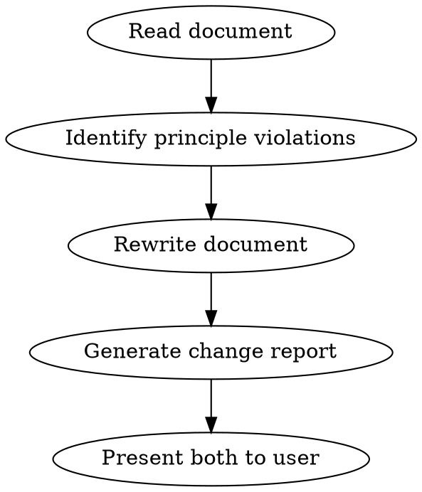

# plsfix

## Overview

Improve spec and instruction documents by applying the 12 principles that make both human and AI communication effective. Produces a rewritten document plus a change report mapping each edit to the principle it implements.

**Core insight:** The same writing principles that make humans respond better also make AI respond better, because LLMs learned from human text. These principles aren't prompt tricks: they're the fundamentals of effective written communication.

**Sources:** These principles are synthesized from official prompt engineering guidance published by [Anthropic](https://platform.claude.com/docs/en/build-with-claude/prompt-engineering/overview), [Google](https://ai.google.dev/gemini-api/docs/prompting-strategies), [OpenAI](https://platform.openai.com/docs/guides/prompt-engineering), and [Microsoft](https://learn.microsoft.com/en-us/azure/ai-foundry/openai/concepts/prompt-engineering).

## When to Use

- Spec or requirements document feels vague or produces bad results
- Instructions to a team or AI keep getting misinterpreted
- Prompt or brief generates generic, off-target output
- Document has grown organically and lost coherence
- User says "fix this", "improve this", "make this clearer" about an instruction document

## The 12 Principles

Principles are ordered by application sequence: structure the document first, then sharpen content, then refine delivery.

### Phase 1: Structure (get the bones right)

| # | Principle | One-liner | Symptom it fixes |
|---|-----------|-----------|------------------|
| P1 | **Context first, ask last** | Lead with background and constraints, close with the actual request; never bury the ask in the middle | Key requirements get missed; output addresses secondary concerns |
| P2 | **One ask per section** | Split multi-goal paragraphs so each section has exactly one objective | Output oscillates between competing goals or drops some |
| P3 | **Break it into steps** | Decompose compound instructions into sequential, numbered steps | Output jumbles or skips parts of the task |
| P4 | **Use structural markup** | Separate instructions, context, examples, and inputs with consistent delimiters (XML tags, markdown headers, or `---` separators) | Reader/AI confuses instructions with examples, or context with the ask |

### Phase 2: Content (sharpen what you're saying)

| # | Principle | One-liner | Symptom it fixes |
|---|-----------|-----------|------------------|
| P5 | **Be specific, not abstract** | Replace vague nouns with concrete details: audience, format, scope, quantities | Output is generic or surface-level |
| P6 | **Name your audience** | State who will read/act on the output and what they already know | Tone, depth, or vocabulary is wrong for the reader |
| P7 | **Define the output contract** | Specify what "done" looks like: format, length, structure, required fields | Output is correct in substance but wrong in shape, length, or structure |
| P8 | **Show, don't tell** | Add 1-3 examples of desired output | Reader/AI guesses wrong about what "good" looks like |

### Phase 3: Delivery (refine how you're saying it)

| # | Principle | One-liner | Symptom it fixes |
|---|-----------|-----------|------------------|
| P9 | **Say what to do, not what to avoid** | Rewrite "don't" and "avoid" instructions as positive directives | Forbidden behavior still appears; instructions feel restrictive rather than enabling |
| P10 | **Make the stakes real** | State why this matters: who benefits, what breaks if done wrong, what success enables | Instructions followed mechanically without judgment or care |
| P11 | **Give an out for uncertainty** | Explicitly state what to do when information is missing, the request is ambiguous, or the task is out of scope | Fabricated answers, confident guesses, or silent failures when the task can't be completed as written |
| P12 | **Resolve contradictions** | Ensure no two instructions conflict; when tensions exist, state which takes priority | Reader/AI wastes effort resolving ambiguity, or silently picks the wrong side of a conflict |

## Workflow



### Step 1: Read and Diagnose

Read the full document. For each section or paragraph, check against all 12 principles in order: Structure (P1-P4), then Content (P5-P8), then Delivery (P9-P12). Note every violation with its location and the principle it violates.

### Step 2: Rewrite

Apply fixes to produce a clean, improved version of the document. Preserve the author's intent, voice, and structure where possible. Make the minimum changes needed to satisfy each principle.

**Rewriting rules:**
- Do not add content the author didn't intend (no scope creep)
- Do not remove content unless it directly contradicts a principle (e.g., removing a "don't" to replace with a positive directive)
- When adding specificity (P5), mark any assumed details with `[CONFIRM: assumed detail]` so the author can verify
- When adding examples (P8), draw them from context in the document itself; if no context exists, mark with `[EXAMPLE NEEDED: describe what kind]`
- When adding structural markup (P4), prefer the delimiter style already used in the document; if none exists, use markdown headers for human-facing docs and XML tags for AI-facing prompts
- When adding an output contract (P7), derive format and constraints from what the document already implies; mark assumptions with `[CONFIRM]`
- Preserve original section headings unless renaming is required to fix P2 (one ask per section)

### Step 3: Generate Change Report

Produce a markdown table summarizing every change:

```
## plsfix Change Report

| # | Location | Principle | Before (summary) | After (summary) | Rationale |
|---|----------|-----------|-------------------|-----------------|-----------|
| 1 | Section 2, para 1 | P5: Be specific | "Build a good dashboard" | "Build a Grafana dashboard showing p95 latency, error rate, and throughput for the payments service" | Original lacked target tool, metrics, and scope |
| 2 | Section 3 | P9: Say what to do | "Don't use jargon" | "Use plain language a non-technical stakeholder would understand" | Negative instruction replaced with positive directive |
| 3 | Section 1 | P4: Use structural markup | Instructions, context, and examples mixed in a single block | Separated with `### Instructions`, `### Context`, and `### Examples` headers | Reader couldn't distinguish instructions from reference material |
```

**Report rules:**
- One row per change (group tightly related changes on the same sentence)
- Always cite the principle by number and name
- "Before" and "After" should be short summaries or direct quotes, not full paragraphs
- "Rationale" explains why this change improves the document in one sentence
- If no violations are found for a principle, do not include a "no changes" row; omit silently
- End the report with a **Principles Not Triggered** line listing any of P1-P12 that required no changes (confirms you checked)

### Step 4: Present

Show the user:
1. The change report (so they can review what changed and why)
2. The rewritten document (full text, ready to use)

Ask: *"Any of the [CONFIRM] items to adjust, or changes you'd like to revert?"*

## Quick Reference: Diagnosis Patterns

| You see this... | Apply this principle |
|-----------------|---------------------|
| Core requirement buried in paragraph 4 of 6 | P1: Context first, ask last |
| Section tries to accomplish multiple goals | P2: One ask per section |
| Run-on paragraph with 3+ distinct instructions | P3: Break into steps |
| Instructions, examples, and context mixed together with no separators | P4: Use structural markup |
| "Build a good X", "make it effective", "ensure quality" | P5: Be specific |
| No mention of who the output is for | P6: Name your audience |
| No specification of output format, length, or structure | P7: Define the output contract |
| No examples of desired output anywhere in doc | P8: Show don't tell |
| Multiple "don't", "avoid", "never" instructions | P9: Say what to do |
| No explanation of why the task matters | P10: Make stakes real |
| No guidance on what to do when uncertain or out of scope | P11: Give an out for uncertainty |
| Two instructions that contradict each other (e.g., "be brief" and "be comprehensive") | P12: Resolve contradictions |

## Common Mistakes

- **Over-specifying:** Adding so much detail that the document becomes brittle and can't adapt to context. Fix: use `[CONFIRM]` tags for assumptions rather than asserting details you don't know.
- **Rewriting voice:** Stripping the author's tone and replacing it with generic "spec language." Fix: match the original register; if it was casual, keep it casual but clearer.
- **Inventing scope:** Adding requirements the author never mentioned because "they should have." Fix: only add specificity that clarifies existing intent, never new intent.
- **Principle-stuffing:** Forcing every principle into every section even when the original was fine. Fix: if it ain't broke, don't fix it. Report only actual violations.
- **Over-structuring:** Adding XML tags and delimiters to a simple, short document that was already clear. Fix: structural markup (P4) helps most when the document is long or mixes multiple content types. A three-sentence instruction doesn't need headers.
