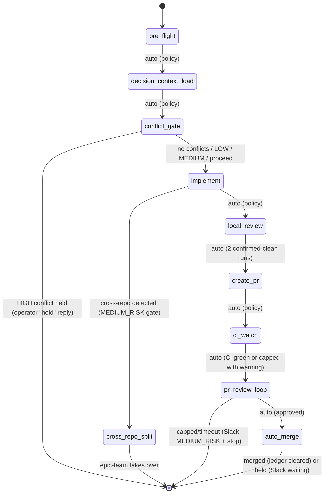

# Ticket Pipeline

> **Authoritative behavior is defined in `prompt.md`; `SKILL.md` is descriptive. When docs
> conflict, `prompt.md` wins.**

## Overview

Chain existing skills into an autonomous per-ticket pipeline: pre_flight -> decision_context_load -> conflict_gate -> implement -> local_review -> create_pr -> ci_watch -> pr_review_loop -> auto_merge. Slack notifications fire at each phase transition. Policy switches (not agent judgment) control auto-advance.

**Cross-repo detection**: When implementation touches files in multiple repos, the pipeline no longer hard-stops. Instead it invokes `decompose-epic` to create per-repo sub-tickets, posts a Slack MEDIUM_RISK gate (10-min timeout), then hands off to `epic-team` for parallel execution.

**Announce at start:** "I'm using the ticket-pipeline skill to run the pipeline for {ticket_id}."

## Auto-Detection (OMN-2614)

When no pipeline state file exists and neither `--skip-to` nor `--force-run` is specified, the
pipeline probes GitHub before the phase loop and infers the correct starting phase automatically.

**Phase inference table:**

| GitHub State | Starting Phase |
|---|---|
| Branch exists on remote, no PR | `local_review` |
| PR open, CI pending / in-progress / failing | `ci_watch` |
| PR open, CI passing, not yet approved | `pr_review_loop` |
| PR open, CI passing, approved | `auto_merge` |
| PR already merged | skip ticket (mark Done, exit) |
| No branch, no PR | `implement` (normal fresh start) |

**Behavior notes:**
- Detection runs only once on a fresh state file (no existing `state.yaml`).
- When an open PR is found, `pr_number` and `pr_url` are pre-populated into
  `phases.create_pr.artifacts` so Phase 3 detects the existing PR and skips creation.
- All phases prior to the detected start phase are marked complete with the current timestamp
  (inferred from GitHub state — no checkpoint files are created for them).
- `--skip-to PHASE` overrides auto-detection when provided explicitly.
- `--force-run` bypasses auto-detection entirely and starts from `implement`.
- If the GitHub repo slug cannot be determined, detection is skipped entirely. If individual
  queries (PR list, CI checks) fail, detection degrades gracefully — a failed CI query defaults
  to `ci_watch` (the safe choice for any open PR).

### Limitations

- **No checkpoint artifacts for skipped phases**: When auto-detection skips to (e.g.) `ci_watch`,
  prior phases are marked complete with timestamps but no checkpoint files are written.
  A subsequent `--skip-to <earlier-phase>` on the same ticket will fail checkpoint validation for those phases.
  Use `--force-run` to restart from scratch if needed.
- **Detection skipped when GitHub is unreachable**: If the repo slug cannot be determined
  or `gh` returns an auth error, detection is skipped entirely and the pipeline starts
  from `implement` (normal fresh-run behavior).

## Quick Start

```
/ticket-pipeline OMN-1234
/ticket-pipeline OMN-1234 --dry-run
/ticket-pipeline OMN-1234 --skip-to create_pr
/ticket-pipeline OMN-1234 --force-run
/ticket-pipeline OMN-1234 --auto-merge    # Skip HIGH_RISK merge gate
```

## Headless Usage

The pipeline runs without an interactive Claude Code session using `claude -p` (print mode).
This is the primary trigger surface for CLI automation, Slack bots, and webhook handlers.

### Basic invocation

```bash
claude -p "Run ticket-pipeline for OMN-1234" \
  --allowedTools "Bash,Read,Write,Edit,Glob,Grep,mcp__linear-server__*,mcp__slack__*"
```

### Required environment variables

| Variable | Purpose | Notes |
|----------|---------|-------|
| `ONEX_RUN_ID` | Unique run identifier for correlation | **Mandatory** — pipeline will not start without this |
| `ONEX_UNSAFE_ALLOW_EDITS` | Permit file edits in headless mode | Set to `1` to allow Write/Edit tools |
| `ANTHROPIC_API_KEY` | Claude API key | Required for `claude -p` |
| `GITHUB_TOKEN` | GitHub CLI auth | Required for PR creation and CI polling |
| `SLACK_BOT_TOKEN` | Slack API token | Required for gate notifications |
| `LINEAR_API_KEY` | Linear API key | Required for ticket updates |

```bash
export ONEX_RUN_ID="pipeline-$(date +%s)-OMN-1234"
export ONEX_UNSAFE_ALLOW_EDITS=1
export ANTHROPIC_API_KEY="..."
export GITHUB_TOKEN="..."
export SLACK_BOT_TOKEN="..."
export LINEAR_API_KEY="..."

claude -p "Run ticket-pipeline for OMN-1234" \
  --allowedTools "Bash,Read,Write,Edit,Glob,Grep,mcp__linear-server__*,mcp__slack__*"
```

### Authentication in headless mode

`ONEX_RUN_ID` is mandatory. It serves as the correlation key written to the pipeline ledger
(`~/.claude/pipelines/ledger.json`) and state file (`~/.claude/pipelines/{ticket_id}/state.yaml`).
Without it the pipeline cannot distinguish runs and will refuse to start.

MCP server auth is sourced from the environment at startup:
- **Linear**: `LINEAR_API_KEY` (or the credential set in `~/.claude/claude_desktop_config.json`)
- **Slack**: `SLACK_BOT_TOKEN`
- **GitHub**: `GITHUB_TOKEN` (used by the `gh` CLI, not an MCP server)

### Resume after rate limits

Checkpoints are written to `~/.claude/pipelines/{ticket_id}/state.yaml` after every phase
transition. If the `claude -p` process is interrupted (rate limit, network drop, process kill),
resume from the last completed phase:

```bash
# Resume from where the pipeline stopped
claude -p "Run ticket-pipeline for OMN-1234 --skip-to ci_watch" \
  --allowedTools "Bash,Read,Write,Edit,Glob,Grep,mcp__linear-server__*,mcp__slack__*"
```

Auto-detection (OMN-2614) will also pick up the correct phase automatically when no
`--skip-to` flag is provided and a state file already exists.

### Full pipeline flags in headless mode

```bash
# Dry run — log all decisions without committing or creating PRs
claude -p "Run ticket-pipeline for OMN-1234 --dry-run" ...

# Force restart from implement (ignores existing state and branch)
claude -p "Run ticket-pipeline for OMN-1234 --force-run" ...

# Skip HIGH_RISK merge gate (auto-merge immediately after approval)
claude -p "Run ticket-pipeline for OMN-1234 --auto-merge" ...

# Jump to a specific phase
claude -p "Run ticket-pipeline for OMN-1234 --skip-to local_review" ...
```

### Trigger surfaces

| Surface | How |
|---------|-----|
| **CLI (direct)** | `claude -p "Run ticket-pipeline for OMN-1234" --allowedTools "..."` |
| **Slack bot** | Webhook handler constructs the `claude -p` call and spawns it as a subprocess |
| **Webhook** | HTTP handler receives ticket ID, sets env vars, invokes `claude -p` |
| **Cron / CI** | Shell script iterates tickets and calls `claude -p` per ticket |

## Pipeline Flow



### Phase 0: pre_flight

- Runs pre-commit hooks + mypy on clean checkout
- Classifies pre-existing issues as AUTO-FIX or DEFER
- AUTO-FIX: <=10 files, same subsystem, low-risk → fix, commit as `chore(pre-existing): fix pre-existing issues [OMN-XXXX]`
- DEFER: creates Linear sub-ticket, notes in PR description
- AUTO-ADVANCE to Phase 0.5

### Phase 0.5: DecisionContextLoader (after intake)

After ticket intake completes and before implementation begins, the pipeline loads active
architectural decisions from the Decision Store and injects them into agent context.

**Query parameters:**
```
NodeDecisionStoreQueryCompute:
  domain: (all domains relevant to ticket repo)
  scope_services: [ticket.repo_slug]
  scope_services_mode: ANY
  epic_id: ticket.epic_id  (if set; omit if ticket has no parent epic)
  status: ACTIVE
```

**Injection format** — inject as a structured block, not prose:

```
--- ACTIVE DECISIONS ---
[TECH_STACK_CHOICE/architecture] Use Kafka for all cross-service async comms
Rationale: Decouples producers from consumers; fits existing Redpanda infra
Rejected: Direct HTTP → tight coupling | gRPC → overkill
Decision ID: <uuid>

[NAMING_CONVENTION/api] All REST endpoints use snake_case path segments
Rationale: Consistency with existing API surface
Rejected: camelCase → breaks existing client contracts
Decision ID: <uuid>
---
```

**When no decisions match scope:** inject an empty block — do not skip injection:
```
--- ACTIVE DECISIONS ---
No active decisions for this scope.
---
```

**Agent instruction:** The agent is instructed to flag any implementation choice that
contradicts an injected decision before proceeding. Contradictions trigger a Slack
`MEDIUM_RISK` notification and require human confirmation to continue.

AUTO-ADVANCE to Phase 0.6

### Phase 0.6: structural conflict gate (before implement)

Before dispatching the implementation agent, the pipeline checks whether any decisions
declared in the ticket YAML contract conflict with existing active decisions.

**Trigger condition:** ticket YAML contract contains a non-empty `decisions: []` block.

**Conflict check:**
```
For each decision in ticket.contract.decisions:
  Run check-conflicts (NodeDecisionStoreQueryCompute structural check)
  → synchronous pure function, no I/O side effects
  → returns: severity (HIGH | MEDIUM | LOW), conflicting_decision_ids, explanation
```

**Severity routing:**
- `HIGH` → post Slack `HIGH_RISK` gate (blocks pipeline):
  ```
  [HIGH_RISK] Structural conflict detected for {ticket_id}
  Decision: {new_decision_summary}
  Conflicts with: {existing_decision_id} — {existing_decision_summary}
  Explanation: {explanation}
  Reply "proceed {ticket_id}" to override, or "hold {ticket_id}" to pause.
  ```
  Pipeline waits for operator reply before continuing. "proceed" → advance to Phase 1.
  "hold" → pipeline exits with `status: held_conflict`.
- `MEDIUM` → post Slack `MEDIUM_RISK` notification, continue automatically to Phase 1
- `LOW` → log only (no Slack), continue automatically to Phase 1

**When ticket has no `decisions:` block:** skip this phase entirely, advance directly to Phase 1.

AUTO-ADVANCE to Phase 1

### Phase 1: implement

- Dispatches `ticket-work` to a polymorphic agent via `Task()` (own context window)
- Human gates still fire for questions/spec within the agent
- **Cross-repo detection** (see below): invokes `decompose-epic` and hands off to `epic-team` instead of hard-stopping
- Slack: `notification.blocked` when waiting for human input
- AUTO-ADVANCE to Phase 2 (single-repo only)

### Phase 1b: cross_repo_split (inline in orchestrator)

When cross-repo changes are detected during Phase 1:

```
ticket-pipeline OMN-XXXX
  → During Phase 1 (implement), agent detects cross-repo dependency
  [OLD] stop_on_cross_repo: true → Hard-stop: "Manual intervention required."
  [NEW] → Invoke decompose-epic to split OMN-XXXX into per-repo sub-tickets
        → Create sub-tickets in Linear (one per repo affected)
        → Post Slack MEDIUM_RISK gate (10-min timeout):
            "[MEDIUM_RISK] OMN-XXXX requires cross-repo work.
             Decomposed into N sub-tickets. Handing off to epic-team.
             Reply 'reject' within 10 min."
        → Silence (10 min): invoke epic-team with parent epic OMN-XXXX
        → epic-team assigns sub-tickets to workers in correct repos
        → ticket-pipeline exits (epic-team owns execution from here)
        → 'reject' reply: revert to hard-stop behavior, notify Slack
```

**Cross-repo detection heuristic**: Implementation touches files in repos not matching the ticket's labeled repo (from `~/.claude/epic-team/repo_manifest.yaml`).

### Phase 2: local_review

- Dispatches `local-review` to a polymorphic agent via `Task()` (own context window)
- Autonomous: loops until clean or policy limits hit
- Requires 2 consecutive confirmed-clean runs with stable run signature before advancing
- Stop on: 0 blocking issues (confirmed by 2 clean runs), max iterations, repeat issues, new major after iteration 1
- AUTO-ADVANCE to Phase 3 (only if quality gate passed: 2 confirmed-clean runs)

### Phase 3: create_pr

- Runs inline in orchestrator (lightweight git/gh operations)
- Idempotent: skips creation if PR already exists on branch
- Pre-checks: clean tree, branch tracks remote, branch name pattern, gh auth, realm/topic invariant
- Pushes branch, creates PR via `gh`, updates Linear status
- AUTO-ADVANCE to Phase 4

### Phase 4: ci_watch

**This phase is non-blocking.** Authoritative behavior is defined in `prompt.md` lines 2362–2414.

- Enables GitHub auto-merge on the PR (idempotent)
- Takes a single quick snapshot of CI checks (one `gh pr checks` call — no polling)
- If all checks are passing or pending: records `status: auto_merge_pending` and advances immediately
- If any checks are already failing: dispatches `ci-watch` as a **background agent** (`run_in_background=True`) to fix failures, then advances immediately without awaiting the result
- **Always AUTO-ADVANCES to Phase 5** — phase completes in seconds, not minutes
- `ci_watch_timeout_minutes` and `max_ci_fix_cycles` are pass-through args forwarded to the background `ci-watch` agent; they are not pipeline-blocking timers

### Phase 5: pr_review_loop

- Invokes `pr-watch` sub-skill (OMN-2524) with configured policy
- `pr-watch` polls `gh pr reviews` every 10 minutes
- Auto-invokes `pr-review-dev` on CHANGES_REQUESTED reviews, pushes fixes, re-requests review
- Returns: `status: approved | capped | timeout | failed`
- On `approved`: AUTO-ADVANCE to Phase 6
- On `capped`: Slack MEDIUM_RISK "merge blocked" + stop pipeline
- On `timeout`: Slack MEDIUM_RISK "review timeout" + stop pipeline
- On `failed`: Slack MEDIUM_RISK gate, stop pipeline

### Phase 6: auto_merge

- Invokes `auto-merge` sub-skill (OMN-2525) with configured policy
- Default (`auto_merge: false`): HIGH_RISK Slack gate requiring explicit "merge" reply
- With `--auto-merge` flag: merges immediately without gate
- All three merge conditions must be met before proceeding:
  1. CI passing (all required checks `conclusion: success`)
  2. At least 1 approved review, no current CHANGES_REQUESTED
  3. No unresolved review comments
- Returns: `status: merged | held | failed`
- On `merged`: clear ticket-run ledger entry, post Slack "merged", update Linear to Done
- On `held`: pipeline exits cleanly; `held` is **not** a terminal state — the pipeline resumes when a human replies "merge" to the Slack HIGH_RISK gate. `merge_gate_timeout_hours` (default 48h) controls how long the gate stays open before expiring. On expiry, the ledger entry is cleared and a new pipeline run is required.
- On `failed`: post Slack MEDIUM_RISK gate, stop pipeline

## Pipeline Policy

All auto-advance behavior is governed by explicit policy switches, not agent judgment:

| Switch | Default | Description |
|--------|---------|-------------|
| `policy_version` | `"5.0"` | Version the policy for forward compatibility |
| `auto_advance` | `true` | Auto-advance between phases |
| `auto_commit` | `true` | Allow local-review to commit fixes |
| `auto_push` | `true` | Allow pushing to remote branch |
| `auto_pr_create` | `true` | Allow creating PRs |
| `max_review_iterations` | `3` | Cap review loops (local + PR) |
| `stop_on_major` | `true` | Stop if new major appears after first iteration |
| `stop_on_repeat` | `true` | Stop if same issues appear twice (fingerprint-based) |
| `stop_on_cross_repo` | `false` | Auto-split via decompose-epic instead of stopping |
| `cross_repo_gate_timeout_minutes` | `10` | Minutes to wait for Slack reply before handing off to epic-team |
| `stop_on_invariant` | `true` | Stop if realm/topic naming violation detected |
| `auto_fix_ci` | `true` | Dispatch background ci-watch agent on CI failure (Phase 4) |
| `ci_watch_timeout_minutes` | `60` | Pass-through to background ci-watch agent: max minutes it waits for CI (not a pipeline-blocking timer) |
| `max_ci_fix_cycles` | `3` | Pass-through to background ci-watch agent: max fix attempts before capping |
| `auto_fix_pr_review` | `true` | Auto-invoke pr-review-dev on CHANGES_REQUESTED reviews |
| `auto_fix_nits` | `false` | Skip nit-level PR comments during auto-fix |
| `pr_review_timeout_hours` | `24` | Max hours waiting for PR approval before timeout |
| `max_pr_review_cycles` | `3` | Max pr-review-dev fix cycles before capping |
| `auto_merge` | `false` | Merge immediately without HIGH_RISK Slack gate |
| `slack_on_merge` | `true` | Post Slack notification on successful merge |
| `merge_gate_timeout_hours` | `48` | Hours to wait for explicit "merge" reply (HIGH_RISK held, no auto-advance); on expiry the ledger entry is cleared and the pipeline exits with `timeout` state requiring a new run |
| `merge_strategy` | `squash` | Merge strategy: squash \| merge \| rebase |
| `delete_branch_on_merge` | `true` | Delete branch after successful merge |

## Cross-Repo Auto-Split

**Requires**: `~/.claude/epic-team/repo_manifest.yaml` (OMN-2519)

### Detection

A cross-repo change is detected when:
1. The implementation agent reports changes in directories not matching the current repo root
2. OR `cross_repo_detector.py` identifies imports/references to modules in different repos

### Split Behavior

```
Phase 1 cross-repo detected:
  1. Stop ticket-work agent (don't commit cross-repo changes)
  2. Create parent epic if OMN-XXXX is a ticket (not already an epic)
     OR use existing parent epic ID
  3. Invoke decompose-epic --parent {parent_id} --repos {detected_repos}
     → Creates per-repo sub-tickets as children
  4. Post Slack MEDIUM_RISK gate:
       "[MEDIUM_RISK] ticket-pipeline: Cross-repo work detected for {ticket_id}
        Decomposed into {N} sub-tickets for repos: {repo_list}
        Handing off to epic-team in 10 minutes.
        Reply 'reject' to revert to hard-stop behavior."
  5. On silence (10 min): invoke epic-team {parent_epic_id}
  6. On 'reject': hard-stop with error message, clear ledger
```

### decompose-epic Dispatch for Cross-Repo

```
Task(
  subagent_type="onex:polymorphic-agent",
  description="ticket-pipeline: cross-repo split for {ticket_id}",
  prompt="Cross-repo changes detected for {ticket_id}.
    Invoke: Skill(skill=\"onex:decompose-epic\",
      args=\"{parent_epic_id} --repos {comma_separated_repo_names}\")

    Read the ModelSkillResult from ~/.claude/skill-results/{context_id}/decompose-epic.json
    Report back with: created_tickets (list), repos_affected."
)
```

## State Management

Pipeline state is stored at `~/.claude/pipelines/{ticket_id}/state.yaml` as the primary state machine. Linear ticket gets a compact summary mirror (run_id, current phase, blocked reason, artifacts).

### Ticket-Run Ledger

Prevents duplicate pipeline runs. Stored at `~/.claude/pipelines/ledger.json`:

```json
{
  "OMN-2356": {
    "active_run_id": "run-abc123",
    "started_at": "2026-02-21T14:00:00Z",
    "log": "~/.claude/pipeline-logs/OMN-2356.log"
  }
}
```

- Entry **created** when pipeline starts (Phase 0)
- Entry **cleared** when pipeline reaches terminal state (merged, failed, capped, cross-repo-split, timeout)
- `held` is a **non-terminal** waiting state (Phase 6 HIGH_RISK gate): the ledger entry is **not** cleared, preventing duplicate runs while awaiting human "merge" reply. Entry clears on merge or `merge_gate_timeout_hours` expiry.
- On new invocation: check ledger first; if entry exists → post "already running" to Slack and exit 0
- `--force-run` breaks stale lock

## Dry Run Mode

`--dry-run` executes phase logic, logs all decisions, and writes state (marked `dry_run: true`), but does NOT commit, push, create PRs, or update Linear status. Slack notifications are prefixed with `[DRY RUN]`.

## Maximum Damage Assessment

If pipeline runs unattended with `--auto-merge`, worst case:
- Pushes code to main via squash-merge — can be reverted
- Deletes feature branch — recreatable from merge commit
- Creates sub-tickets for cross-repo work — deleteable
- Hands off to epic-team for parallel execution — epic-team has its own gates
- Sends Slack notifications — ignorable

Without `--auto-merge` (default): pipeline halts at Phase 6 waiting for explicit "merge" reply.

## Supporting Modules (OMN-1970)

| Module | Location | Purpose |
|--------|----------|---------|
| `pipeline_slack_notifier.py` | `plugins/onex/hooks/lib/` | Threaded Slack notifications with correlation formatting |
| `cross_repo_detector.py` | `plugins/onex/hooks/lib/` | Detect changes spanning multiple repo roots |
| `linear_contract_patcher.py` | `plugins/onex/hooks/lib/` | Safe marker-based patching of Linear descriptions |

These modules are imported by the pipeline orchestration logic in `prompt.md`.

## Dispatch Contracts (Execution-Critical)

**This section governs how you execute the pipeline. Follow it exactly.**

You are an orchestrator. You coordinate phase transitions, state persistence, and policy checks.
You do NOT implement, review, or fix code yourself. Heavy phases run in separate agents via `Task()`.

**Rule: The coordinator must NEVER call Edit(), Write(), or Bash(code-modifying commands) directly.**
If code changes are needed, dispatch a polymorphic agent.

### Phase 0: pre_flight — runs inline (lightweight checks only)

No dispatch needed. The orchestrator runs pre-commit hooks and mypy directly, classifies issues, and auto-fixes or defers as appropriate. No Task() dispatch because pre_flight is lightweight and must complete before the first agent is spawned.

```
# Inline orchestrator actions for Phase 0:
# 1. Run: pre-commit run --all-files (capture output)
# 2. Run: mypy src/ (capture output)
# 3. Classify issues: AUTO-FIX (<=10 files, same subsystem) or DEFER (else)
# 4. AUTO-FIX: apply fixes, commit as chore(pre-existing): fix pre-existing issues [OMN-XXXX]
# 5. DEFER: create Linear sub-ticket via MCP, note in PR description template
# 6. Update state.yaml: phase=implement
# AUTO-ADVANCE to Phase 1
```

After dispatch: if `auto_fixed` is non-empty, orchestrator commits:
`git add <changed_files> && git commit -m "chore(pre-existing): fix pre-existing lint/type errors"`

### Phase 0.5: decision_context_load — runs inline (lightweight query)

No dispatch needed. The orchestrator calls `NodeDecisionStoreQueryCompute` directly and
injects the result into the shared pipeline context before Phase 1 dispatches.

```
# Inline orchestrator actions for Phase 0.5:
# 1. Call NodeDecisionStoreQueryCompute:
#      scope_services = [ticket.repo_slug]
#      scope_services_mode = ANY
#      epic_id = ticket.epic_id (omit if None)
#      status = ACTIVE
# 2. Format result as structured block (see Phase 0.5 spec above)
# 3. Store in state["phases"]["decision_context_load"]["artifacts"]["decisions_block"]
# 4. If result is empty: store "No active decisions for this scope."
# 5. Update state.yaml: phase=conflict_gate
# AUTO-ADVANCE to Phase 0.6
```

### Phase 0.6: conflict_gate — runs inline (synchronous check)

No dispatch needed. The orchestrator runs the structural conflict check synchronously
and routes based on severity before dispatching the implementation agent.

```
# Inline orchestrator actions for Phase 0.6:
# 1. If ticket.contract.decisions is empty: skip, advance to Phase 1
# 2. For each decision in ticket.contract.decisions:
#      result = check_conflicts(decision, scope=ticket.repo_slug)
#      → returns: {severity: HIGH|MEDIUM|LOW, conflicts: [...], explanation: str}
# 3. HIGH severity found:
#      Post Slack HIGH_RISK gate with conflict summary
#      Wait for operator reply: "proceed {ticket_id}" or "hold {ticket_id}"
#      "proceed" → update state, advance to Phase 1
#      "hold" → update state: phase=held_conflict, clear ledger, exit pipeline
# 4. MEDIUM severity found (no HIGH):
#      Post Slack MEDIUM_RISK notification
#      Continue automatically to Phase 1
# 5. LOW only (no HIGH/MEDIUM):
#      Log conflict summary to pipeline log
#      Continue automatically to Phase 1
# 6. Update state.yaml: phase=implement
# AUTO-ADVANCE to Phase 1
```

### Phase 1: implement — Step 0 then dispatch to polymorphic agent

Step 0 runs inline (no dispatch) to create/checkout the git branch before ticket-work.
`{branch_name}` is resolved from `state["phases"]["implement"]["artifacts"]["branch_name"]`
after Step 0 completes. ticket-work is dispatched only after Step 0 artifacts exist.

```
Task(
  subagent_type="onex:polymorphic-agent",
  description="ticket-pipeline: Phase 1 implement for {ticket_id}: {title}",
  prompt="You are executing ticket-work for {ticket_id}.
    Invoke: Skill(skill=\"ticket-work\", args=\"{ticket_id}\")

    Ticket: {ticket_id} - {title}
    Description: {description}
    Branch: {branch_name}   # Resolved from Step 0 artifacts (not a template placeholder)
    Repo: {repo_path}

    Execute the full ticket-work workflow.
    Do NOT commit changes -- the orchestrator handles git operations.
    Report back with: files changed, tests run, any blockers, cross-repo files detected."
)
```

If the agent reports cross-repo files, execute Phase 1b (cross_repo_split) inline.

### Phase 2: local_review — dispatch to polymorphic agent

```
Task(
  subagent_type="onex:polymorphic-agent",
  description="ticket-pipeline: Phase 2 local-review for {ticket_id}",
  prompt="You are executing local-review for {ticket_id}.
    Invoke: Skill(skill=\"local-review\", args=\"--max-iterations {max_review_iterations} --required-clean-runs 1\")

    Branch: {branch_name}
    Repo: {repo_path}

    Execute the local review loop.
    Report back with: iterations completed, blocking issues found, whether review passed."
)
```

### Phase 3: create_pr — runs inline (lightweight git/gh operations only)

No dispatch needed. The orchestrator runs `git push`, `gh pr create`, and Linear MCP calls directly.

### Phase 4: ci_watch — runs inline (non-blocking; background dispatch only on failure)

Phase 4 runs inline in the orchestrator. No blocking dispatch is used. See `prompt.md` lines
2362–2414 for the authoritative implementation.

The orchestrator:
1. Enables auto-merge: `gh pr merge --auto --squash {pr_number} --repo {repo}`
2. Takes a CI snapshot: `gh pr checks {pr_number} --repo {repo} --json name,state,conclusion`
3. If any checks are failing and `auto_fix_ci=true`, dispatches a **background** fix agent:

```
Task(
  subagent_type="onex:polymorphic-agent",
  run_in_background=True,
  description="ci-watch: fix CI failures for {ticket_id} PR #{pr_number}",
  prompt="CI is failing for PR #{pr_number} in {repo} ({ticket_id}).
    Invoke: Skill(skill=\"onex:ci-watch\",
      args=\"{pr_number} {repo} --max-fix-cycles {max_ci_fix_cycles} --no-auto-fix\")
    Fix any failures, push fixes. GitHub will auto-merge once CI is green."
)
```

4. Advances immediately to Phase 5 — does NOT await the background task result.

### Phase 5: pr_review_loop — dispatch to polymorphic agent

```
Task(
  subagent_type="onex:polymorphic-agent",
  description="ticket-pipeline: Phase 5 pr_review_loop for {ticket_id} on PR #{pr_number}",
  prompt="Invoke: Skill(skill=\"onex:pr-watch\",
    args=\"--pr {pr_number} --ticket-id {ticket_id} --timeout-hours {pr_review_timeout_hours} --max-review-cycles {max_pr_review_cycles}\")
    Report back with: status, pr_review_cycles_used, watch_duration_hours."
)
```

### Phase 6: auto_merge — dispatch to polymorphic agent

`merge_gate_timeout_hours` is passed to `auto-merge` to control the HIGH_RISK Slack gate lifetime.
When `auto_merge: false`, the gate waits up to `merge_gate_timeout_hours` (default 48h) for a human
"merge" reply before expiring. On expiry, the pipeline clears the ledger and a new run is required.

```
Task(
  subagent_type="onex:polymorphic-agent",
  description="ticket-pipeline: Phase 6 auto_merge for {ticket_id} on PR #{pr_number}",
  prompt="Invoke: Skill(skill=\"onex:auto-merge\",
    args=\"--pr {pr_number} --ticket-id {ticket_id}{' --auto-merge' if auto_merge else ''} --strategy {merge_strategy} --gate-timeout-hours {merge_gate_timeout_hours}\")
    Report back with: status, merged_at, branch_deleted."
)
```

---

## Detailed Orchestration

Full orchestration logic (state machine, helper functions, error handling, resume behavior)
is documented in `prompt.md`. The dispatch contracts above are sufficient to execute the pipeline.

---

## See Also

- `ticket-work` skill (Phase 1)
- `local-review` skill (Phase 2)
- `ci-watch` skill (Phase 4, OMN-2523)
- `pr-watch` skill (Phase 5, OMN-2524)
- `auto-merge` skill (Phase 6, OMN-2525)
- `pr-review-dev` skill (PR review and fix loop, used by pr-watch in Phase 5)
- `ci-failures` skill (CI diagnosis and fix, used by ci-watch in Phase 4)
- `decompose-epic` skill (cross-repo split, OMN-2522)
- `epic-team` skill (receives handoff after cross-repo split)
- `slack-gate` skill (HIGH_RISK merge gate, OMN-2521)
- `decision-store` skill (OMN-2768) — DecisionContextLoader and check-conflicts
- `NodeDecisionStoreQueryCompute` (OMN-2767) — decision query node used in Phase 0.5/0.6
- `~/.claude/epic-team/repo_manifest.yaml` (cross-repo detection, OMN-2519)
- `~/.claude/pipelines/ledger.json` (ticket-run ledger)
- Linear MCP tools (`mcp__linear-server__*`)
