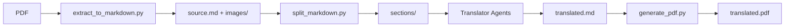

# PDF Translation Skill

Translate PDF documents between any language pair with optimized support for academic papers and documents with complex layouts.

## When to Use This Skill

Use this skill when:
- User wants to translate a PDF document to another language
- User has academic papers, research documents, or technical manuals to translate
- User needs to preserve document structure (tables, headings, lists) during translation
- User wants both Markdown and PDF output formats
- User mentions translating documents with tables, figures, or complex layouts

## Usage

```bash
/pdf-translator <pdf_path> [options]
```

### Arguments
- `<pdf_path>`: PDF file or directory containing PDFs

### Options
| Option | Description | Default |
|--------|-------------|---------|
| `--source-lang` | Source language code (auto for detection) | `auto` |
| `--target-lang` | Target language code | `ko` |
| `--output-format` | Output format (markdown/pdf/both) | `both` |
| `--output-dir` | Output directory | `./translated` |
| `--parallel` | Concurrent agents | `5` |
| `--dict` | Custom dictionary (JSON) | none |
| `--high-quality` | Use Opus model for translation | `false` |
| `--academic` | Academic document mode | `false` |
| `--term-style` | Term annotation style (parenthesis/footnote/inline) | `parenthesis` |
| `--first-occurrence` | Annotate terms only on first occurrence | `true` |
| `--describe-images` | Add AI-generated image descriptions | `false` |

### Language Codes
`ja` (Japanese), `en` (English), `ko` (Korean), `zh` (Chinese), `es` (Spanish), `fr` (French), `de` (German), `ru` (Russian), `ar` (Arabic), `he` (Hebrew), or any ISO 639-1 code.

## Examples

```bash
# Basic translation (English PDF to Korean)
/pdf-translator "/docs/manual.pdf"

# Japanese academic paper to Korean with terminology annotations
/pdf-translator "/papers/research.pdf" --source-lang ja --academic

# High-quality translation using Opus model
/pdf-translator "/papers/important.pdf" --high-quality

# Academic mode with footnote-style term annotations
/pdf-translator "/papers/thesis.pdf" --academic --term-style footnote

# Batch translation of a directory
/pdf-translator "/docs/" --target-lang ko --parallel 10

# Markdown output only
/pdf-translator "/books/novel.pdf" --output-format markdown

# Arabic RTL document to English
/pdf-translator "/docs/arabic.pdf" --source-lang ar --target-lang en
```

---

## Architecture



**Key Features**:
- Full document context preserved during translation
- Clean Markdown intermediate format (human-readable, editable)
- Section-based parallel translation for large documents
- pandoc + weasyprint for high-quality PDF output

---

## Execution Workflow

### Phase 0: Environment Setup

```bash
bash scripts/setup_env.sh
```

This installs pandoc and creates `.venv/` with Python dependencies (pymupdf, pdfplumber, weasyprint).

```bash
PYTHON=".venv/bin/python"
```

### Phase 1: Extract PDF to Markdown

```bash
WORK_DIR="/tmp/pdf_translate_$(date +%s)"
$PYTHON scripts/extract_to_markdown.py \
  --pdf "{PDF_PATH}" \
  --output-dir "$WORK_DIR" \
  --source-lang en \
  --target-lang ko
```

**Output:**
- `$WORK_DIR/source.md` - Original Markdown (preserves structure)
- `$WORK_DIR/images/` - Extracted images
- `$WORK_DIR/metadata.json` - Document metadata

### Phase 2: Split Markdown (if needed)

For large documents (>6000 tokens), split into sections:

```bash
$PYTHON scripts/split_markdown.py \
  --input "$WORK_DIR/source.md" \
  --output-dir "$WORK_DIR/sections" \
  --max-tokens 6000
```

**Output:**
- `$WORK_DIR/sections/section_001.md`
- `$WORK_DIR/sections/section_002.md`
- `$WORK_DIR/sections/sections_manifest.json`

### Phase 3: Translation

Translate each section using the Markdown translator guide (`references/translator_markdown.md`).

#### Option A: Direct Translation (Small documents)

The orchestrator translates the Markdown directly:
1. Read `source.md` (or each section)
2. Translate following `translator_markdown.md` guidelines
3. Write to `translated.md`

#### Option B: Parallel Translation (Large documents)

Spawn Task agents for each section:

```
Task(
  subagent_type: "general-purpose",
  model: "sonnet",  // or "opus" for --high-quality
  run_in_background: false,
  prompt: "Read references/translator_markdown.md for guidelines.
           Translate $WORK_DIR/sections/section_001.md from English to Korean.
           Write output to $WORK_DIR/translated/section_001.md"
)
```

### Phase 4: Merge Translated Sections

If split, merge translated sections:

```bash
cat $WORK_DIR/translated/section_*.md > $WORK_DIR/translated.md
```

### Phase 5: Generate PDF

```bash
$PYTHON scripts/generate_pdf.py \
  --markdown "$WORK_DIR/translated.md" \
  --output "$OUTPUT_DIR/{filename}_translated.pdf"
```

### Phase 6: Validation (Optional)

Review output for:
- Markdown formatting preserved
- Tables rendered correctly
- Images referenced properly
- No untranslated text

---

## Model Selection

### Default (no flags)
| Task | Model |
|------|-------|
| Markdown translation | Sonnet |
| Validation | Haiku |

### With `--high-quality`
| Task | Model |
|------|-------|
| Markdown translation | Opus |
| Validation | Sonnet |

---

## Academic Mode (`--academic`)

When enabled:
- Technical terms include original language in parentheses
- Abbreviations expanded on first occurrence
- Citations and references preserved
- Formal academic writing style maintained

### Term Annotation Styles (`--term-style`)

| Style | Example |
|-------|---------|
| `parenthesis` | 기계 학습(Machine Learning) |
| `footnote` | 기계 학습¹ |
| `inline` | 기계 학습/Machine Learning |

### First Occurrence (`--first-occurrence`)

When `true` (default):
- First mention: 기계 학습(Machine Learning)
- Subsequent: 기계 학습

When `false`:
- All mentions include original term

---

## Language-Specific Processing

| Source | Special Handling |
|--------|------------------|
| Japanese | Vertical→horizontal writing, ruby tag removal |
| Chinese | Traditional/simplified handling, vertical→horizontal |
| Arabic/Hebrew | RTL→LTR conversion, text direction adjustment |
| English | Standard processing |

| Target | Special Handling |
|--------|------------------|
| Korean | Translationese removal, natural expression check |

---

## Custom Dictionary (Optional)

**The translator works without external dictionary files.** It naturally translates based on context.

Use custom dictionaries ONLY for:
- **Proper nouns**: names, places, organizations, brands
- **Document-specific terms**: proprietary terms unique to this document

**Do NOT add common words** - let the translator handle them naturally.

### Creating a Custom Dictionary

Use the `--dict` option with a JSON file:

```json
{
  "metadata": {
    "source_language": "en",
    "target_language": "ko",
    "document_title": "Annual Report 2024"
  },
  "proper_nouns": {
    "names": { "John Smith": "존 스미스" },
    "places": { "Silicon Valley": "실리콘밸리" },
    "organizations": { "OpenAI": "OpenAI" }
  },
  "domain_terms": {
    "ProprietaryTech": "고유 기술명"
  },
  "preserve_original": {
    "terms": ["API", "GPU", "URL"]
  },
  "abbreviations": {
    "LLM": "Large Language Model"
  },
  "style_notes": {
    "notes": ""
  }
}
```

### Templates

| Template | Use Case |
|----------|----------|
| [assets/template.json](assets/template.json) | General documents |
| [assets/template_academic.json](assets/template_academic.json) | Academic papers, technical documents |

---

## Work Directory Structure

```
$WORK_DIR/
├── source.md               # Original Markdown (extracted from PDF)
├── metadata.json           # Document metadata (title, pages, languages)
├── images/                 # Extracted images
│   ├── page001_img000.png
│   ├── page002_img000.png
│   └── ...
├── sections/               # Split sections (for large documents)
│   ├── section_001.md
│   ├── section_002.md
│   └── sections_manifest.json
├── translated/             # Translated sections
│   ├── section_001.md
│   ├── section_002.md
│   └── ...
└── translated.md           # Final merged translation
```

---

## Error Handling

| Error | Action |
|-------|--------|
| PDF extraction failure | Skip corrupted file, report |
| Translation timeout | Retry with smaller chunks |
| Table extraction failure | Treat as text block |
| Layout preservation failure | Fallback to Markdown only |
| Low quality score | Re-translate with Opus |

---

## Text Processing

The following automatic text cleanup is applied during extraction and output generation:

| Issue | Fix Applied |
|-------|-------------|
| Corrupted characters (●) | Restored to parentheses |
| Broken URLs (spaces) | Spaces removed, domains fixed |
| Missing @ in emails | Restored based on pattern |
| Artifact text (a1111111111) | Filtered out |
| Small images (logos, icons) | Filtered (min 200x100) |
| Page headers/footers | Auto-detected and removed |
| Superscript numbers | Converted to `^[n]` format |
| Reference section | Auto-formatted with merged entries |
| Concatenated words | Split using wordninja (`thepatient` → `the patient`) |
| Reversed text | Detected and corrected (`rewol` → `lower`) |
| Missing punctuation spaces | Added (`text.Next` → `text. Next`) |
| Table text spacing | Improved with x_tolerance parameter |

### PDF Extraction Error Correction

Some complex PDF artifacts cannot be fully corrected during extraction. The translator prompts include instructions to recognize and correct remaining errors:
- Split medical/scientific terms: `broncho alveolar` → `bronchoalveolar`
- Single-letter fragments: `Diaphragm a tic` → `Diaphragmatic`

See `references/translator_markdown.md` and `references/translator_academic.md` for details.

### Header/Footer Detection

Automatically detects and removes common header/footer patterns:
- DOI links (`https://doi.org/...`)
- Journal volume/issue patterns (`Journal| (2024) 16:642`)
- Page numbers (standalone numbers at page boundaries)
- Date stamps (`Received: 23 July 2024`)
- Copyright notices

### Superscript Handling

Reference numbers and author affiliations are detected by font size and converted to standard format:
- `word¹` → `word^[1]`
- `Author¹,²` → `Author^[1,2]`

### Reference Section Processing

Multi-language support for reference section headers:
- English: References, Bibliography, Works Cited
- Korean: 참고문헌
- German: Literatur, Literaturverzeichnis
- French: Références, Bibliographie
- Chinese/Japanese: 参考文献

### List Detection

Automatically detects and formats various list styles:
- Bullet: `•`, `·`, `-`, `*`, `▪`, `▸`, `►`
- Numbered: `1.`, `1)`, `(1)`, `①`
- Roman: `i.`, `ii.`, `iii.`
- Letter: `a.`, `a)`, `(a)`

---

## Output Formats

### Markdown Output
- Preserves document structure (headings, paragraphs, lists)
- Tables converted to Markdown tables
- URLs converted to clickable links
- Metadata in YAML frontmatter

### PDF Output
- Generated via pandoc + weasyprint from Markdown
- Clean text rendering with system fonts (Pretendard preferred)
- Proper table rendering with borders and headers
- Clickable links with styling
- Page numbers at bottom

---

## File Reference

| Path | Description |
|------|-------------|
| `SKILL.md` | This file |
| `references/orchestrator.md` | Orchestrator workflow guide |
| `references/translator_markdown.md` | Markdown translation guidelines |
| `references/translator_academic.md` | Academic document translation |
| `references/validator_generic.md` | Generic validation instruction |
| `references/validator_ko.md` | Korean-specific validation |
| `scripts/setup_env.sh` | Environment setup (installs pandoc, Python dependencies) |
| `scripts/extract_to_markdown.py` | PDF extraction to Markdown with images |
| `scripts/split_markdown.py` | Split large Markdown into sections by token count |
| `scripts/generate_pdf.py` | PDF output generation (Markdown → PDF via pandoc + weasyprint) |
| `assets/template.json` | Dictionary template for general documents |
| `assets/template_academic.json` | Dictionary template for academic documents |

---

## Known Limitations

PDF extraction has inherent limitations due to the format's nature:

| Limitation | Description | Workaround |
|------------|-------------|------------|
| Figure text extraction | Text inside charts/graphs/diagrams may be extracted as body text | Manual review of figure areas |
| Complex table structures | Tables with merged cells or nested structures may not parse correctly | Tables extracted as best-effort Markdown |
| Multi-column layouts | Two-column academic papers may have text order issues | Usually handled correctly, but verify flow |
| Scanned PDFs | Image-based PDFs require OCR (not included) | Use OCR tools first, then translate |
| Mathematical formulas | LaTeX/MathML may not render perfectly | Formulas preserved as-is when possible |

### Quality Expectations

- **Academic papers**: 85-95% accuracy on text extraction
- **Technical manuals**: 80-90% accuracy
- **Complex layouts**: 70-85% accuracy (flowcharts, multi-column)
- **Tables**: Variable (depends on structure complexity)

For best results with complex documents, review the extracted `source.md` before translation and manually correct any extraction errors.
