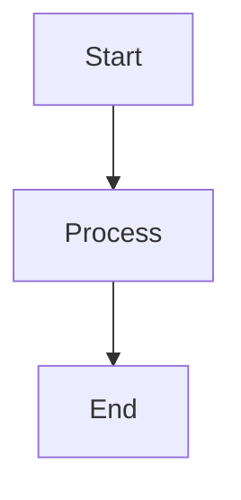
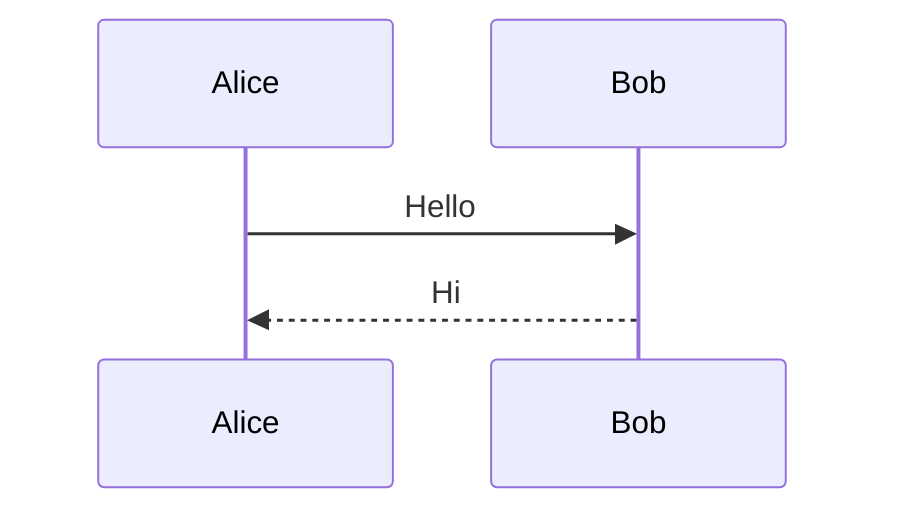
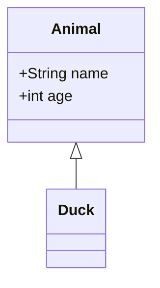
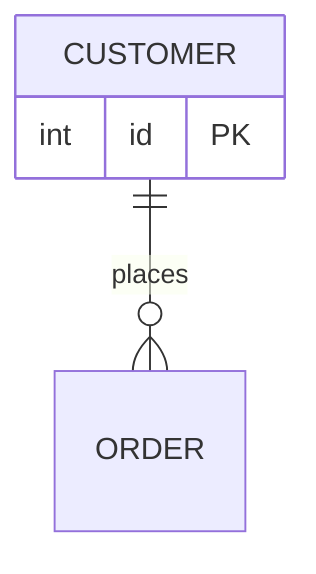
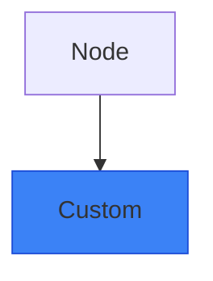
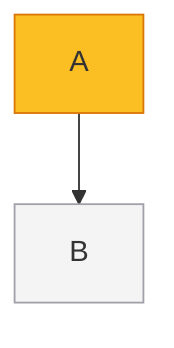
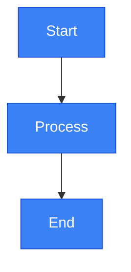
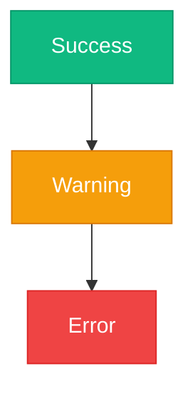
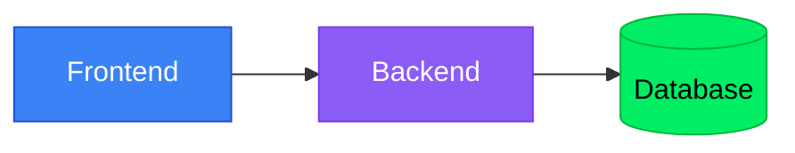

# Beautiful Mermaid Diagrams

## Conventions

- MUST use English for all text in the diagram.

## Quick syntax reference

### Flowcharts

### Sequence diagrams

### Class diagrams

### ER diagrams

## Diagram types by use case

| Use case         | Diagram type      | Keywords                        |
| ---------------- | ----------------- | ------------------------------- |
| Process flows    | `graph TD/LR`     | journeys, algorithms, workflows |
| API interactions | `sequenceDiagram` | requests, OAuth, transactions   |
| System design    | `classDiagram`    | models, MVC, patterns           |
| Database schemas | `erDiagram`       | entities, relationships, tables |
| State machines   | `stateDiagram-v2` | lifecycle, workflows, states    |

## Common shapes

| Shape     | Syntax     | Description          |
| --------- | ---------- | -------------------- |
| Rectangle | `[text]`   | Default node         |
| Rounded   | `(text)`   | Rounded corners      |
| Diamond   | `{text}`   | Decision/condition   |
| Stadium   | `([text])` | Start/end/process    |
| Circle    | `((text))` | Endpoint             |
| Database  | `[(text)]` | Data store           |
| Hexagon   | `{{text}}` | Alternative decision |

## Edge styles

| Style    | Syntax | Use case        |
| -------- | ------ | --------------- |
| Solid    | `-->`  | Default flow    |
| Dotted   | `-.->` | Optional/dashed |
| Thick    | `==>`  | Highlighted     |
| No arrow | `---`  | Related only    |

## Examples by type

| Diagram type      | Examples                                                         |
| ----------------- | ---------------------------------------------------------------- |
| Flowcharts        | [reference/flowcharts.md](reference/flowcharts.md)               |
| Sequence diagrams | [reference/sequence-diagrams.md](reference/sequence-diagrams.md) |
| Class diagrams    | [reference/class-diagrams.md](reference/class-diagrams.md)       |
| ER diagrams       | [reference/er-diagrams.md](reference/er-diagrams.md)             |
| State diagrams    | [reference/state-diagrams.md](reference/state-diagrams.md)       |

## Styling options

### Inline styles

### Class definitions

## Preset color themes

### Semantic colors

Use colors to convey meaning consistently across diagrams.

| Color         | Hex                   | Meaning             | Use for                        |
| ------------- | --------------------- | ------------------- | ------------------------------ |
| Green         | `#10b981` / `#059669` | Success, positive   | Completed, approved, active    |
| Red           | `#ef4444` / `#dc2626` | Error, danger       | Failed, rejected, error states |
| Yellow/Orange | `#f59e0b` / `#d97706` | Warning, caution    | Pending, review needed, alerts |
| Blue          | `#3b82f6` / `#1d4ed8` | Information, action | Links, processes, buttons      |
| Gray          | `#6b7280`             | Neutral, disabled   | Inactive, optional, background |

### Database brand colors

Use brand colors for common database systems.

| Database      | Shape      | Brand Color      | Example               |
| ------------- | ---------- | ---------------- | --------------------- |
| MongoDB       | `[(name)]` | Green `#00ED64`  | `DB[(MongoDB)]`       |
| PostgreSQL    | `[(name)]` | Blue `#4169E1`   | `DB[(PostgreSQL)]`    |
| MySQL         | `[(name)]` | Orange `#F29111` | `DB[(MySQL)]`         |
| Redis         | `[(name)]` | Red `#DC382D`    | `DB[(Redis)]`         |
| Elasticsearch | `[(name)]` | Yellow `#F4B400` | `DB[(Elasticsearch)]` |
| SQLite        | `[(name)]` | Blue `#003B57`   | `DB[(SQLite)]`        |

### Quick theme presets

Copy these classDef statements for common themes.

**Modern blue theme** (default for most diagrams):

**Status theme** (success/warning/error):

**Architecture theme** (frontend/backend/data layers):

