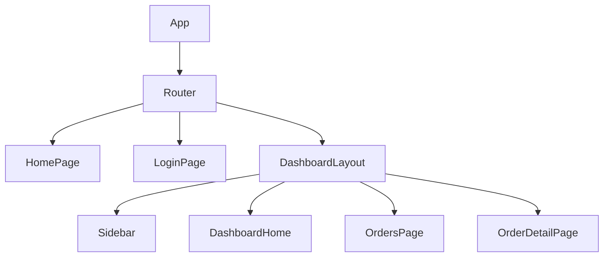

# Analyzing Frontend Layer

**Output:** `docs/unwind/layers/frontend/` (folder with index.md + section files)

**Principles:** See `analysis-principles.md` - completeness, machine-readable, link to source, no commentary, incremental writes.

## Output Structure

```
docs/unwind/layers/frontend/
├── index.md           # Route overview, page count, tech stack
├── routes.md          # Routing structure
├── pages.md           # Page purposes and user flows [MUST]
├── state.md           # State management
└── api-hooks.md       # API integration points
```

For large codebases (20+ pages), split by feature:
```
docs/unwind/layers/frontend/
├── index.md
├── auth-feature.md
├── dashboard-feature.md
└── ...
```

## Process (Incremental Writes)

**Step 1: Setup**
```bash
mkdir -p docs/unwind/layers/frontend/
```
Write initial `index.md`:
```markdown
# Frontend Layer

## Sections
- [Routes](routes.md) - _pending_
- [Pages](pages.md) - _pending_
- [State](state.md) - _pending_
- [API Hooks](api-hooks.md) - _pending_

## Summary
_Analysis in progress..._
```

**Step 2: Analyze and write routes.md**
1. Find route definitions
2. Document URL patterns and nesting
3. Write `routes.md` immediately
4. Update `index.md`

**Step 3: Analyze and write pages.md** [MUST - Focus on WHAT not HOW]
1. Document page purposes and user flows
2. List permission gates and API dependencies
3. Write `pages.md` immediately
4. Update `index.md`

**Step 4: Analyze and write state.md**
1. Find state management (store, slices, atoms)
2. Document what state persists
3. Write `state.md` immediately
4. Update `index.md`

**Step 5: Analyze and write api-hooks.md**
1. Find API client/hooks
2. Document endpoints consumed
3. Write `api-hooks.md` immediately
4. Update `index.md`

**Step 6: Finalize index.md**
Add tech stack, page count, component tree

## Output Format

```markdown
# Frontend Layer

## Technology Stack

```json
{
  "framework": "react",
  "version": "18.2.0",
  "language": "typescript",
  "stateManagement": "redux-toolkit",
  "routing": "react-router-dom",
  "styling": "tailwind",
  "build": "vite"
}
```

Source: [package.json](https://github.com/owner/repo/blob/main/package.json)

## Routes

[routes.tsx](https://github.com/owner/repo/blob/main/src/router/routes.tsx)

```tsx
export const routes: RouteObject[] = [
  { path: '/', element: <HomePage /> },
  { path: '/login', element: <LoginPage /> },
  {
    path: '/dashboard',
    element: <ProtectedRoute><DashboardLayout /></ProtectedRoute>,
    children: [
      { index: true, element: <DashboardHome /> },
      { path: 'orders', element: <OrdersPage /> },
      { path: 'orders/:id', element: <OrderDetailPage /> },
    ]
  },
  { path: '*', element: <NotFoundPage /> }
];
```

## Components

### UserDashboard

[UserDashboard.tsx](https://github.com/owner/repo/blob/main/src/pages/Dashboard/UserDashboard.tsx)

```tsx
export function UserDashboard() {
  const { user } = useAuth();
  const { data: orders, isLoading } = useOrders();

  if (isLoading) return <Spinner />;

  return (
    <div className="p-6">
      <h1>Welcome, {user.name}</h1>
      <OrdersTable orders={orders} />
    </div>
  );
}
```

[Continue for ALL components...]

## State Management

### Store Configuration

[store.ts](https://github.com/owner/repo/blob/main/src/store/store.ts)

```tsx
export const store = configureStore({
  reducer: {
    auth: authReducer,
    ui: uiReducer,
    [api.reducerPath]: api.reducer,
  },
  middleware: (getDefault) => getDefault().concat(api.middleware),
});
```

### Auth Slice

[authSlice.ts](https://github.com/owner/repo/blob/main/src/store/authSlice.ts)

```tsx
interface AuthState {
  user: User | null;
  token: string | null;
  isAuthenticated: boolean;
}

const authSlice = createSlice({
  name: 'auth',
  initialState: { user: null, token: null, isAuthenticated: false },
  reducers: {
    setCredentials: (state, action: PayloadAction<{ user: User; token: string }>) => {
      state.user = action.payload.user;
      state.token = action.payload.token;
      state.isAuthenticated = true;
    },
    logout: (state) => {
      state.user = null;
      state.token = null;
      state.isAuthenticated = false;
    },
  },
});
```

[Continue for ALL slices...]

## API Hooks

[api.ts](https://github.com/owner/repo/blob/main/src/api/api.ts)

```tsx
export const api = createApi({
  baseQuery: fetchBaseQuery({
    baseUrl: '/api/v1',
    prepareHeaders: (headers, { getState }) => {
      const token = (getState() as RootState).auth.token;
      if (token) headers.set('authorization', `Bearer ${token}`);
      return headers;
    },
  }),
  endpoints: (builder) => ({
    getUser: builder.query<User, void>({
      query: () => '/users/me',
    }),
    getOrders: builder.query<Order[], void>({
      query: () => '/orders',
    }),
    createOrder: builder.mutation<Order, CreateOrderRequest>({
      query: (body) => ({ url: '/orders', method: 'POST', body }),
    }),
  }),
});

export const { useGetUserQuery, useGetOrdersQuery, useCreateOrderMutation } = api;
```

## Component Tree



## Unknowns

- [List anything unclear]
```

## Additional Requirements

### Focus on WHAT, not HOW

The goal is to enable rebuild in ANY framework. Prioritize documenting functionality over implementation.

### MUST Document (Essential for Feature Parity)

| Category | What to Document | Example |
|----------|------------------|---------|
| **User Flows** | What users can do, step by step | "User creates budget → selects calendar → adds positions → publishes" |
| **Page Purposes** | What each page accomplishes | "BudgetViewPage: View, edit, compare budgets" |
| **State Persistence** | What state survives refresh | "Auth token, selected org, theme preference" |
| **Permission Gates** | What requires authorization | "Budget publish requires admin role" |
| **API Interactions** | What data is fetched/mutated | "Page fetches /api/budgets on mount" |

### SHOULD Document (Valuable Patterns)

| Category | What to Document |
|----------|------------------|
| Component hierarchy | Parent-child relationships |
| Route structure | URL patterns and nesting |
| Error boundaries | How errors are caught and displayed |
| Loading states | What users see during fetches |

### DON'T Document (Tech-Specific)

| Category | Why to Omit |
|----------|-------------|
| CSS class names | Framework-specific (Tailwind, etc.) |
| React hook implementations | Can use different state management |
| Component library usage | DaisyUI, MUI, etc. are choices |
| Build configuration | Vite, Webpack are tools |

### Page Documentation Format

```markdown
### BudgetViewPage [MUST]

**Purpose:** View and edit budget allocations with comparison to snapshots

**User Flow:**
1. Select calendar and period filters
2. View position-team allocation grid
3. Edit allocations (if draft status)
4. Compare to snapshot (optional)
5. Publish budget (admin only)

**Permissions:**
- View: manager, admin, owner
- Edit: admin, owner (draft only)
- Publish: admin, owner

**API Dependencies:**
- GET /api/budgets/:id
- PUT /api/budgets/:id
- GET /api/snapshots (for comparison)
```

## Mandatory Tagging

**Every page, flow, and state requirement must have a [MUST], [SHOULD], or [DON'T] tag in its heading.**

Default categorizations for frontend layer:
- **[MUST]**: User flows, page purposes, permission requirements, API dependencies
- **[SHOULD]**: State management patterns, loading states, error boundaries
- **[DON'T]**: CSS class names, component library usage, build configuration

Example:
```markdown
### LoginPage [MUST]
### UserRegistrationFlow [MUST]
### AuthStore [SHOULD]
### TailwindClasses [DON'T]
```

See `analysis-principles.md` section 9 for full tagging rules.

## Refresh Mode

If `docs/unwind/layers/frontend/` exists, compare current state and add `## Changes Since Last Review` section to `index.md`.
