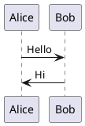

# Code Audit Skill

This skill guides a structured, bottom-up code audit process that produces clear documentation with PlantUML diagrams.

## Quick Reference

| Phase | Action |
|-------|--------|
| 0 | Initialize or resume audit |
| 1 | Define scope (boundaries, aspects) |
| 2 | Analyze components bottom-up |
| 3 | Synthesize findings into docs/diagrams |
| 4 | Human review and finalization |

## Invocation

All audits are stored in `code-audits/` relative to the current working directory.

**Directory naming**: `code-audits/<system-title>-YYMMDD/`
- Example: `code-audits/redemption-service-250106/`

When invoked:
1. Check `code-audits/` for existing audits with `state.json`
2. If found, list them and offer to resume
3. If starting fresh, ask for a short system title (kebab-case), then create directory

## Output Directory Structure

```
<audit-dir>/
├── state.json           # Tracks progress for resumption
├── index.md             # Main audit index (created in Phase 3)
├── boundaries.md        # Scope definition (created in Phase 1)
├── entry-points.md      # System entry points (created in Phase 3)
├── techdebt.md          # TODOs and technical debt (created in Phase 3)
├── components/          # Per-file summaries (created in Phase 2)
├── aspects/             # Cross-cutting concerns (created in Phase 3)
├── diagrams/            # PlantUML source files (created in Phase 3)
└── generated/           # Post-processed with SVGs (created in Phase 4)
```

## State File Format

```json
{
  "version": 1,
  "title": "redemption-service",
  "phase": "scoping|discovery|synthesis|review|complete",
  "boundaries": {
    "directories": ["app/services/**"],
    "files": [],
    "excludes": ["**/*_test.rb", "**/*.spec.ts"]
  },
  "aspects": ["error-handling", "retry-patterns", "execution-contexts", "authorization"],
  "components": {
    "app/services/foo.rb": {
      "status": "pending|in_progress|complete",
      "summary_file": "components/app-services-foo.md"
    }
  },
  "checkpoint_interval": 5,
  "created_at": "2024-01-01T00:00:00Z",
  "updated_at": "2024-01-01T00:00:00Z"
}
```

## Required Focus Areas

Every audit MUST document these cross-cutting concerns:

1. **Error Handling** - How errors are caught, propagated, logged, and recovered from
2. **Retry Patterns** - Any retry logic, backoff strategies, idempotency handling
3. **Execution Contexts** - How code is invoked (web request, background job, scheduler, CLI, etc.)
4. **Authorization** - Access control, permission checks, authentication requirements
5. **Testing Patterns** - Test coverage approach, test types used, mocking strategies, what's tested vs. not
6. **Database Patterns** - Transactions, queries, migrations, connection management, N+1 risks
7. **Configuration & Secrets** - Environment variables, feature flags, secrets management, config loading
8. **Logging & Observability** - Log levels, structured logging, tracing, metrics, health checks
9. **Concurrency & Thread Safety** - Locks, async patterns, race condition risks, thread pools
10. **External Integrations** - API clients, webhooks, third-party services, failure handling

## Phase Workflow

See `workflow.md` for detailed instructions on each phase. 
Use subagents/tasks for individual, isolated task execution to maintain efficient context.

### Phase 0: Initialize/Resume

1. Check for existing audits in `code-audits/`:
   - Look for directories containing `state.json`
   - If found, list them with their phase and progress
   - Offer to resume any incomplete audit

2. If resuming:
   - Read and parse `state.json`
   - Jump to the current phase

3. If starting fresh:
   - Ask for a short system title (kebab-case, e.g., "redemption-service")
   - Generate directory name: `code-audits/<title>-YYMMDD/`
   - Create directory structure:
     ```
     mkdir -p code-audits/<title>-YYMMDD/{components,aspects,diagrams,generated}
     ```
   - Initialize `state.json` with phase="scoping"
   - Proceed to Phase 1

### Phase 1: Scoping

Use `AskUserQuestion` to gather:

1. **Boundaries**: Which directories/files to include
   - Accept glob patterns (e.g., `app/services/**/*.rb`)
   - Can be specific files or broad directories

2. **Excludes**: What to skip
   - Tests, generated files, vendor code, etc.

3. **Additional Aspects**: Beyond the 4 required ones
   - Performance patterns, caching, external integrations, etc.

Then:
- Write `boundaries.md` documenting the scope
- Update `state.json` with boundaries and aspects
- Set phase to "discovery"

### Phase 2: Discovery (Bottom-Up)

1. Enumerate all files matching boundaries (respecting excludes)
2. Register each in `state.json` with status "pending"
3. Use `TodoWrite` to track progress

For each file:
1. Mark "in_progress" in state
2. Read and analyze the code
3. Create component summary in `components/` using the template
4. Mark "complete" in state
5. Every N files (checkpoint_interval), pause and ask user to verify

When all components complete:
- Update phase to "synthesis"

### Phase 3: Synthesis

1. Read all component summaries
2. Identify patterns across components
3. Create aspect documentation:
   - `aspects/error-handling.md`
   - `aspects/retry-patterns.md`
   - `aspects/execution-contexts.md`
   - `aspects/authorization.md`
   - `aspects/testing-patterns.md`
   - `aspects/database-patterns.md`
   - `aspects/configuration-secrets.md`
   - `aspects/logging-observability.md`
   - `aspects/concurrency-thread-safety.md`
   - `aspects/external-integrations.md`
   - Plus any user-specified aspects

4. Create `entry-points.md` documenting:
   - Where external requests enter the system (routes, endpoints, CLI)
   - Background job entry points
   - Scheduled task triggers
   - Event/webhook handlers
   - Recommended reading order for newcomers

5. Create `techdebt.md` consolidating:
   - TODOs and FIXMEs found in code
   - Deprecated patterns still in use
   - Known issues and workarounds
   - Suggested improvements from component analysis

6. Design PlantUML diagrams:
   - Architecture overview (component relationships)
   - Data flow diagrams (how data moves through system)
   - Sequence diagrams (for key flows)
   - State diagrams (where relevant)

7. Write `index.md` tying everything together

8. Update phase to "review"

### Phase 4: Review

1. Present audit summary to user
2. Walk through each aspect
3. Show diagram previews (describe what they show)
4. Allow corrections/additions
5. Run the render script automatically:
   ```bash
   ~/.claude/skills/audit/scripts/render-puml.sh <audit-dir>
   ```
6. Mark phase as "complete"

## Diagram Guidelines

### Embedding in Markdown

Small diagrams can be embedded directly:

~~~markdown

~~~

### Separate Files

Larger diagrams go in `diagrams/`:
- Reference in markdown: ``

### Supported Types

- `@startuml` / `@enduml` - class, sequence, activity, component
- `@startmindmap` / `@endmindmap` - hierarchical views
- `@startwbs` / `@endwbs` - work breakdown structures
- `@startjson` / `@endjson` - data structure visualization

### Valid Colors

PlantUML only supports specific color names. Use these valid colors:

| Category | Valid Colors |
|----------|--------------|
| Basic | Red, Green, Blue, Yellow, Orange, Purple, Pink, Cyan, Magenta, White, Black, Gray |
| Light | LightBlue, LightGreen, LightYellow, LightGray, LightPink, LightCyan, LightCoral, LightSalmon |
| Purple variants | Lavender, Plum, Violet, Orchid, MediumPurple, DarkViolet, Indigo, Thistle |
| Other | Aqua, Beige, Coral, Crimson, Gold, Khaki, Lime, Maroon, Navy, Olive, Silver, Teal, Tomato |

**Invalid colors to avoid**: LightPurple, LightOrange, LightRed (use alternatives above)

You can also use hex codes: `#E6E6FA` (lavender), `#DDA0DD` (plum), `#EE82EE` (violet)

## Templates

Use templates from `templates/` directory for consistency:
- `templates/index.md` - Main audit index
- `templates/component.md` - Per-file component summary
- `templates/aspect.md` - Cross-cutting concern documentation
- `templates/entry-points.md` - System entry points documentation
- `templates/techdebt.md` - Technical debt tracking

## Render Script

The `scripts/render-puml.sh` script:
- Uses Docker (`plantuml/plantuml` image)
- Converts `.puml` files to SVG
- Processes markdown files to replace plantuml blocks/references with SVG
- Outputs to `generated/` directory

Usage:
```bash
~/.claude/skills/audit/scripts/render-puml.sh /path/to/audit
```
