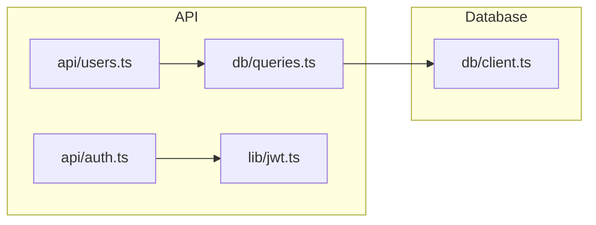

# Codebase Context Generator

## Purpose

Generate context files that help AI agents understand your codebase without blind exploration:

| File | Purpose | Format |
|------|---------|--------|
| `codebase-context.md` | Human-readable project overview | Markdown |
| `code-index.json` | Fast lookups for concepts, exports, types | JSON |
| `deps.mermaid` | Dependency graph for tracing imports | Mermaid |

## Quick Start

Run the extraction scripts to generate machine-readable context:

```bash
# Generate all context files (code-index.json, deps.mermaid, deps.json)
~/.claude/skills/codebase-context/scripts/generate-all.sh .

# Or run individually:
~/.claude/skills/codebase-context/scripts/generate-code-index.sh .
~/.claude/skills/codebase-context/scripts/generate-deps.sh . mermaid
```

Then use the skill to generate the human-readable context:
```
/codebase-context
```

## When to Use

- Setting up a new project for AI-assisted development
- After significant architectural changes
- When onboarding new team members who use AI tools
- When agents are spending too many tokens exploring the codebase
- When staleness check indicates context is outdated

---

## Integration with CLAUDE.md

### Recommended: Progressive Disclosure

Add a **single reference line** in your project's `CLAUDE.md`:

```markdown
For full project structure and workflows, see `.claude/codebase-context.md`.
```

This lets agents discover the context file when they need to explore, without forcing it to load on every request.

### Why NOT to use "CRITICAL: Read First" blocks

Earlier versions of this skill recommended adding a mandatory preload block at the top of CLAUDE.md:

```markdown
## CRITICAL: Read Codebase Context First
BEFORE using Glob, Grep, or exploring the codebase, you MUST read...
```

**This approach has problems:**

1. **Token waste on targeted tasks** — A request like "fix this typo in RecipeDetailScreen" doesn't need 400 lines of project structure loaded into context.
2. **Competes with instruction budget** — LLMs can follow ~150-200 instructions consistently. Every line of context displaces task-specific instructions.
3. **Staleness risk** — File paths change constantly. Stale paths in mandatory context actively mislead the agent, which is worse than no context.
4. **Defeats progressive disclosure** — In monorepos, Claude Code already merges `CLAUDE.md` files from root down to the working directory. Package-level files give you free progressive disclosure.

### For Monorepos

Use package-level `CLAUDE.md` files instead of cramming everything into root:

```
CLAUDE.md                  # Project overview, commands, rules (~50 lines)
apps/mobile/CLAUDE.md      # Mobile patterns, design system, workflows
apps/api/CLAUDE.md         # API conventions, DB patterns, auth flow
```

Each file only loads when working in that directory.

---

## Lessons Learned: Keeping Context Lean

Based on real-world usage, here's what works and what doesn't in context files:

### What to include

| Content | Why |
|---------|-----|
| One-line project description | Anchors every agent decision |
| Directory tree (top 2-3 levels) | Shows structure without file-path brittleness |
| Domain concepts/vocabulary | Stable across refactors, prevents misunderstandings |
| Key workflows (1 line each) | Shows how features connect |
| Patterns and conventions | Prevents style drift |
| Gotchas | Saves debugging time |

### What to leave out

| Content | Why |
|---------|-----|
| Environment variable examples | Sensitive, discoverable from `.env.example` |
| Code snippets/API usage examples | Go stale fast, agent can read the actual code |
| Full file listings per screen/feature | Too granular, changes frequently |
| App Store / deployment details | Rarely relevant to coding tasks |
| Marketing site info | Not relevant to development |
| Build/deploy commands beyond basics | Discoverable from `package.json` |

### Target size

Aim for **80-150 lines** in `codebase-context.md`. If it's over 200, you're probably including things that belong in package-level `CLAUDE.md` files or separate docs.

---

## Staleness Detection

Before reading codebase-context.md, check if it's stale by running:

```bash
.claude/check-context-freshness.sh
```

If the script exits non-zero or prints "STALE", regenerate the context.

### How Staleness Detection Works

When generating context, also create `.claude/codebase-context.snapshot` containing:
- Directory tree hash (top 3 levels)
- Key config file checksums (package.json, tsconfig.json, etc.)
- Generation timestamp

The freshness check compares current state against the snapshot.

### Generate the Freshness Check Script

After generating codebase-context.md, create `.claude/check-context-freshness.sh`:

```bash
#!/bin/bash
# Check if codebase-context.md needs regeneration

SNAPSHOT_FILE=".claude/codebase-context.snapshot"
CONTEXT_FILE=".claude/codebase-context.md"

if [ ! -f "$CONTEXT_FILE" ]; then
    echo "STALE: No context file found"
    exit 1
fi

if [ ! -f "$SNAPSHOT_FILE" ]; then
    echo "STALE: No snapshot file found"
    exit 1
fi

CURRENT_TREE=$(find . -maxdepth 3 -type d -not -path '*/\.*' -not -path './node_modules*' -not -path './dist*' -not -path './build*' -not -path './.next*' 2>/dev/null | sort | md5sum | cut -d' ' -f1)
STORED_TREE=$(grep "^tree:" "$SNAPSHOT_FILE" 2>/dev/null | cut -d' ' -f2)

if [ "$CURRENT_TREE" != "$STORED_TREE" ]; then
    echo "STALE: Directory structure changed"
    exit 1
fi

for CONFIG in package.json tsconfig.json pyproject.toml Cargo.toml go.mod; do
    if [ -f "$CONFIG" ]; then
        CURRENT_HASH=$(md5sum "$CONFIG" 2>/dev/null | cut -d' ' -f1)
        STORED_HASH=$(grep "^$CONFIG:" "$SNAPSHOT_FILE" 2>/dev/null | cut -d' ' -f2)
        if [ "$CURRENT_HASH" != "$STORED_HASH" ]; then
            echo "STALE: $CONFIG changed"
            exit 1
        fi
    fi
done

GENERATED=$(grep "^generated:" "$SNAPSHOT_FILE" 2>/dev/null | cut -d' ' -f2)
if [ -n "$GENERATED" ]; then
    NOW=$(date +%s)
    AGE=$((NOW - GENERATED))
    DAYS=$((AGE / 86400))
    if [ $DAYS -gt 7 ]; then
        echo "STALE: Context is $DAYS days old (recommend regenerating weekly)"
        exit 1
    fi
fi

echo "FRESH: Context is up to date"
exit 0
```

### Generate the Snapshot

After generating codebase-context.md, create `.claude/codebase-context.snapshot`:

```bash
#!/bin/bash
SNAPSHOT_FILE=".claude/codebase-context.snapshot"

TREE_HASH=$(find . -maxdepth 3 -type d -not -path '*/\.*' -not -path './node_modules*' -not -path './dist*' -not -path './build*' -not -path './.next*' 2>/dev/null | sort | md5sum | cut -d' ' -f1)

echo "tree: $TREE_HASH" > "$SNAPSHOT_FILE"
echo "generated: $(date +%s)" >> "$SNAPSHOT_FILE"

for CONFIG in package.json tsconfig.json pyproject.toml Cargo.toml go.mod; do
    if [ -f "$CONFIG" ]; then
        HASH=$(md5sum "$CONFIG" | cut -d' ' -f1)
        echo "$CONFIG: $HASH" >> "$SNAPSHOT_FILE"
    fi
done

echo "Snapshot saved to $SNAPSHOT_FILE"
```

---

## Generation Process

### Step 1: Analyze Project Structure

Explore the codebase to understand:

1. **Project type and stack** — Framework, language, package manager
2. **Directory structure** — Key folders and their purposes (top 2-3 levels)
3. **Domain concepts** — Business vocabulary and key workflows
4. **Patterns & conventions** — Naming, code style, state management

### Step 2: Write a Lean Context File

Create `.claude/codebase-context.md` with these sections (target: 80-150 lines):

```markdown
# Codebase Context

> Optional reference for AI agents. Read when you need to understand project structure.

## Project Overview
- One-line description, type, package manager

## Tech Stack
- Table of layer → technology

## Directory Structure
- Tree view, top 2-3 levels with purpose annotations

## Domain Concepts
- Table of term → meaning

## Key Workflows
- One line per workflow showing the flow

## Patterns
- Bullet list of conventions (styling, naming, auth, etc.)

## Gotchas
- Non-obvious behaviors that waste debugging time
```

**Omit**: env vars, code snippets, deployment details, marketing content, full file listings.

### Step 3: Save Files

1. `.claude/codebase-context.md` — The context document
2. `.claude/codebase-context.snapshot` — Freshness snapshot
3. `.claude/check-context-freshness.sh` — Freshness check script (make executable)

```bash
chmod +x .claude/check-context-freshness.sh
```

### Step 4: Add Reference to CLAUDE.md

Add one line to the project's `CLAUDE.md` (do NOT add a mandatory preload block):

```markdown
For full project structure and workflows, see `.claude/codebase-context.md`.
```

---

## Code Index (Lightweight Search)

In addition to the human-readable context file, generate a machine-optimized code index for fast lookups.

### Purpose

The code index provides O(1) lookups for common agent queries:
- "Where is authentication handled?" → Jump directly to relevant files
- "What exports does this module have?" → Instant answer without reading files
- "What depends on this file?" → Trace dependencies without exploration

### Generate code-index.json

After generating codebase-context.md, also create `.claude/code-index.json`:

```json
{
  "version": "1.0",
  "generated": 1706140800,
  "concepts": {
    "authentication": ["src/auth/login.ts:15", "src/middleware/jwt.ts:1"],
    "error handling": ["src/utils/errors.ts:1", "src/api/middleware.ts:42"],
    "database": ["src/db/client.ts:1", "src/db/queries.ts:1"]
  },
  "entry_points": {
    "POST /api/login": "src/app/api/auth/login/route.ts:15",
    "GET /api/users": "src/app/api/users/route.ts:8"
  },
  "exports": {
    "src/lib/db/client.ts": ["prisma", "PrismaClient"],
    "src/lib/utils/index.ts": ["cn", "formatDate", "debounce"]
  },
  "types": {
    "User": "src/types/user.ts:5",
    "Task": "src/types/task.ts:3"
  }
}
```

### Index Sections

**concepts**: Maps domain concepts to file locations
**entry_points**: Maps API routes/CLI commands to handlers
**exports**: Maps files to their public exports
**types**: Maps type/interface names to definitions

---

## Dependency Graph

Generate a lightweight dependency graph to answer "what depends on what?" questions.

### Generate deps.mermaid

Create `.claude/deps.mermaid` with a Mermaid flowchart:



### How to Generate

**For JavaScript/TypeScript projects:**

```bash
npx madge --json src > .claude/deps.json
npx madge --dot src > .claude/deps.dot
```

**Manual extraction (any language):**
- Grep for import statements
- Build adjacency list: `file → [imported files]`
- Output as Mermaid or DOT

### Graph Scope

Keep the graph focused:
- Include: source files that define core logic
- Exclude: node_modules, vendor, test files, type-only imports
- Limit depth: top 2-3 levels of the import tree

---

## Output Structure

After generation, the `.claude/` directory contains:

```
.claude/
├── codebase-context.md           # Human-readable context (80-150 lines)
├── codebase-context.snapshot     # Freshness snapshot
├── code-index.json               # Machine-optimized lookups
├── deps.mermaid                  # Dependency graph
└── check-context-freshness.sh    # Freshness check script
```

---

## Best Practices

1. **Progressive disclosure** — Reference context from CLAUDE.md, don't mandate preloading it
2. **Keep it lean** — Target 80-150 lines; if over 200, split into package-level files
3. **Concepts over file paths** — Domain vocabulary is stable; file paths change constantly
4. **Check freshness** — Run the check script before trusting the context
5. **Monorepo structure** — Use package-level `CLAUDE.md` files for package-specific guidance
6. **Commit the files** — Version control context, snapshot, and check script

## Maintenance

The staleness check detects when regeneration is needed:
- Directory structure changes (new folders, reorganization)
- Config file changes (package.json, tsconfig.json, etc.)
- Age > 7 days

Manual regeneration triggers:
- Adding new major features
- Changing tech stack components
- Modifying conventions or patterns

---

## Companion Tools

### grepai — Semantic Code Search

[grepai](https://github.com/yoanbernabeu/grepai) enables natural language code search using vector embeddings. 100% local (uses Ollama), supports MCP server for Claude Code integration.

```bash
grepai search "user authentication flow"
grepai trace callers myFunction
```

### Recommended Workflow

| Step | Tool | Purpose |
|------|------|---------|
| 1 | codebase-context.md | Understand project structure |
| 2 | code-index.json | Fast lookups (concepts, exports, types) |
| 3 | deps.mermaid | Trace dependencies |
| 4 | grepai | Find code by semantic meaning (if installed) |
| 5 | Glob/Grep | Exact pattern matching |
