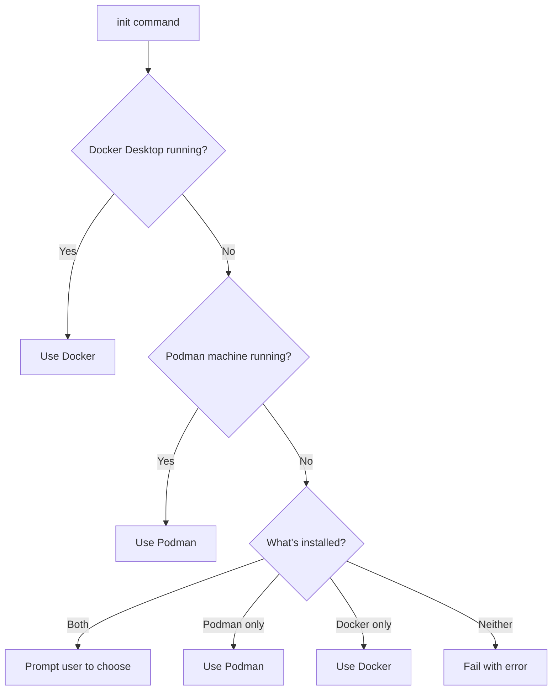

# Apache Polaris Local Forge

Set up a complete local [Apache Polaris](https://polaris.apache.org/) development environment with [RustFS](https://docs.rustfs.com/) S3-compatible storage, PostgreSQL metastore, and k3d/k3s Kubernetes — all on your machine.

Query [Apache Iceberg](https://iceberg.apache.org/) tables locally with DuckDB, PyIceberg, or any Iceberg REST-compatible engine.

**MANIFEST FILE:** `.snow-utils/snow-utils-manifest.md` (exact path, always .md)

**PREREQUISITE:** NO PREREQUISITE -- this skill is self-contained infrastructure.

**AUTH MODEL:**

- **Bootstrap credentials:** Auto-generated admin credentials for Apache Polaris realm setup (in `.bootstrap-credentials.env`)
- **Principal credentials:** API-generated client_id/client_secret for catalog access (in `work/principal.txt`)
- **RustFS credentials:** Static `admin`/`password` for S3-compatible storage (no IAM)

**SENSITIVE DATA:** `principal.txt` contains `realm,client_id,client_secret`. When displaying to user, show ONLY the realm. Mask credentials: `client_id: ****xxxx` (last 4 chars). NEVER show `client_secret` at all.

## Prerequisites

This skill requires the following tools installed on your machine:

| Tool | Purpose | Install |
|------|---------|---------|
| Podman (default) | Container runtime (OSS) | **Already installed** - Podman is a dependency of Cortex Code |
| Docker (alternative) | Container runtime | [Docker Desktop](https://www.docker.com/products/docker-desktop/) (>= 4.27) |
| k3d | k3s-in-Docker/Podman | `brew install k3d` or [k3d.io](https://k3d.io/) |
| Python | >= 3.12 | [python.org](https://www.python.org/downloads/) |
| uv | Python package manager | `curl -LsSf https://astral.sh/uv/install.sh \| sh` |

**Note:** Podman is a dependency of Cortex Code and should already be installed on your system. If not present, install via `brew install podman` or [podman.io](https://podman.io/).

**Container Runtime (Auto-Detected):** The CLI automatically detects which runtime to use during `init`:



**Detection priority:** Running runtime preferred over installed. Docker preferred when both running. Override by setting `PLF_CONTAINER_RUNTIME=docker` or `podman` in `.env`.

**First-time Podman users:** Run `doctor --fix` after `init` to automatically create and start the Podman machine. See [docs/podman-setup.md](docs/podman-setup.md) for manual setup.

**Optional:**

| Tool | Purpose | Install |
|------|---------|---------|
| DuckDB CLI | SQL verification | `brew install duckdb` |
| AWS CLI | S3 bucket operations on RustFS | `brew install awscli` |
| direnv | Auto-load env vars | `brew install direnv` |

## Workflow

**CRITICAL: SETUP TAKES 2-5 MINUTES.** Tell user upfront so they don't wait anxiously.

**PERMISSIONS:** Cortex Code prompts for approval on each new command.

- Before `init`: Select **"Allow using 'uv' for this session"**
- After `init`: Select **"Allow using 'plf' for this session"** (or option 5)

This avoids repeated prompts. See [Cortex Code Permissions](#cortex-code-permissions) for details.

**SETUP APPROACH FOR CORTEX CODE (REQUIRED):**

1. **First, show the plan:**

   ```
   ## Apache Polaris Local Forge Setup (Total: ~2-5 minutes)
   
   **Permissions:** Cortex Code prompts for approval on each new command.
   Select "Allow using 'plf' for this session" (option 5) to run all steps smoothly.
   
   **Container runtime:** Auto-detected based on what's running.
   - Docker Desktop running → uses Docker
   - Podman machine running → uses Podman
   - Neither running → will prompt you to choose
   
   Steps to complete:
   - [ ] Step 1: Initialize & detect runtime (~5s)
   - [ ] Step 2: Doctor check & fix (~5-30s)
   - [ ] Step 3: Generate configuration files (~10s)
   - [ ] Step 4: Create k3d cluster (~30s)
   - [ ] Step 5: Wait for RustFS and PostgreSQL (~60-90s)
   - [ ] Step 6: Deploy Apache Polaris (~60s)
   - [ ] Step 7: Setup catalog (~30s)
   - [ ] Step 8: Verify with DuckDB (~5s)
   
   Ready to proceed with cluster name: "<directory-name>"
   
   Say "proceed" to continue, or specify a different cluster name.
   ```

   **STOP**: Wait for user response. If user says "proceed" or similar, use the default cluster name. If user provides a name, use that instead. Then proceed to Step 1.

2. **Then run each step individually** with a header message.

   **FORMATTING**: Before each step header, output a blank line. This ensures proper visual separation in Cortex Code.

   ---

   **Step 1: Initialize & detect runtime**

   > **NOTE:** Before `init`, there is no `./bin/plf` wrapper. Use `uv run --project <SKILL_DIR>` for these commands.

   First, detect runtime availability:

   ```bash
   uv run --project <SKILL_DIR> polaris-local-forge runtime detect --json
   ```

   This outputs JSON with detection result:
   - `{"status": "detected", "runtime": "docker|podman", ...}` - Runtime found, proceed
   - `{"status": "choice", "options": ["docker", "podman"], ...}` - User choice required
   - `{"status": "error", ...}` - Neither installed, show error

   **Based on detection result:**

   - **If `"status": "detected"`**: Run init (runtime will be auto-set):

     ```bash
     uv run --project <SKILL_DIR> polaris-local-forge --work-dir <WORK_DIR> init
     ```

   - **If `"status": "choice"`**: Present choice using **AskQuestion tool** with radio options:

     | Option | Label | Description |
     |--------|-------|-------------|
     | `docker` | Use Docker | User will start Docker Desktop manually |
     | `podman` | Use Podman (recommended) | Machine will be created/started by `doctor --fix` |

     Then run init with explicit runtime:

     ```bash
     uv run --project <SKILL_DIR> polaris-local-forge --work-dir <WORK_DIR> init --runtime <user_choice>
     ```

     (The `--runtime` flag bypasses the interactive prompt that would "Abort" in non-interactive shells)

   - **If `"status": "error"`**: Display the error message and stop

   After `init` completes, the `./bin/plf` wrapper is created. Use it for ALL subsequent commands.

   ---

   **Step 2: Doctor check & fix**

   Run: `./bin/plf doctor --fix`

   This automatically:
   - Creates Podman machine (`k3d`) if using Podman and machine doesn't exist
   - Starts Podman machine if stopped
   - Kills gvproxy if blocking port 19000 (required by RustFS)
   - Sets up SSH config for Podman VM access

   ---

   **Step 3: Generate configuration files**

   Run: `./bin/plf prepare`

   ---

   **Step 4: Create k3d cluster**

   Run: `./bin/plf cluster create`

   ---

   **Step 5: Wait for RustFS and PostgreSQL**

   Run: `./bin/plf cluster wait --tags bootstrap`

   ---

   **Step 6: Deploy Apache Polaris**

   Run: `./bin/plf polaris deploy`
   Wait: `./bin/plf cluster wait --tags polaris`
   Run: `./bin/plf polaris bootstrap`

   ---

   **Step 7: Setup catalog**

   Run: `./bin/plf catalog setup`

   ---

   **Step 8: Verify with DuckDB**

   Run: `./bin/plf catalog verify-sql`

   For interactive exploration: `./bin/plf catalog explore-sql`

   ---

   **All steps complete!**

   After Step 8 succeeds, output the completion summary (see "Step 4: Summary" section below).

3. **After each step completes**, briefly confirm success before moving to next step.

4. **FORMATTING RULES** (critical for Cortex Code display):
   - Always output a **blank line** before headers and code blocks
   - Always output a **blank line** after code blocks before continuing text
   - Never concatenate output directly after closing triple backticks
   - Use `---` horizontal rules between major sections

**FORBIDDEN ACTIONS -- NEVER DO THESE:**

- NEVER use `sed/awk/bash` to edit `.env` or configuration files -- use the Edit/StrReplace tool
- NEVER hardcode credentials in scripts -- always read from `.env` or `work/principal.txt`
- NEVER assume the cluster is running -- always check status with `k3d cluster list` before operations
- NEVER run destructive commands (`cluster delete`, `polaris purge`) without explicit user confirmation
- NEVER skip teardown confirmation because user did setup in the same session -- ALWAYS confirm destruction regardless of session context
- NEVER delete `.snow-utils/` directory -- this contains the manifest needed for replay/audit. Teardown and cleanup commands always preserve `.snow-utils/`
- NEVER expose `principal.txt` contents in output -- show only the realm. Mask client_id: show `****` + last 4 chars. NEVER show client_secret at all. Example: `realm: POLARIS, client_id: ****a1b2, client_secret: ********`
- NEVER modify files in the skill directory (`<SKILL_DIR>`) -- `k8s/`, `polaris-forge-setup/`, `src/`, `example-manifests/` are read-only source. Only the user's `--work-dir` is writable
- NEVER create `.snow-utils/` in the skill directory -- ALWAYS ask for a work directory FIRST, then create `.snow-utils/` there
- NEVER start setup (with or without manifest) without a work directory -- the skill repo is READ-ONLY
- NEVER guess or invent CLI commands or options -- ONLY use commands from the CLI Reference tables below (e.g., `plf cluster status` NOT `plf status`). If a command fails, run `./bin/plf --help` or `./bin/plf <group> --help` and use ONLY the commands/options shown there
- NEVER run raw `duckdb` commands -- use `./bin/plf catalog query --sql "..."` for data queries, `./bin/plf catalog verify-sql` for initial setup verification, or `./bin/plf catalog explore-sql` for interactive sessions
- NEVER construct DuckDB SQL manually EXCEPT for `catalog query --sql` which requires the caller to provide the SQL
- NEVER extract credentials from `principal.txt` to pass to other commands -- credentials are automatically loaded by CLI commands
- NEVER use `uv run --project ... polaris-local-forge` after init -- ALWAYS use the `./bin/plf` wrapper script which handles paths, env vars, and suppresses warnings
- NEVER use `plf` commands for REST API queries (list catalogs, show namespaces, list tables, etc.) -- use Ansible playbooks instead (see [Apache Polaris API Queries](#apache-polaris-api-queries))
- NEVER look for or try to run a `polaris` CLI -- there is NO `polaris` command in this skill. The only CLI is `plf` (for infrastructure) and Ansible (for API queries)
- NEVER run `which polaris` or `polaris --help` -- the `polaris` binary does not exist

**COMMAND ROUTING:**

- **plf commands:** Only for CLI operations listed in [CLI Reference](#cli-reference) (init, prepare, cluster, catalog setup/cleanup, teardown, doctor, verify-sql, etc.)
- **REST API queries:** For query intents (list/show/describe catalogs, namespaces, tables, principals, roles, views, grants) -- use `./bin/plf api query <endpoint>` (see [Apache Polaris API Queries](#apache-polaris-api-queries))
- **General chat:** Explanations, questions, troubleshooting advice -- respond directly without running commands

**PROJECT CONTEXT DETECTION (AUTO-ACTIVATION):**

When user is in a directory containing ANY of these files, treat it as an **active polaris-local-forge project** and auto-activate this skill for **ALL operations** (setup, queries, cleanup, teardown):

| Context Signal | Check | Meaning |
|----------------|-------|---------|
| `.snow-utils/snow-utils-manifest.md` with `polaris-local-forge:` | `grep -q "polaris-local-forge:" .snow-utils/snow-utils-manifest.md` | This skill is installed (primary) |
| `.env` with `PLF_POLARIS_CATALOG_NAME` | `grep -q "PLF_POLARIS_CATALOG_NAME" .env` | Polaris config exists (secondary) |
| `bin/plf` wrapper script | `[ -x bin/plf ]` | CLI initialized (tertiary) |

**CRITICAL - When context detected:**

- For **cleanup/teardown** requests → ALWAYS present confirmation dialog with options (see [Teardown Flow](#teardown-flow))
- For **API queries** → Use `./bin/plf api query` (see [Apache Polaris API Queries](#apache-polaris-api-queries))
- For **setup/replay** → Use appropriate flow from this skill
- **NEVER** offer generic cleanup dialogs - always use `plf` commands with the structured teardown dialog

**When context detected AND user asks API-related queries** (list/show/describe/what catalogs/namespaces/tables/principals/roles/views/grants):

**⚠️ FIRST — CHECK FOR WRITE OPERATIONS (FAIL FAST):**

Before doing ANYTHING else, check if user is asking to **create**, **update**, **delete**, **add**, **remove**, **modify**, **drop**, or **grant/revoke**. If YES, respond IMMEDIATELY:

```
⚠️ Write operations are not supported yet.

This skill currently supports **read-only** API queries (GET only):
- list/show catalogs, namespaces, tables, views
- describe/get principals, roles, grants

Create/update/delete operations will be added in a future phase.
```

**DO NOT** proceed to construct endpoints or run Ansible for write operations. Stop here.

**DO NOT (FORBIDDEN):**

- ❌ `polaris` CLI — DOES NOT EXIST (no `polaris namespaces list`, no `polaris --help`, no `polaris namespace list`)
- ❌ `curl` to any Polaris endpoint — needs OAuth token you don't have (no `curl http://localhost:8181/...`, no `curl http://localhost:18181/...`)
- ❌ `jq` piped from curl — same reason, curl won't work without OAuth
- ❌ `kubectl get ns` — "namespaces" means Polaris catalog namespaces, NOT Kubernetes
- ❌ `docker ps` / `docker ps --filter "name=polaris"` — assume infra is running, don't check
- ❌ Port `8181` — wrong port, Polaris runs on `18181` in this skill
- ❌ Snowflake disambiguation ("Is this Snowflake or Polaris?") — it's Polaris
- ❌ "No Polaris service detected" fallback — don't give up, use Ansible
- ❌ `ansible-playbook` directly — causes asdf/tool-versions conflict, MUST use `uv run`
- ❌ `cd <dir> && ansible-playbook` — wrong pattern, use `uv run --project`
- ❌ **POST/PUT/DELETE operations** — write operations NOT supported, fail fast (see above)
- ❌ `-e "method=POST"` or any method other than GET — read-only phase
- ❌ `-e '{"body": ...}'` or any JSON body parameter — not supported
- ❌ Constructing JSON request bodies — not supported
- ❌ Asking user for JSON input — not supported

**DO (REQUIRED) — USE `plf api query` COMMAND:**

```bash
./bin/plf api query /api/catalog/v1/polardb/namespaces
./bin/plf api query /api/management/v1/catalogs
./bin/plf api query /api/management/v1/principals
```

**Key points:**

1. Use `./bin/plf api query <endpoint>` — clean, simple, handles all the complexity
2. Endpoint must start with `/api/...` — construct from user intent (see table below)
3. Only GET is supported (read-only phase)
4. Output is JSON by default, use `-o text` for plain text
5. Use `-v` for verbose Ansible output if debugging

**Quick context check (run silently before API queries):**

```bash
grep -q "polaris-local-forge:" .snow-utils/snow-utils-manifest.md 2>/dev/null || grep -q "PLF_POLARIS_CATALOG_NAME" .env 2>/dev/null || [ -x bin/plf ]
```

**API QUERY ROUTING (CRITICAL):**
When user asks about Apache Polaris data (catalogs, namespaces, tables, views, principals, roles, grants):

1. Do NOT search for CLI tools (`polaris`, `plf query`, etc.) -- they don't exist
2. Do NOT try `curl` to any endpoint -- it won't work (needs OAuth token)
3. Do NOT run `kubectl` commands to check services or namespaces -- this is NOT Kubernetes
4. Do NOT check if Polaris is running -- assume the setup is complete
5. Go DIRECTLY to `./bin/plf api query <endpoint>` with the constructed endpoint path

**DISAMBIGUATION -- "namespaces" = Polaris catalog namespaces (NOT Kubernetes):**
When user says "namespaces", "list namespaces", "show namespaces" → this means Apache Polaris catalog namespaces, accessed via `/api/catalog/v1/{catalog}/namespaces`. Do NOT interpret as Kubernetes namespaces.

**INTERACTIVE PRINCIPLE:** This skill is designed to be interactive. At every decision point, ASK the user and WAIT for their response before proceeding. When presenting choices (e.g., runtime selection, execution mode), use the **AskQuestion tool** with radio options for better UX in Cortex Code.

**EXCEPTION:** Once user selects **"Run all (recommended)"** at the config review step, the skill switches to **autonomous mode** for that setup flow. No further confirmation prompts until setup completes or an error occurs. Track this as `EXECUTION_MODE=run_all`.

**DISPLAY PRINCIPLE:** When showing configuration or status, substitute actual values from `.env` and the manifest. The user should see real values, not raw `${...}` placeholders.

**OUTPUT PRINCIPLE:** Terminal output gets collapsed/truncated in Cortex Code UI. When running `--dry-run` or any diagnostic command, you MUST copy the relevant output into your response. The user CANNOT see collapsed terminal output. Format with proper code blocks: ` ```text ` for summaries, ` ```bash ` for commands.

**RESILIENCE PRINCIPLE:** Always update the manifest IMMEDIATELY after each resource creation step, not in batches. This ensures Resume Flow can recover from any interruption.

Pattern:

```
1. Set overall Status: IN_PROGRESS at START of resource creation
2. Update each resource row to DONE immediately after creation
3. Set Status: COMPLETE only at the END when ALL resources verified
```

If user aborts mid-flow, the manifest preserves progress:

- Overall Status stays IN_PROGRESS
- Completed resources show DONE
- Pending resources show PENDING/REMOVED
- Resume Flow picks up from first non-DONE resource

**IDEMPOTENCY PRINCIPLE:** Before editing any file, CHECK if the change is already applied.

Pattern for manifest updates:

```bash
grep -q "Status.*COMPLETE" .snow-utils/snow-utils-manifest.md && echo "Already complete" || echo "Needs update"
```

Pattern for file edits:

```
1. Read current file state
2. Check if desired content already exists
3. Only edit if change is needed
4. Skip with message: "Already applied: [description]"
```

**ENVIRONMENT REQUIREMENT:** The skill uses local RustFS for S3-compatible storage. AWS CLI commands target `http://localhost:19000` with static credentials. No real AWS account is needed.

> **Note:** This skill configures Apache Polaris with local RustFS (S3-compatible) storage only.
> For real AWS S3 support, see Phase 2 in [SKILL_README.md](SKILL_README.md).

**CRITICAL RULE - ALL OPERATIONS VIA CLI:**

> **NEVER** use direct `podman`, `docker`, `k3d`, `kubectl`, or `helm` commands.
> ALL operations MUST go through `polaris-local-forge` CLI commands.
> Direct commands cause port binding issues (gvproxy) and stale state.
> See "FORBIDDEN COMMANDS" section in CLI Reference for details.

**Pre-Check Rules (Fail Fast):**

| Command | Pre-Check | If Fails |
|---------|-----------|----------|
| Any command | NOT using direct podman/k3d/kubectl | Stop: "Use CLI commands only. See FORBIDDEN COMMANDS." |
| `init` | Docker or Podman installed | Auto-detects runtime; prompts user if both installed but neither running; fails if neither installed |
| `doctor` | Tools installed | Report missing tools with install instructions |
| `doctor` | No ghost clusters | Report stale Docker resources if found |
| `doctor --fix` | (none - fixes issues) | Creates Podman machine if missing; starts if stopped; kills gvproxy if blocking port 19000; sets up SSH config; cleans up ghost clusters |
| `cluster create` | Cluster doesn't exist | Stop: "Cluster already exists. Use `cluster delete` first or `setup` to resume." |
| `cluster create` | No ghost cluster | Stop: "Ghost cluster detected. Use `--force` to clean up stale references." |
| `cluster create` | Ports 19000, 19001, 18181 available | Stop: "Port in use. Run `doctor --fix` first." |
| `catalog setup` | Cluster running, Apache Polaris ready | Stop: "Cluster not ready. Run setup first." |
| `polaris deploy` | Cluster running | Stop: "Cluster not running. Run `cluster create` first." |
| `polaris purge` | Apache Polaris deployed | Stop: "Apache Polaris not deployed. Nothing to purge." |
| `teardown` | Any resources exist | Proceed gracefully (idempotent with `--yes`) |
| `catalog cleanup` | Catalog exists | Proceed gracefully (idempotent with `--yes`) |

### Step 0: Initialize Project Directory

**FIRST: Check if in skill directory (NEVER initialize here):**

```bash
if [ -f "SKILL.md" ] && [ -d "src/polaris_local_forge" ]; then
  IN_SKILL_DIR="true"
else
  IN_SKILL_DIR="false"
fi
```

**If IN_SKILL_DIR is true, show:**

```
⚠️  You're in the polaris-local-forge skill directory.

This directory contains the source code and is READ-ONLY.
All workspace files must be created in a separate directory.

Where would you like to create your Apache Polaris workspace?

  1. ~/polaris-dev (recommended)
  2. Specify custom path: ___________
```

**STOP**: Wait for user input. NEVER offer "current directory" as an option when in skill directory.

**After user provides work directory:**

1. Create the directory if needed: `mkdir -p <path>`
2. Change to that directory using Shell `working_directory` parameter for subsequent commands
3. **PRESERVE any prior user choices** (e.g., if user already selected "Run all", continue in autonomous mode)

---

**If NOT in skill directory, detect if user already has a workspace set up:**

```bash
if [ -f .env ] && [ -f pyproject.toml ]; then
  echo "Existing workspace detected: $(pwd)"
  [ -d .snow-utils ] && echo "  Found: .snow-utils/"
fi
```

**If existing workspace detected -> go to Step 0a (Prerequisites Check).**

**If NOT in an existing workspace (and NOT in skill directory), ask user:**

```
Where would you like to create your Apache Polaris workspace?

Options:
  1. Use current directory: $(pwd)
  2. Create a new directory (e.g., polaris-dev)
```

**STOP**: Wait for user input.

**Initialize the workspace with the CLI:**

```bash
uv run --project <SKILL_DIR> polaris-local-forge --work-dir . init
```

This command:

- Copies template files (`.env`, `.envrc`, `.gitignore`)
- Creates required directories (`.kube/`, `work/`, `bin/`, `k8s/`)
- Sets `PROJECT_HOME`, `K3D_CLUSTER_NAME`, and `SKILL_DIR` in `.env`
- Creates `bin/plf` wrapper script for simplified CLI invocation

To use a custom cluster name:

```bash
uv run --project <SKILL_DIR> polaris-local-forge --work-dir . init --cluster-name my-cluster
```

> **IMPORTANT:** All subsequent CLI commands use `--work-dir` to point generated files here.
> The skill directory (`<SKILL_DIR>`) stays read-only. For a second cluster, create another
> directory and re-run the skill.

**Use the wrapper script (created by `init`):**

**CRITICAL:** After running init, ALWAYS use `./bin/plf` for ALL commands. NEVER use `uv run --project ...` directly - the wrapper handles everything:

```bash
./bin/plf doctor
./bin/plf cluster create
./bin/plf catalog verify-sql
```

The wrapper sources `.env` automatically and handles all paths.

**IMPORTANT - Command Execution:** Use Shell tool's `working_directory` parameter, NOT `cd &&`:

```
Shell(command="./bin/plf <COMMAND>", working_directory="<PROJECT_HOME>")
```

### Step 0a: Configuration Review and Confirmation

**Display current configuration for user review:**

```
Configuration Review
────────────────────
  Config file:                   .env
  Work directory:                $(pwd)

  PLF_CONTAINER_RUNTIME:         ${PLF_CONTAINER_RUNTIME}  # ADAPT: podman (default) or docker
  PLF_PODMAN_MACHINE:            ${PLF_PODMAN_MACHINE}     # macOS only (default: k3d)

  K3D_CLUSTER_NAME:              ${K3D_CLUSTER_NAME}      # ADAPT: defaults to project directory name
  K3S_VERSION:                   ${K3S_VERSION}
  KUBECONFIG:                    .kube/config

  AWS_ENDPOINT_URL:              http://localhost:19000
  AWS_REGION:                    us-east-1
  AWS_ACCESS_KEY_ID:             admin

  POLARIS_URL:                   http://localhost:18181
  POLARIS_REALM:                 ${POLARIS_REALM}           # ADAPT: customizable

  PLF_POLARIS_S3_BUCKET:         ${PLF_POLARIS_S3_BUCKET}    # ADAPT: customizable
  PLF_POLARIS_CATALOG_NAME:      ${PLF_POLARIS_CATALOG_NAME} # ADAPT: customizable
  PLF_POLARIS_PRINCIPAL_NAME:    ${PLF_POLARIS_PRINCIPAL_NAME} # ADAPT: customizable

Review the configuration above. Would you like to change any values?
  1. Accept all (recommended for first-time setup)
  2. Edit a specific value
  3. Cancel
```

**STOP**: Wait for user input.

**If user selects "2. Edit a specific value":**

1. Ask: "Which value to edit? (e.g., K3D_CLUSTER_NAME)"
2. User provides the variable name
3. Ask: "Enter new value for {variable}:"
4. **Update `.env` using StrReplace tool:**

   ```
   StrReplace(.env, "{VARIABLE}=old-value", "{VARIABLE}=new-value")
   ```

5. Re-display configuration with updated value
6. Return to confirmation prompt (user can edit more or accept)

**For `PLF_PODMAN_MACHINE` edits (macOS only):**

If user wants to use a different Podman machine, list available machines:

```bash
podman machine ls --format "{{.Name}}"
```

Display options:

```
Podman Machine Selection:
  0. Create new 'k3d' machine (recommended for isolation)
  1. k3d (if exists)
  2. podman-machine-default
  3. [other existing machines...]

Enter machine name or number:
```

**If user selects "0. Create new":**

```bash
podman machine init k3d --cpus 4 --memory 16384 --now
podman system connection default k3d
```

Then run `./bin/plf doctor --fix` to configure SSH access.

**After confirmation, proceed to prerequisites check.**

### Step 0b: Prerequisites Check

**Check manifest for cached tool verification:**

```bash
grep "^tools_verified:" .snow-utils/snow-utils-manifest.md 2>/dev/null
```

**If `tools_verified:` exists with a date:** Skip tool checks, continue to Step 0c.

**Otherwise, run prerequisite check:**

```bash
./bin/plf doctor
```

The doctor command checks:

- Required tools: podman/docker, k3d, kubectl, uv
- Podman machine status (macOS only)
- SSH config for Podman VM access (macOS only)
- Port availability: 19000 (RustFS), 19001 (RustFS Console), 18181 (Apache Polaris), 6443 (k3d API)

**With `--fix` flag** (macOS with Podman):

- **Creates Podman machine** (`k3d`) if it doesn't exist
- **Starts Podman machine** if stopped
- **Kills gvproxy** if blocking port 19000 (required by RustFS)
- **Sets up SSH config** for Podman VM access

**Note:** `doctor --fix` is now fully automatic - it creates and configures the Podman machine without manual intervention. See [docs/podman-setup.md](docs/podman-setup.md) for advanced configuration options.

If any tool is missing, stop and provide installation instructions from the Prerequisites table above.

**STOP**: Do not proceed until all prerequisites pass.

**After all tools verified, update manifest:**

```bash
grep -q "^tools_verified:" .snow-utils/snow-utils-manifest.md 2>/dev/null || \
  echo "tools_verified: $(date +%Y-%m-%d)" >> .snow-utils/snow-utils-manifest.md 2>/dev/null || true
```

### Step 0c: Detect or Initialize Manifest

#### CRITICAL: Work Directory Check

**BEFORE any manifest operations, verify we are NOT in the skill directory:**

```bash
if [ -f "SKILL.md" ] && [ -d "src/polaris_local_forge" ]; then
  echo "ERROR: Currently in skill directory (read-only source)"
  echo "       Cannot create .snow-utils/ here"
  exit 1
fi
```

**If in skill directory, STOP and ask:**

```
⚠️  You're in the skill source directory (read-only).

Where would you like to create your Apache Polaris workspace?

  1. Create new directory: ~/polaris-dev
  2. Specify custom path: ___________

Enter choice [1]:
```

**STOP**: Wait for user input. NEVER proceed with manifest operations in skill directory.

**After user provides work directory:**

1. Create the directory if needed: `mkdir -p <path>`
2. Change to that directory: Use Shell `working_directory` parameter
3. THEN proceed with manifest detection below

---

#### Remote Manifest URL Detection

If the user provides a URL (in their prompt or pasted), detect and normalize it **before** local manifest detection:

**Supported URL patterns and translation rules:**

- **GitHub blob:** `https://github.com/{owner}/{repo}/blob/{branch}/{path}` -> replace host with `raw.githubusercontent.com` and remove `/blob/` segment
- **GitHub raw:** `https://raw.githubusercontent.com/...` -> use as-is
- **GitHub gist:** `https://gist.github.com/{user}/{id}` -> append `/raw` if not already present
- **Any other HTTPS URL ending in `.md`** -> use as-is

**After translating, show user and confirm:**

```
Found manifest URL. Download URL:
  <translated_raw_url>

Download to current directory as <filename>? [yes/no]
```

**STOP**: Wait for user confirmation.

**If yes:**

```bash
curl -fSL -o <filename> "<translated_raw_url>"
```

After successful download, continue with local manifest detection below.

---

**Check for existing manifest:**

```bash
WORKING_MANIFEST=""
SHARED_MANIFEST=""

if [ -f .snow-utils/snow-utils-manifest.md ]; then
  WORKING_MANIFEST="EXISTS"
  WORKING_STATUS=$(grep "^\*\*Status:\*\*" .snow-utils/snow-utils-manifest.md | head -1)
  echo "Working manifest: .snow-utils/snow-utils-manifest.md (${WORKING_STATUS})"
fi

for f in *-manifest.md; do
  [ -f "$f" ] && grep -q "## shared_info\|CORTEX_CODE_INSTRUCTION" "$f" 2>/dev/null && {
    SHARED_MANIFEST="$f"
    echo "Shared manifest: $f"
  }
done
```

**Decision matrix:**

| Working Manifest | Shared Manifest | Action |
|-----------------|-----------------|--------|
| None | None | Fresh start -> Step 0e |
| None | Exists | Copy shared to `.snow-utils/` -> Step 0d |
| Exists (REMOVED) | None | Replay Flow (reuse existing config) |
| Exists (COMPLETE) | None | Ask user: re-run, reset, or skip |
| Exists (IN_PROGRESS) | None | Resume Flow -- run pending steps from CLI Reference |
| Exists | Exists | **Conflict** -- ask user which to use |

**If BOTH manifests exist, show:**

```
Found two manifests:

  1. Working manifest: .snow-utils/snow-utils-manifest.md
     Status: <WORKING_STATUS>

  2. Shared manifest: <SHARED_MANIFEST>
     (contains resource definitions from another setup)

Which manifest should we use?
  A. Resume working manifest (continue where you left off)
  B. Start fresh from shared manifest (backup working, adapt values)
  C. Cancel
```

**STOP**: Wait for user choice.

**If using example manifest** (user says "get started with apache polaris using example manifest"):

> **NOTE:** This assumes the Work Directory Check above has passed. The example manifest is copied FROM the skill's `example-manifests/` directory TO the user's work directory.

```bash
# In user's work directory (NOT skill directory!)
mkdir -p .snow-utils && chmod 700 .snow-utils
cp <SKILL_DIR>/example-manifests/polaris-local-forge-manifest.md .snow-utils/snow-utils-manifest.md
chmod 600 .snow-utils/snow-utils-manifest.md
```

Then proceed to **Step 0d** to check for adaptive markers.

### Step 0d: Shared Manifest Adapt-Check

**ALWAYS run this step when using a shared or example manifest. Prompt user ONLY if `# ADAPT:` markers are found.**

```bash
ADAPT_COUNT=$(grep -c "# ADAPT:" .snow-utils/snow-utils-manifest.md 2>/dev/null)
echo "ADAPT markers found: ${ADAPT_COUNT}"
```

**If `ADAPT_COUNT` > 0 (markers found):**

Extract all values with `# ADAPT:` markers and present to user:

```
Manifest Value Review
─────────────────────
The following values can be customized for your environment:

  Setting                       Default Value              Marker
  ────────────────────────────  ─────────────────────────  ──────────────────────
  PLF_CONTAINER_RUNTIME:        podman                     # ADAPT: podman or docker
  K3D_CLUSTER_NAME:             (project directory name)   # ADAPT: customizable
  POLARIS_REALM:                POLARIS                    # ADAPT: customizable
  PLF_POLARIS_S3_BUCKET:        polaris                    # ADAPT: customizable
  PLF_POLARIS_CATALOG_NAME:     polardb                    # ADAPT: customizable
  PLF_POLARIS_PRINCIPAL_NAME:   super_user                 # ADAPT: customizable
  KUBECONFIG:                   (derived from cluster name)
  KUBECTL_PATH:                 (derived from cluster name)

Options:
  1. Accept all defaults (recommended for first-time setup)
  2. Edit a specific value
  3. Cancel
```

**STOP**: Wait for user choice.

| Choice | Action |
|--------|--------|
| **1 -- Accept all** | Proceed with defaults |
| **2 -- Edit specific** | Ask which value, update manifest and `.env` in-place, re-display |
| **3 -- Cancel** | Stop |

**If user changes `PLF_CONTAINER_RUNTIME`:** Update `.env` with the new value. If switching to Docker, clear `PLF_PODMAN_MACHINE` from `.env`.

**If user changes `K3D_CLUSTER_NAME`:** Automatically update derived values (`KUBECONFIG`, `KUBECTL_PATH`, resource table row 1) in the manifest. Also update `.env` with the new cluster name.

**If user changes `POLARIS_REALM` or any `PLF_POLARIS_*` value:** Update both the manifest and `.env`.

**If `ADAPT_COUNT` = 0 (no markers):** Proceed silently with values as-is.

### Step 0e: Initialize Manifest

Use the `--with-manifest` flag to initialize the manifest along with the workspace:

```bash
./bin/plf init --with-manifest
```

This creates `.snow-utils/snow-utils-manifest.md` with proper permissions (chmod 700 for directory, chmod 600 for file).

If already initialized, you can add the manifest separately:

```bash
./bin/plf init --with-manifest --force
```

### Step 1: Environment Setup

**SHOW -- what we're about to do:**

> Set up the lightweight Python environment for querying and exploration.
> This creates a virtual environment and installs query dependencies
> (`duckdb`, `pyiceberg`, `boto3`, `pandas`) from the workspace `pyproject.toml`.
> The infrastructure CLI runs from the skill directory separately.

**STOP**: Wait for user confirmation before proceeding.

**DO:**

```bash
uv python pin 3.12
uv venv
uv sync --all-extras
```

**SUMMARIZE:**

> Environment ready. Python venv created with query/notebook dependencies.
> Configuration loaded from `.env`.

### Step 2: Full Setup

**SHOW -- what we're about to do (tell user this):**

> I'll set up the complete Apache Polaris environment. **This takes 2-5 minutes.**
>
> **6 steps:**
>
> 1. Pre-check & start Podman (~5s)
> 2. Generate configs (~10s)
> 3. Create k3d cluster (~30s)
> 4. Wait for RustFS & PostgreSQL (~60-90s)
> 5. Deploy Apache Polaris (~60s)
> 6. Setup catalog & verify (~35s)
>
> Services will be available at:
>
> - **Apache Polaris API:** localhost:18181
> - **RustFS S3:** localhost:19000
> - **RustFS Console:** localhost:19001
>
> Ready to proceed?

**STOP**: Ask user for execution preference:

> How would you like to proceed?

**Present using AskQuestion tool** with radio options:

| Option | Label | Description |
|--------|-------|-------------|
| `run_all` | Run all (recommended) | Execute all setup steps automatically |
| `step_by_step` | Step by step | Pause after each step for confirmation |

**CRITICAL: Track EXECUTION_MODE for the rest of the session:**

```
EXECUTION_MODE = user's choice ("run_all" or "step_by_step")
```

**Based on user choice:**

- **If "run_all":** Execute ALL steps below without pausing. NO confirmation prompts. Only stop on actual errors.
- **If "step_by_step":** Run each step, show output, then ask "Continue?" before the next step.

**IMPORTANT:** Once user selects "run_all", ALL subsequent stopping points in this session are SKIPPED. The skill proceeds automatically through Steps 1-8 without asking for confirmation. This includes:

- Prerequisite checks (auto-proceed if passing)
- Each CLI command execution (run immediately)
- Manifest updates (update immediately)

Only stop for:

1. Fatal errors that prevent continuation
2. Explicit destructive operations (teardown, purge) that were NOT part of the original setup flow

> **NOTE:** Cortex Code will still show its command approval dialog (platform security feature).
> Tell user: "Select **option 5** ('Allow using plf for this session') on the first `plf` command to avoid approval prompts for remaining steps."

**DO -- Run each step as a SEPARATE command (REQUIRED for Cortex Code visibility):**

```bash
./bin/plf doctor --fix                        # Step 1: Pre-check, auto-starts Podman
./bin/plf init --with-manifest                # Step 2: Copy templates, create dirs, init manifest
```

The `init --with-manifest` command creates the `.snow-utils/snow-utils-manifest.md` file with the resources tracking table.

**Continue with remaining setup steps:**

```bash
./bin/plf prepare                             # Step 3: Generate k8s configs
./bin/plf cluster create                      # Step 4: Create k3d cluster
./bin/plf cluster wait --tags bootstrap       # Wait for RustFS + PostgreSQL
./bin/plf polaris deploy                      # Step 5: Deploy Apache Polaris to cluster
./bin/plf cluster wait --tags polaris         # Wait for Apache Polaris + bootstrap job
./bin/plf polaris bootstrap                   # Step 6: Bootstrap Apache Polaris (create principal)
./bin/plf catalog setup                       # Step 7: Setup demo catalog
./bin/plf catalog verify-sql                  # Step 8: Verify with DuckDB
```

**CRITICAL RULES:**

- **HONOR EXECUTION_MODE:** If user selected "run_all", DO NOT ask for confirmation between steps. Proceed automatically.
- **Run all mode:** Execute full sequence, NO prompts between steps. Just run each command and report results.
- **Step by step mode:** Pause after each step, ask "Continue? [yes/no]"
- Run EACH command above as a SEPARATE bash invocation (for Cortex Code visibility)
- NEVER combine multiple commands (hides output from Cortex Code)
- NEVER use `podman machine start` directly (use `doctor --fix`)
- **DESTRUCTIVE COMMANDS (teardown, delete, cleanup, purge):** ALWAYS STOP and ask user for explicit confirmation BEFORE running. After user confirms, pass `--yes` to skip CLI's interactive prompt (CLI prompts don't work in non-interactive shell)
- **TEARDOWN AFTER SETUP:** Even if user completes setup in this session and then asks to teardown, you MUST still present the teardown confirmation dialog with options. Session context does NOT bypass destruction confirmation. See [Teardown Flow](#teardown-flow).
- **DO NOT re-ask** work directory, runtime, cluster name, etc. after user has already answered them

**After setup completes, set the scoped cluster environment for this session:**

```bash
export KUBECONFIG="$(pwd)/.kube/config"
export PATH="$(pwd)/bin:$PATH"
set -a && source .env && set +a
```

**Update manifest after each successful step (RESILIENCE PATTERN):**

After each step completes successfully, update the manifest resource row status from `PENDING` to `DONE`:

```bash
# Example: After cluster create succeeds, update row 1
# Use Edit/StrReplace tool to change: | 1 | k3d cluster | infrastructure | PENDING |
# To: | 1 | k3d cluster | infrastructure | DONE |
```

If interrupted mid-flow, the manifest preserves progress:

- Overall Status stays IN_PROGRESS
- Completed resources show DONE
- Pending resources show PENDING
- Resume Flow picks up from first PENDING resource

**After ALL steps complete, update manifest status to COMPLETE:**

```bash
# Use Edit/StrReplace tool to change: **Status:** IN_PROGRESS
# To: **Status:** COMPLETE
```

**Verify manifest was written:**

```bash
cat .snow-utils/snow-utils-manifest.md
```

Expected: all 7 resource rows show `DONE`, Status shows `COMPLETE`.

**SUMMARIZE:**

> Setup complete. Cluster `${K3D_CLUSTER_NAME}` running with Apache Polaris, RustFS, and PostgreSQL.
> Catalog `${PLF_POLARIS_CATALOG_NAME}` created with principal `${PLF_POLARIS_PRINCIPAL_NAME}`.
> Credentials saved to `work/principal.txt`.
> Manifest: `.snow-utils/snow-utils-manifest.md`

### Step 3: Verification

**SHOW -- what we're about to do:**

> Verify the entire setup by running a DuckDB SQL script that:
>
> 1. Connects to Apache Polaris REST catalog at `http://localhost:18181`
> 2. Authenticates using the principal credentials from `work/principal.txt`
> 3. Creates a test Iceberg table on RustFS
> 4. Queries the table to confirm read/write works
>
> This confirms: Apache Polaris API, RustFS S3, catalog, principal, and RBAC grants are all working.

**DO:**

```bash
./bin/plf catalog verify-sql
```

**Check the result:**

- **If SUCCEEDED:** Continue to Step 3a (generate notebook)
- **If FAILED:** Check Troubleshooting section. Common issues: Apache Polaris not ready, RustFS not accessible, principal credentials invalid.

**SUMMARIZE (on success):**

> Verification passed! DuckDB successfully queried Iceberg tables via Apache Polaris REST catalog on RustFS.

### Step 3a: Generate Notebook

**SHOW -- what we're about to do:**

> Generate a Jupyter notebook for interactive Apache Polaris and Iceberg exploration.
> The notebook is pre-configured with your catalog connection details and
> principal credentials, ready to run.

**DO:**

```bash
./bin/plf catalog generate-notebook
```

**SUMMARIZE:**

> Notebook generated at `notebooks/verify_polaris.ipynb`.
> Open it with `jupyter notebook notebooks/verify_polaris.ipynb` for interactive exploration.

### Step 4: Summary

**SUMMARIZE -- Setup Complete:**

Output the following summary (substitute actual values from `.env`). **Remember:** blank line before AND after the code block.

```
Apache Polaris Local Forge -- Setup Complete!

Service URLs:
  Apache Polaris API:     http://localhost:18181
  RustFS S3:       http://localhost:19000
  RustFS Console:  http://localhost:19001

Catalog:
  Name:      ${PLF_POLARIS_CATALOG_NAME}
  S3 Bucket: ${PLF_POLARIS_S3_BUCKET}
  Principal: ${PLF_POLARIS_PRINCIPAL_NAME}

Credentials:
  RustFS:    admin / password
  Apache Polaris:   See work/principal.txt
  Bootstrap: See k8s/polaris/.bootstrap-credentials.env

Next steps:
  jupyter notebook notebooks/verify_polaris.ipynb  # Interactive exploration
  ./bin/plf catalog verify-sql                        # Re-run verification
  ./bin/plf catalog explore-sql                       # Interactive DuckDB SQL

Shell setup:
  export KUBECONFIG=$(pwd)/.kube/config
  export PATH=$(pwd)/bin:$PATH
  set -a && source .env && set +a   # AWS config for RustFS
  kubectl get pods -n polaris
  aws s3 ls

Manifest: .snow-utils/snow-utils-manifest.md
```

**Update manifest status to COMPLETE.**

## Catalog-Only Flows

These flows operate on the catalog without rebuilding the cluster.

### Catalog Setup (cluster must be running)

**Trigger:** "setup catalog only", "create catalog"

```bash
./bin/plf catalog setup
```

### Catalog Cleanup

**Trigger:** "cleanup catalog", "remove catalog"

**STOP**: Confirm with user before executing.

```bash
./bin/plf catalog cleanup --yes
```

Updates manifest status to REMOVED. Generated files in `work/` are preserved.

### Catalog Reset

**Trigger:** "reset polaris catalog", "recreate catalog"

**STOP**: Confirm with user before executing.

```bash
./bin/plf catalog cleanup --yes
./bin/plf catalog setup
```

Runs cleanup + setup. Generates new `principal.txt` (new credentials).

### Full Catalog Reset

**Trigger:** "full catalog reset", "purge polaris database"

**STOP**: This is destructive. Confirm with user.

```bash
./bin/plf polaris reset --yes
./bin/plf catalog setup
```

Purges the entire Apache Polaris database and recreates from scratch.

## Teardown Flow

**Trigger:** "teardown polaris", "delete everything", "clean up", "cleanup", "remove cluster"

**CRITICAL - ALWAYS CONFIRM, NO EXCEPTIONS:**

Even if user just completed `setup:all` in this same session, you MUST STOP and confirm before any destruction.

**STOP - PRESENT OPTIONS TO USER:**

Before running ANY teardown command, present this dialog:

```
Teardown Options:

  1. Cluster only (default)
     - Deletes k3d cluster, Polaris, RustFS, PostgreSQL
     - Keeps all local files for quick replay
     - Use `setup:replay` to restore

  2. Cluster + generated files
     - Deletes cluster AND cleans generated files
     - Use `setup:all` for fresh start

  CLEANUP_PATHS: .kube work k8s scripts bin notebooks .env .aws .envrc .gitignore .venv

  NOTE: .snow-utils/ is ALWAYS preserved. Replay is possible after BOTH options
        unless you manually delete .snow-utils/snow-utils-manifest.md

Which option? [1/2] (or 'cancel' to abort)
```

**Wait for user response** - do NOT proceed without explicit selection.

**After user selects option:**

Option 1 (cluster only):

```bash
./bin/plf teardown --yes
```

Option 2 (cluster + files):

```bash
# CLEANUP_PATHS from Taskfile.yml - keep in sync!
./bin/plf teardown --yes
rm -rf .kube work k8s scripts bin notebooks .env .aws .envrc .gitignore .venv
```

The `--yes` flag is passed because CLI prompts don't work in non-interactive shell, NOT to skip user confirmation from the agent.

**After completion, output EXACTLY this message (DO NOT list individual commands or resources):**

```
Teardown complete.

.snow-utils/ preserved for audit and replay. 

Run **replay** anytime to restore.
```

DO NOT list individual CLI commands. The agent can run replay when user asks.

Updates manifest status to REMOVED.

### Podman Machine (macOS)

On macOS with Podman, teardown stops the Podman machine by default when using `--yes` (fully releases ports 19000, 19001, 18181). To keep Podman running:

```bash
./bin/plf teardown --yes --no-stop-podman
```

## Replay Flow

**Trigger:** "replay polaris local forge", "recreate environment"

When manifest has `Status: REMOVED`:

1. Read config values from manifest
2. Show replay plan to user
3. On confirmation, execute Steps 1-10
4. Reuse existing `.env` and work directory layout
5. Re-activate scoped environment (`KUBECONFIG`, `PATH` for kubectl)
6. Regenerate catalog-level files (new principal credentials)
7. Update manifest to COMPLETE

## Apache Polaris API Queries

> **EXPERIMENTAL FEATURE:** REST API query support via natural language is experimental.
> Currently supports read-only operations. Write operations (create, delete, update) will be added in a future phase.

> **AUTO-ACTIVATION:** If user's current directory has `.snow-utils/snow-utils-manifest.md` with `polaris-local-forge:`, or `.env` with `PLF_POLARIS_CATALOG_NAME`, this is an active polaris-local-forge project. Skip all disambiguation and use `plf api query` (see PROJECT CONTEXT DETECTION above).

**When to use:** User asks to list, show, describe, or query catalogs, namespaces, tables, views, principals, roles, or grants.

**IMPORTANT — GO DIRECTLY TO ANSIBLE:**

- There is NO `polaris` CLI — do NOT run `which polaris` or `polaris --help`
- There is NO `plf query` or `plf polaris` subcommand
- Do NOT search for CLI tools — go DIRECTLY to the Ansible playbook
- Do NOT try `curl` or `jq` — Ansible handles OAuth and credentials automatically
- Construct the endpoint path dynamically based on user intent

**How:** Use `./bin/plf api query <endpoint>` — the CLI handles Ansible, OAuth, and output formatting.

> **SEMANTIC UNDERSTANDING:** Recognize intent variations — these all mean the same thing:
>
> - "list catalogs" = "show me catalogs" = "what catalogs exist" = "get all catalogs"
> - "show namespaces" = "list namespaces" = "namespaces in catalog" = "what namespaces"
> - "describe table X" = "show table X" = "get table X details" = "table X schema"

> **CRITICAL DISAMBIGUATION — "namespaces" means POLARIS NAMESPACES:**
>
> - When user says "namespaces", "list namespaces", "show namespaces" — this means **Apache Polaris catalog namespaces**, NOT Kubernetes namespaces
> - Do NOT run `kubectl get ns` or check Kubernetes namespaces
> - Do NOT run `curl` to any endpoint — Ansible handles this
> - Do NOT check if Polaris is running or look for services — assume setup is complete
> - Go DIRECTLY to Ansible with endpoint `/api/catalog/v1/{catalog}/namespaces`

### Why Ansible (not curl/jq)

- **No extra dependencies** — users don't need `jq` installed
- **Credentials hidden** — OAuth token retrieval uses `no_log: true`, never exposed
- **Consistent pattern** — same approach as existing `catalog_setup.yml`
- **JSON output** — Ansible returns structured JSON for easy formatting
- **Reads .env** — Automatically uses user's configured catalog name

### Endpoint Construction (Generic Pattern)

The playbook accepts an `endpoint` parameter. Construct the endpoint path based on user intent:

**Management API Endpoints** (`/api/management/v1/...`):

| User Intent | Endpoint Path |
|-------------|---------------|
| "list catalogs", "show catalogs" | `/api/management/v1/catalogs` |
| "show catalog {name}", "describe catalog {name}" | `/api/management/v1/catalogs/{name}` |
| "list principals", "show principals" | `/api/management/v1/principals` |
| "show principal {name}", "describe principal {name}" | `/api/management/v1/principals/{name}` |
| "list principal roles", "show my roles" | `/api/management/v1/principal-roles` |
| "show principal role {name}" | `/api/management/v1/principal-roles/{name}` |
| "list roles for principal {name}" | `/api/management/v1/principals/{name}/principal-roles` |
| "list catalog roles for {catalog}" | `/api/management/v1/catalogs/{catalog}/catalog-roles` |
| "show catalog role {role} in {catalog}" | `/api/management/v1/catalogs/{catalog}/catalog-roles/{role}` |
| "list grants for role {role} in {catalog}" | `/api/management/v1/catalogs/{catalog}/catalog-roles/{role}/grants` |

**Catalog API Endpoints** (`/api/catalog/v1/...`):

| User Intent | Endpoint Path |
|-------------|---------------|
| "list namespaces", "show namespaces" | `/api/catalog/v1/{catalog}/namespaces` |
| "show namespace {ns}", "describe namespace {ns}" | `/api/catalog/v1/{catalog}/namespaces/{ns}` |
| "list tables in {ns}", "show tables" | `/api/catalog/v1/{catalog}/namespaces/{ns}/tables` |
| "show table {table} in {ns}", "describe table {table}" | `/api/catalog/v1/{catalog}/namespaces/{ns}/tables/{table}` |
| "list views in {ns}", "show views" | `/api/catalog/v1/{catalog}/namespaces/{ns}/views` |
| "show view {view} in {ns}", "describe view {view}" | `/api/catalog/v1/{catalog}/namespaces/{ns}/views/{view}` |

### Endpoint Construction Rules

1. **Parse user intent** to identify the operation type (list/show/describe)
2. **Extract entity names** from the request (catalog, namespace, table, view, principal, role)
3. **Use defaults** when not specified:
   - `{catalog}` → use value from `.env` `PLF_POLARIS_CATALOG_NAME` (typically `polardb`)
   - `{ns}` → use `default` if not specified
4. **Substitute placeholders** in the endpoint path
5. **Execute** with the constructed endpoint

### Execution Pattern

Use `./bin/plf api query <endpoint>` — the CLI handles Ansible, OAuth, environment, and output formatting:

```bash
# List all catalogs
./bin/plf api query /api/management/v1/catalogs

# List namespaces in polardb catalog
./bin/plf api query /api/catalog/v1/polardb/namespaces

# Show table details
./bin/plf api query /api/catalog/v1/polardb/namespaces/default/tables/penguins

# List grants for a catalog role
./bin/plf api query /api/management/v1/catalogs/polardb/catalog-roles/admin/grants

# Text output instead of JSON
./bin/plf api query /api/management/v1/catalogs -o text

# Verbose mode for debugging
./bin/plf api query /api/management/v1/catalogs -v
```

Use Shell tool with `working_directory` set to `<WORK_DIR>`:

```
Shell(command="./bin/plf api query /api/catalog/v1/polardb/namespaces", working_directory="<WORK_DIR>")
```

### Messaging Template

When running API queries, show clear progress:

```
**Querying Apache Polaris:** {intent description}

Running: `plf api query {endpoint}`
```

Example:

```
**Querying Apache Polaris:** list namespaces in polardb catalog

Running: `plf api query /api/catalog/v1/polardb/namespaces`
```

### Output Formatting

Ansible returns JSON in `result.json`. Format as markdown table for the user:

```
**Namespaces in catalog `polardb`:**

| Namespace |
|-----------|
| default |
| analytics |
```

## Export for Sharing Flow

**Trigger phrases:** "export manifest for sharing", "share polaris manifest"

**Purpose:** Create a portable copy of the manifest that another developer can use to replay the entire setup on their machine.

### Precondition

Cortex Code MUST verify manifest has `Status: COMPLETE` or `Status: REMOVED`:

```bash
grep "^\*\*Status:\*\*" .snow-utils/snow-utils-manifest.md
```

If status is `IN_PROGRESS`, refuse with: "Cannot export incomplete setup. Complete the setup first or teardown to set status to REMOVED."

### Export Steps

1. **Read active manifest** from `.snow-utils/snow-utils-manifest.md`

2. **Read `project_name`** from `## project_recipe` section

3. **Determine `shared_by`** from machine username (fall back to asking user):

   ```bash
   SHARED_BY=$(whoami)
   echo "Exporting as: ${SHARED_BY}"
   ```

4. **Ask user for export location:**

   ```
   Export manifest for sharing:

     Filename: {project_name}-manifest.md
     Default location: ./ (project root)

   Save to [./]:
   ```

   **STOP**: Wait for user input.

5. **Ask about container runtime:**

   ```
   Container Runtime Export Option
   ───────────────────────────────
   Your setup used: {container_runtime from manifest}

   How should the exported manifest handle container runtime?

     1. Keep current value ({container_runtime}) - recipient reproduces exact environment
     2. Clear for auto-detection - recipient's CLI detects their runtime

   Choice [2]:
   ```

   **STOP**: Wait for user input. Default is **2 (auto-detect)** for maximum flexibility.

6. **If file already exists at target:** Ask overwrite / rename with timestamp / cancel

7. **Create export file** with these transformations:
   - Inject `<!-- CORTEX_CODE_INSTRUCTION -->` HTML comment at top (see `example-manifests/polaris-local-forge-manifest.md` for format)
   - Add `## shared_info` section with `shared_by: {SHARED_BY}`, `shared_date`, `original_project_dir`, `notes`
   - Preserve `## installed_skills` with skill URL (enables Cortex self-installation)
   - Change `**Status:** COMPLETE` to `**Status:** REMOVED`
   - Add `# ADAPT: customizable` markers on user-customizable values
   - **If user chose option 2:** Set `container_runtime:  # Auto-detected by CLI`
   - **If user chose option 1:** Keep `container_runtime: {value}`
   - Remove `podman_machine` line (always auto-detected by CLI)

8. **Show confirmation:**

   ```
   Exported: {project_name}-manifest.md

     Location: ./{project_name}-manifest.md
     Shared by: {SHARED_BY}
     Container runtime: {kept|cleared for auto-detection}
     Status set to: REMOVED

   Share this file with your colleague. They can open it in Cursor and ask Cortex Code:
     "setup from shared manifest"
   ```

> **Note:** The exported file is in the project root, NOT in `.snow-utils/`. Skills only read from `.snow-utils/snow-utils-manifest.md` so the export is invisible to all skill flows.

## Consuming Projects: Minimal Setup

A separate project that wants to query the Apache Polaris catalog needs only:

**In the project directory:**

- `.env` with:

```bash
POLARIS_URL=http://localhost:18181
AWS_ENDPOINT_URL=http://localhost:19000
AWS_ACCESS_KEY_ID=admin
AWS_SECRET_ACCESS_KEY=password
AWS_REGION=us-east-1
# From work/principal.txt in the polaris workspace:
POLARIS_REALM=POLARIS
CLIENT_ID=<from principal.txt>
CLIENT_SECRET=<from principal.txt>
```

- A notebook (`.ipynb`) or SQL scripts for querying
- `pyproject.toml` with query deps (copy `user-project/pyproject.toml` from the skill repo)

**NOT needed:** k8s manifests, ansible, polaris-local-forge CLI source.

## Stopping Points

1. Step 0: Ask for workspace directory (if not detected)
2. Step 0a: Configuration review -- wait for user confirmation
3. Step 0b: If prerequisites missing (show install instructions)
4. Step 0c: Manifest detection (ask which to use if conflict)
5. Step 0d: Adapt-check (if shared manifest has `# ADAPT:` markers)
6. Step 1: Before environment setup (uv venv)
7. Step 2: Before full setup (show 6-step plan, wait for OK)
8. Step 3: Before verification (DuckDB test)
9. Step 3a: Before generating notebook
10. Catalog-only flows: Before cleanup/reset
11. Teardown: Before destructive operations

## CLI Reference

All commands use the `./bin/plf` wrapper script (created by `init`):

```bash
./bin/plf <command>
```

The wrapper sources `.env` automatically and handles all paths. Aliased as `plf` in tables below.

### Command Execution

**IMPORTANT:** Run commands from the project directory using the Shell tool's `working_directory` parameter:

```
Shell(command="./bin/plf <COMMAND>", working_directory="<PROJECT_HOME>")
```

**DO NOT** use `cd && ./bin/plf` pattern - use `working_directory` instead for cleaner output.

The wrapper sources `.env` (created by `init`) which contains:

```
PROJECT_HOME=/path/to/your/project
K3D_CLUSTER_NAME=your-project-name
SKILL_DIR=/path/to/polaris-local-forge
```

**Commands this skill executes:**

| Logical Command | Purpose |
|-----------------|---------|
| `plf doctor` | Check prerequisites |
| `plf doctor --fix` | Fix Podman/SSH issues |
| `plf init` | Initialize work directory |
| `plf prepare` | Generate configuration files |
| `plf cluster create` | Create k3d cluster |
| `plf cluster wait` | Wait for deployments |
| `plf polaris deploy` | Deploy Apache Polaris |
| `plf polaris bootstrap` | Create admin principal |
| `plf catalog setup` | Setup Iceberg catalog |
| `plf catalog verify-sql` | Verify with DuckDB |
| `plf cluster delete --yes` | Delete cluster (destructive) |
| `plf teardown --yes` | Full cleanup (destructive) |

**Recommended permission setting:** When Cortex Code prompts for command approval:

**Before `init` (uses `uv`):**

- **Option 5: "Allow using 'uv' for this session"** - Recommended

**After `init` (uses `./bin/plf` wrapper):**

- **Option 5: "Allow using 'plf' for this session"** - Recommended for "Run all" mode
- **Option 4: "Always allow using 'plf'"** - If you use this skill frequently

> **TIP:** When running "Run all (recommended)" mode, select option 5 on the first `plf` command to avoid approval prompts for each of the 8+ setup steps.

This is safe because:

- You control the skill source code
- Commands are well-defined CLI operations
- `uv` only runs Python from your trusted project

**Global options (before any subcommand):**

| Option | Description |
|--------|-------------|
| `--work-dir PATH` | Working directory for generated files (default: skill directory) |
| `--env-file PATH` | Path to .env file (default: `<work-dir>/.env`) |

**OPTION NAMES (NEVER guess or invent options):**

> ONLY use options listed in the tables below. If a command fails with "No such option",
> run `./bin/plf <command> --help` to see actual available options and
> use ONLY those. NEVER invent, abbreviate, or rename options.

**`--yes` flag:** Pass `--yes` ONLY after getting explicit user confirmation from the agent conversation. The flag skips the CLI's interactive prompt (which doesn't work in Cortex Code's non-interactive shell), but the agent MUST still ask the user for confirmation before running the command. All destructive commands support `--dry-run` to preview.

**COMMAND NAMES (exact -- do NOT substitute):**

- `catalog setup` -- NOT "catalog create", "catalog init"
- `catalog cleanup` -- NOT "catalog delete", "catalog remove"
- `catalog verify-sql` -- NOT "catalog verify", "verify-sql"
- `catalog explore-sql` -- NOT "catalog explore", "explore-sql"
- `cluster create` -- NOT "cluster setup", "cluster init"
- `cluster delete` -- NOT "cluster remove", "cluster destroy"

**FORBIDDEN FILE EDIT COMMANDS (NEVER use for config files):**

> **CRITICAL:** NEVER use `sed`, `awk`, or bash string manipulation to edit `.env`,
> manifest files, or any configuration files. Use the Edit/StrReplace tool instead.

| NEVER Use | Use Instead |
|-----------|-------------|
| `sed -i 's/old/new/' .env` | Edit/StrReplace tool |
| `awk '{...}' file > newfile` | Edit/StrReplace tool |
| `echo "VAR=value" >> .env` | Edit/StrReplace tool |
| `cat > .env << EOF` | Write tool (only for new files) |

**If ports are blocked (gvproxy error on port 19000):**

Port 19000 is required by RustFS. On macOS with Podman, the `gvproxy` network process may hold this port. The `doctor --fix` command handles this automatically:

```bash
# Automatic fix (recommended)
./bin/plf doctor --fix
```

This will:

- Kill gvproxy processes blocking port 19000
- Stop and restart the Podman machine
- Set up SSH config for VM access

**Manual fix (if automatic fails):**

```bash
# Only use if doctor --fix doesn't work
pkill -f gvproxy
podman machine stop k3d
sleep 5
podman machine start k3d
./bin/plf doctor --fix  # Re-run to verify
```

**After fixing ports, continue setup:**

```bash
./bin/plf prepare
./bin/plf cluster create
./bin/plf cluster wait --tags bootstrap
./bin/plf polaris deploy
./bin/plf cluster wait --tags polaris
./bin/plf polaris bootstrap
./bin/plf catalog setup
./bin/plf catalog verify-sql
```

### Doctor (Prerequisites Check)

| Command | Description |
|---------|-------------|
| `plf doctor` | Check prerequisites, tools, Podman machine, ports |
| `plf doctor --fix` | Auto-fix: create Podman machine if missing, start if stopped, kill gvproxy on port 19000, setup SSH |
| `plf doctor --output json` | Output status as JSON |

### Runtime

| Command | Description |
|---------|-------------|
| `plf runtime detect` | Detect container runtime (docker/podman/choice) |
| `plf runtime detect --json` | Output detection result as JSON (for agents) |
| `plf runtime docker-host` | Output DOCKER_HOST value for current runtime |

### Init & Prepare

| Command | Description |
|---------|-------------|
| `plf init` | Initialize project directory (.env, .envrc, .gitignore, directories) |
| `plf init --force` | Re-initialize, overwriting existing files |
| `plf init --runtime docker\|podman` | Initialize with explicit runtime (skips interactive prompt) |
| `plf prepare` | Generate config files from templates (runs ansible prepare.yml) |
| `plf prepare --tags <tags>` | Run specific ansible tags |
| `plf prepare --dry-run` | Preview without executing |

### Cluster

| Command | Description |
|---------|-------------|
| `plf cluster create` | Create k3d cluster with RustFS and PostgreSQL (waits for API server) |
| `plf cluster create --force` | Clean up ghost/stale cluster references before creating |
| `plf cluster create --wait-timeout N` | Custom API server wait timeout in seconds (default: 120) |
| `plf cluster create --skip-wait` | Skip API server readiness check (for debugging) |
| `plf cluster create --dry-run` | Preview cluster creation |
| `plf cluster delete --yes` | Delete k3d cluster |
| `plf cluster delete --dry-run` | Preview cluster deletion |
| `plf cluster wait --tags bootstrap` | Wait for RustFS + PostgreSQL to be ready |
| `plf cluster wait --tags polaris` | Wait for Apache Polaris deployment + bootstrap job |
| `plf cluster list` | List k3d clusters |
| `plf cluster list --output json` | List clusters in JSON format |
| `plf cluster status` | Show cluster and services status |
| `plf cluster status --output json` | Show status in JSON format |

### Teardown

| Command | Description |
|---------|-------------|
| `plf teardown` | Complete teardown: catalog cleanup, cluster delete, prompt to stop Podman |
| `plf teardown --yes` | Teardown with confirmation skipped (stops Podman by default on macOS) |
| `plf teardown --yes --no-stop-podman` | Teardown but keep Podman running |
| `plf teardown --dry-run` | Preview teardown operations |

### Apache Polaris

| Command | Description |
|---------|-------------|
| `plf polaris deploy` | Deploy Apache Polaris to cluster |
| `plf polaris deploy --dry-run` | Preview Apache Polaris deployment |
| `plf polaris purge` | Delete Apache Polaris deployment |
| `plf polaris purge --dry-run` | Preview Apache Polaris purge |
| `plf polaris bootstrap` | Run bootstrap job (create principal and catalog) |
| `plf polaris bootstrap --dry-run` | Preview bootstrap job |

### Catalog

| Command | Description |
|---------|-------------|
| `plf catalog setup` | Configure Apache Polaris catalog via Ansible |
| `plf catalog setup --tags <tags>` | Run specific ansible tags |
| `plf catalog setup --dry-run` | Preview catalog setup |
| `plf catalog cleanup --yes` | Clean up catalog via Ansible |
| `plf catalog cleanup --dry-run` | Preview catalog cleanup |
| `plf catalog verify-sql` | Run DuckDB verification (loads + inserts data) |
| `plf catalog explore-sql` | Open interactive DuckDB session with catalog pre-loaded |
| `plf catalog query --sql "..."` | Execute read-only SQL query (no inserts) |

### Data Query Triggers (Read-Only)

**CRITICAL:** When user asks about existing data (counts, stats, queries), use `catalog query` NOT `verify-sql`.

`verify-sql` **inserts data every time** - running it twice doubles the penguin count!

**Trigger phrases:** "how many penguins", "count penguins", "penguin count", "query data", "show data"

| User Intent | SQL to Pass |
|-------------|-------------|
| "how many penguins we load?" | `SELECT COUNT(*) as total_penguins FROM polaris_catalog.wildlife.penguins` |
| "show penguins by species" | `SELECT species, COUNT(*) as count FROM polaris_catalog.wildlife.penguins GROUP BY species ORDER BY species` |
| "show tables" / "list tables" | `SHOW ALL TABLES` |
| "show island distribution" | `SELECT island, COUNT(*) as count FROM polaris_catalog.wildlife.penguins GROUP BY island` |

**Example command:**

```bash
./bin/plf catalog query --sql "SELECT COUNT(*) as total_penguins FROM polaris_catalog.wildlife.penguins"
```

**When to use each:**

| Command | Use When |
|---------|----------|
| `catalog verify-sql` | Initial setup verification (runs once after `catalog setup`) |
| `catalog query --sql` | Any subsequent data queries (read-only, safe to run multiple times) |

### Status & Verification Commands

Use CLI commands for all status checks and verification:

| Task | CLI Command |
|------|-------------|
| Check prerequisites | `plf doctor` |
| Fix prerequisites | `plf doctor --fix` |
| List clusters | `plf cluster list` |
| Check cluster & services status | `plf cluster status` |
| Wait for bootstrap (RustFS + PostgreSQL) | `plf cluster wait --tags bootstrap` |
| Wait for Apache Polaris | `plf cluster wait --tags polaris` |
| Verify catalog with DuckDB | `plf catalog verify-sql` |
| Query existing data (read-only) | `plf catalog query --sql "SELECT ..."` |
| Interactive SQL exploration | `plf catalog explore-sql` |
| View config | Read `.env` file directly |

### Logs & Troubleshooting (kubectl allowed for debugging only)

When CLI commands don't provide enough detail for debugging, use kubectl directly for logs and diagnostics:

| Command | Description |
|---------|-------------|
| `kubectl logs -f -n polaris deployment/polaris` | Stream Apache Polaris logs |
| `kubectl logs -f -n polaris statefulset/postgresql` | Stream PostgreSQL logs |
| `kubectl logs -f -n rustfs deployment/rustfs` | Stream RustFS logs |
| `kubectl get events -n polaris --sort-by='.lastTimestamp'` | Recent Apache Polaris events |
| `kubectl describe pod -n polaris -l app=polaris` | Diagnose Apache Polaris pod |

**Note:** For all other operations (status checks, waiting for resources, verification), use the CLI commands above. kubectl is only for log streaming and deep debugging.

## Known Limitations

This skill is designed for **local development and learning** only:

| Limitation | Details |
|------------|---------|
| **Not for production** | Single-node cluster, no HA, ephemeral storage |
| **macOS/Linux only** | No native Windows support (WSL2 may work but untested) |
| **Single cluster** | One k3d cluster named by `K3D_CLUSTER_NAME` at a time |
| **Local storage** | RustFS data stored in Podman/Docker volumes (lost on teardown) |
| **No real AWS** | Uses RustFS with static credentials, not real AWS S3 |
| **Port requirements** | Needs ports 19000, 19001, 18181 free |
| **Resource limits** | Requires ~4GB RAM and ~10GB disk for Podman machine |

**What this skill CANNOT do:**

- Connect to real AWS S3 (use RustFS for local S3-compatible storage)
- Run multiple Apache Polaris instances
- Provide persistent data across teardown (data is ephemeral)
- Run on ARM Windows or native Windows (Podman/Docker limitation)

## Troubleshooting

**Always start with CLI status check:**

```bash
./bin/plf cluster status              # Check overall status
./bin/plf cluster wait --tags bootstrap  # Wait for RustFS + PostgreSQL
./bin/plf cluster wait --tags polaris    # Wait for Apache Polaris
```

**Ghost cluster (cluster create fails with "already exists" but cluster list is empty):**

This happens when Docker/Podman has stale resources from a previous cluster that wasn't fully cleaned up (e.g., after switching container runtimes).

```bash
# Detect ghost clusters
./bin/plf doctor
# If ghost-cluster check fails, clean up with:
./bin/plf doctor --fix
# Or force cleanup during create:
./bin/plf cluster create --force
```

**API server not ready after cluster creation:**

The cluster create command waits for the API server by default (120s timeout). If you see "server could not find the requested resource" errors:

```bash
# Wait for API server manually
./bin/plf cluster wait
# Or recreate with longer timeout
./bin/plf cluster delete --yes
./bin/plf cluster create --wait-timeout 180
```

**Apache Polaris pod stuck in ContainerCreating:**

```bash
# First check status with CLI
./bin/plf cluster status
# If still stuck, use kubectl for deeper debugging
kubectl get events -n polaris --sort-by='.lastTimestamp'
kubectl describe pod -n polaris -l app=polaris
# Then redeploy
./bin/plf polaris deploy
```

**RustFS not accessible:**

```bash
# Check status first
./bin/plf cluster status
# Then verify S3 access
aws s3 ls --endpoint-url http://localhost:19000
```

**Bootstrap job fails:**

```bash
# Check logs for debugging
kubectl logs -f -n polaris jobs/polaris-bootstrap
# Purge and re-bootstrap using CLI
./bin/plf polaris purge
./bin/plf polaris deploy
./bin/plf cluster wait --tags polaris
./bin/plf polaris bootstrap
```

**Catalog setup fails (S3 bucket error):**

```bash
# Verify S3 access
aws s3 ls --endpoint-url http://localhost:19000
# Reset catalog using CLI
./bin/plf catalog cleanup --yes
./bin/plf catalog setup
```

**DuckDB verification fails:**

```bash
# Use CLI to verify catalog
./bin/plf catalog verify-sql
# If that fails, check credentials
cat work/principal.txt
```

**Official documentation:**

- [Apache Polaris Documentation](https://polaris.apache.org/)
- [Apache Polaris Management API Spec](https://polaris.apache.org/releases/1.3.0/polaris-api-specs/polaris-management-api/)
- [Apache Polaris Catalog API Spec (Swagger)](https://editor.swagger.io/?url=https://raw.githubusercontent.com/apache/polaris/refs/heads/main/spec/generated/bundled-polaris-catalog-service.yaml)
- [RustFS Documentation](https://docs.rustfs.com/)
- [Apache Iceberg](https://iceberg.apache.org/)

## Security Notes

### Credential Storage

- **Bootstrap credentials:** Generated RSA keys and admin credentials are stored in `k8s/polaris/` with restricted permissions (chmod 600)
- **Principal credentials:** `work/principal.txt` contains sensitive `client_id` and `client_secret`
- **RustFS credentials:** Static `admin`/`password` for local development only -- not suitable for production use
- **KUBECONFIG:** Scoped to project directory (`.kube/config`) to isolate from system kubeconfig
- **kubectl binary:** Downloaded to project `bin/` directory to ensure version compatibility with the cluster
- **.env file:** Contains configuration but no secrets by default -- add to `.gitignore` if you add sensitive values
- **Manifest directory:** `.snow-utils/` directory uses chmod 700; manifest files use chmod 600
- **Network isolation:** All services run on localhost ports (18181, 19000, 19001) -- not exposed externally by default

### Output Masking (Cortex Code Rules)

When displaying sensitive values to users, Cortex Code MUST mask credentials:

**Display Rules for Cortex Code:**

| Credential | SHOW | NEVER Show |
|------------|------|------------|
| `realm` | Full value | - |
| `client_id` | Last 4 chars: `****a1b2` | Full value |
| `client_secret` | `********` only | ANY part of the value |
| RustFS credentials | `admin/password` (known static) | - |

**IMPORTANT for automation:**

- NEVER echo or print `client_secret` values directly
- When reading `principal.txt`, display: `realm: POLARIS, client_id: ****a1b2, client_secret: ********`
- When reading `.env`, mask any password or secret values before displaying to user

## Directory Structure

### User Workspace (--work-dir)

After skill-based setup, the user's project directory contains:

```
my-polaris-project/                   # User's --work-dir
├── .env                              # Environment configuration (from .env.example)
├── pyproject.toml                    # Lightweight query deps (from user-project/)
├── .venv/                            # Python virtual environment (uv sync)
├── .snow-utils/
│   └── snow-utils-manifest.md        # Resource tracking manifest
├── .kube/
│   └── config                        # Cluster kubeconfig (chmod 600)
├── bin/
│   └── kubectl                       # Version-matched kubectl binary
├── k8s/                              # Generated + copied k8s manifests
│   ├── features/
│   │   ├── rustfs.yaml               # RustFS deployment (copied from skill)
│   │   ├── polaris.yaml              # Generated Apache Polaris Helm values
│   │   └── postgresql.yaml           # Generated PostgreSQL Helm values
│   └── polaris/
│       ├── kustomization.yaml        # Copied from skill
│       ├── polaris-secrets.yaml      # Generated secrets
│       ├── .bootstrap-credentials.env
│       ├── .polaris.env
│       ├── rsa_key / rsa_key.pub     # RSA key pair
│       └── jobs/                     # Bootstrap/purge jobs (copied from skill)
├── work/
│   └── principal.txt                 # Catalog credentials (chmod 600)
├── notebooks/
│   └── verify_polaris.ipynb          # Generated verification notebook
└── scripts/
    └── explore_catalog.sql           # Generated SQL verification script
```

### Skill Repository (read-only source)

```
polaris-local-forge/                  # SKILL_DIR -- read-only
├── .env.example                      # Template copied to user workspace
├── config/cluster-config.yaml        # k3d cluster configuration
├── k8s/                              # Static k8s manifests (source of truth)
├── polaris-forge-setup/              # Ansible playbooks + templates
├── scripts/explore_catalog.py        # Python verification script
├── src/polaris_local_forge/          # CLI source
├── user-project/
│   └── pyproject.toml                # Lightweight deps template
├── pyproject.toml                    # Full CLI + infrastructure deps
├── SKILL.md                          # This file
├── SKILL_README.md                   # Skills documentation
└── example-manifests/
    └── polaris-local-forge-manifest.md
```
