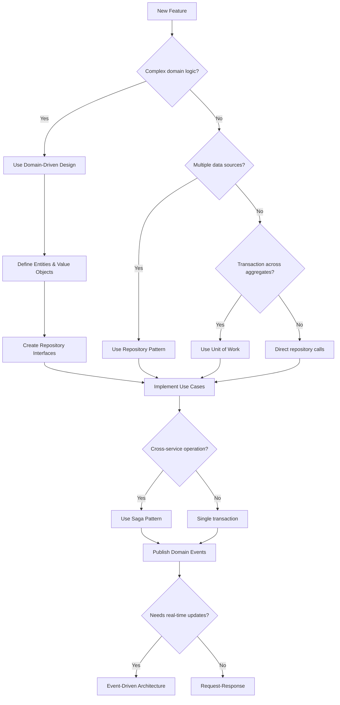

# Python Backend Architecture

Production-ready patterns for Python backend systems following Clean Architecture, Domain-Driven Design, and modern distributed system patterns.

## Quick Reference

| Need to...                        | See Reference                                                   |
| --------------------------------- | --------------------------------------------------------------- |
| Structure a new project           | [project-structure.md](references/project-structure.md)         |
| Follow code standards             | [code-style.md](references/code-style.md)                       |
| Implement DI, Repository, UoW     | [architecture-patterns.md](references/architecture-patterns.md) |
| Design entities and value objects | [domain-driven-design.md](references/domain-driven-design.md)   |
| Build FastAPI endpoints           | [api-design.md](references/api-design.md)                       |
| Set up SQLAlchemy and queries     | [database-patterns.md](references/database-patterns.md)         |
| Implement caching                 | [caching.md](references/caching.md)                             |
| Handle events and sagas           | [event-driven.md](references/event-driven.md)                   |
| Build microservices               | [microservices.md](references/microservices.md)                 |
| Secure the application            | [security.md](references/security.md)                           |
| Add logging, metrics, tracing     | [observability.md](references/observability.md)                 |
| Write tests                       | [testing.md](references/testing.md)                             |
| Deploy to production              | [deployment.md](references/deployment.md)                       |

---

## Core Principles

### Architecture Layers

```
┌─────────────────────────────────────────────┐
│           Presentation Layer                │  ← API routes, schemas, middleware
├─────────────────────────────────────────────┤
│           Application Layer                 │  ← Use cases, DTOs, interfaces
├─────────────────────────────────────────────┤
│             Domain Layer                    │  ← Entities, value objects, events
├─────────────────────────────────────────────┤
│          Infrastructure Layer               │  ← DB, cache, messaging, external APIs
└─────────────────────────────────────────────┘
```

**Dependency Rule**: Dependencies point inward. Domain has no external dependencies.

### Key Principles

1. **Dependency Injection** - Depend on abstractions, not implementations
2. **Single Responsibility** - One reason to change per class/function
3. **Explicit over Implicit** - No hidden dependencies or magic
4. **Async by Default** - Use async/await for all I/O operations
5. **Type Hints Everywhere** - All public APIs fully typed
6. **Immutability** - Prefer immutable data structures (especially value objects)
7. **Early Return** - Reduce nesting with guard clauses

---

## Architecture Decision Flowchart



---

## Common Patterns Summary

### Domain Layer

- **Entities**: Objects with identity and lifecycle. See [domain-driven-design.md](references/domain-driven-design.md#entities)
- **Value Objects**: Immutable objects compared by value. See [domain-driven-design.md](references/domain-driven-design.md#value-objects)
- **Domain Events**: Capture what happened. See [domain-driven-design.md](references/domain-driven-design.md#domain-events)
- **Aggregates**: Consistency boundaries. See [domain-driven-design.md](references/domain-driven-design.md#aggregates)

### Application Layer

- **Use Cases**: Single operation orchestrators
- **DTOs**: Data transfer between layers
- **Interfaces**: Abstract ports for infrastructure

### Infrastructure Layer

- **Repositories**: Data access abstraction. See [architecture-patterns.md](references/architecture-patterns.md#repository-pattern)
- **Unit of Work**: Transaction management. See [architecture-patterns.md](references/architecture-patterns.md#unit-of-work-pattern)
- **Event Bus**: Publish/subscribe messaging. See [event-driven.md](references/event-driven.md#event-bus)

### Presentation Layer

- **Routers**: HTTP endpoint handlers. See [api-design.md](references/api-design.md#fastapi-router-structure)
- **Schemas**: Request/response validation. See [api-design.md](references/api-design.md#requestresponse-schemas)
- **Dependencies**: DI factory functions. See [api-design.md](references/api-design.md#dependency-injection-setup)

---

## Error Handling Strategy

```python
# Domain errors (business logic violations)
class DomainError(Exception): pass
class EntityNotFoundError(DomainError): pass
class BusinessRuleViolationError(DomainError): pass

# Infrastructure errors (external system failures)
class InfrastructureError(Exception): pass
class DatabaseConnectionError(InfrastructureError): pass
class ExternalAPIError(InfrastructureError): pass

# Map to HTTP in presentation layer
@router.get("/{id}")
async def get_item(id: UUID, use_case: GetItemUseCase = Depends(...)):
    try:
        return await use_case.execute(id)
    except EntityNotFoundError:
        raise HTTPException(status_code=404, detail="Not found")
    except BusinessRuleViolationError as e:
        raise HTTPException(status_code=400, detail=str(e))
    except InfrastructureError:
        raise HTTPException(status_code=503, detail="Service unavailable")
```

See [code-style.md](references/code-style.md#error-handling) for full exception hierarchy.

---

## Quick Start Patterns

### Basic Repository + Use Case

```python
# 1. Define interface (application layer)
class UserRepository(ABC):
    @abstractmethod
    async def get_by_id(self, id: UUID) -> User | None: pass

    @abstractmethod
    async def save(self, user: User) -> User: pass

# 2. Implement (infrastructure layer)
class PostgresUserRepository(UserRepository):
    def __init__(self, session: AsyncSession):
        self._session = session

    async def get_by_id(self, id: UUID) -> User | None:
        result = await self._session.execute(
            select(UserModel).where(UserModel.id == id)
        )
        model = result.scalar_one_or_none()
        return self._to_entity(model) if model else None

# 3. Use case (application layer)
@dataclass
class GetUserUseCase:
    user_repo: UserRepository

    async def execute(self, user_id: UUID) -> UserDTO:
        user = await self.user_repo.get_by_id(user_id)
        if not user:
            raise EntityNotFoundError("User", str(user_id))
        return UserDTO.from_entity(user)

# 4. Route (presentation layer)
@router.get("/{user_id}")
async def get_user(
    user_id: UUID,
    use_case: GetUserUseCase = Depends(get_user_use_case)
):
    return await use_case.execute(user_id)
```

### Adding Caching

```python
@dataclass
class GetUserUseCase:
    user_repo: UserRepository
    cache: CacheService

    async def execute(self, user_id: UUID) -> UserDTO:
        # Try cache
        cached = await self.cache.get(f"user:{user_id}")
        if cached:
            return UserDTO.parse_raw(cached)

        # Fetch from DB
        user = await self.user_repo.get_by_id(user_id)
        if not user:
            raise EntityNotFoundError("User", str(user_id))

        # Cache result
        dto = UserDTO.from_entity(user)
        await self.cache.set(f"user:{user_id}", dto.json(), ttl=300)
        return dto
```

See [caching.md](references/caching.md) for advanced patterns.

### Publishing Events

```python
@dataclass
class CreateOrderUseCase:
    order_repo: OrderRepository
    event_bus: EventBus

    async def execute(self, command: CreateOrderCommand) -> OrderDTO:
        order = Order.create(user_id=command.user_id, items=command.items)
        saved = await self.order_repo.add(order)

        # Publish event after successful save
        await self.event_bus.publish(OrderCreatedEvent.from_entity(saved))

        return OrderDTO.from_entity(saved)
```

See [event-driven.md](references/event-driven.md) for event handlers and saga patterns.

---

## Production Readiness

Before deploying, verify:

- [ ] **Observability**: Logging, metrics, tracing configured. See [observability.md](references/observability.md)
- [ ] **Security**: Auth, input validation, rate limiting. See [security.md](references/security.md)
- [ ] **Testing**: Unit, integration, E2E tests passing. See [testing.md](references/testing.md)
- [ ] **Resilience**: Circuit breakers, retries, graceful shutdown. See [microservices.md](references/microservices.md)
- [ ] **Deployment**: Docker, K8s, health checks configured. See [deployment.md](references/deployment.md)
