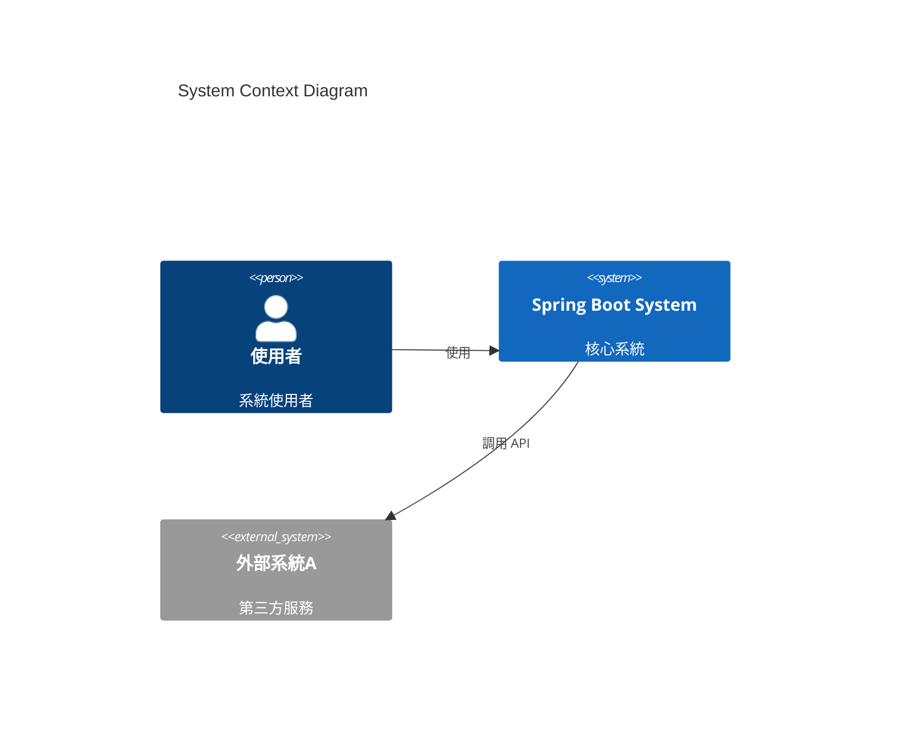
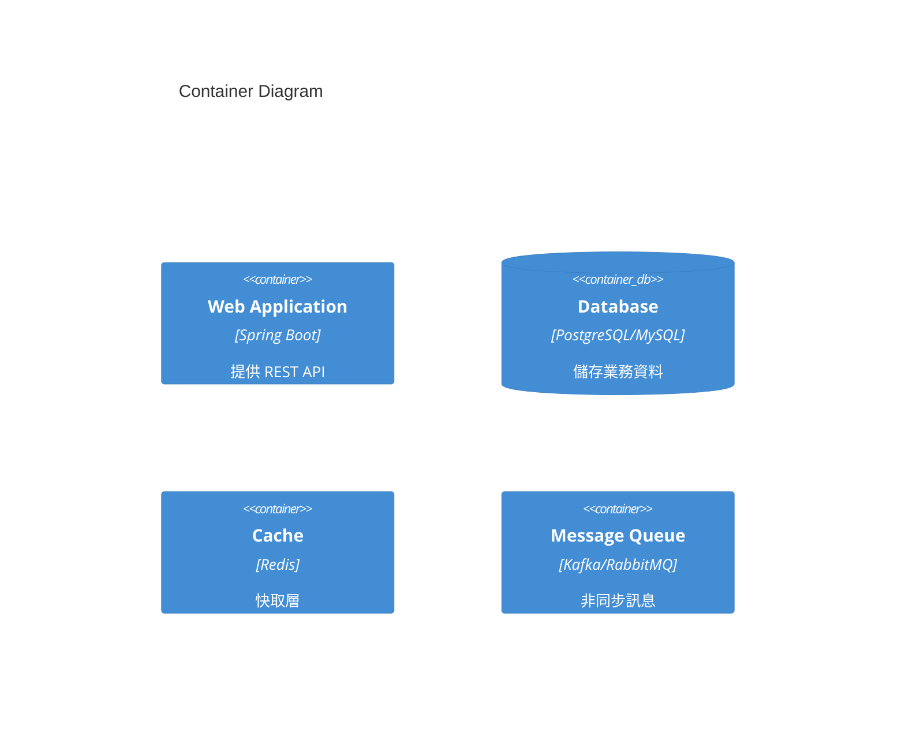
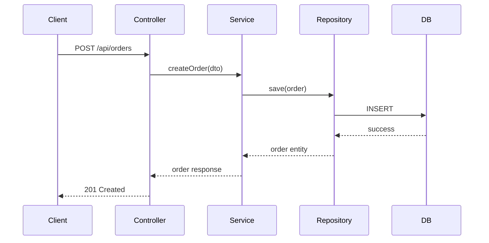
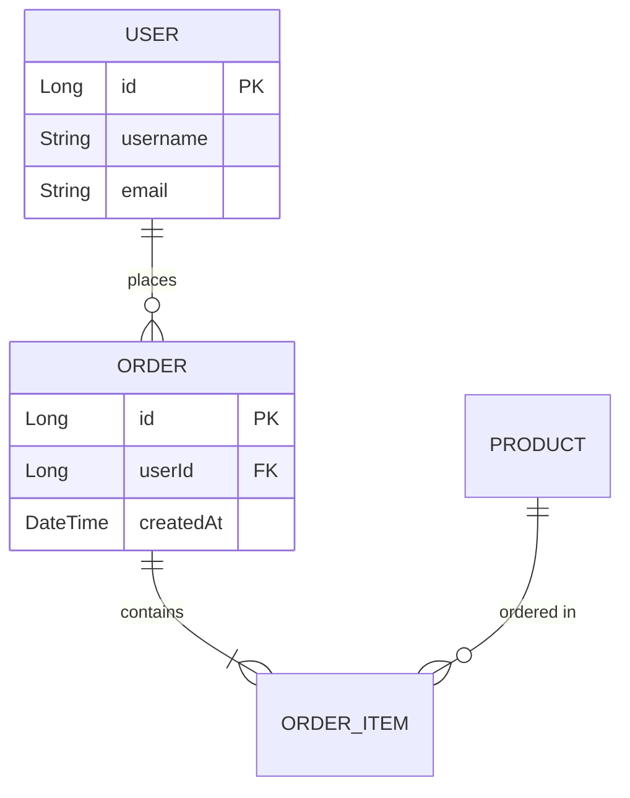

# Spring Boot System Architecture Analyzer

## Purpose
系統化分析 Spring Boot 專案並生成完整的企業級架構文件,涵蓋系統概述、架構視圖、技術細節、部署策略等所有關鍵面向。

## Scope
此 Skill 適用於:
- 單體 Spring Boot 應用
- Spring Cloud 微服務架構
- 混合架構系統
- 需要生成完整架構文件的場景

## Analysis Methodology

### Phase 1: Project Discovery (專案探索)
**目標**: 建立專案基礎認知

**Actions**:
1. 識別專案根目錄和結構
2. 讀取 `pom.xml` 或 `build.gradle` 確定:
   - Spring Boot 版本
   - 主要依賴和技術棧
   - 是否為多模組專案
3. 檢查 `README.md` 了解專案背景
4. 識別原始碼主要目錄結構

**Output**: 專案基本資訊清單

---

### Phase 2: Architecture Documentation Generation (架構文件生成)

依據完整架構文件標準,系統化生成以下各部分:

#### 2.1 系統概述 (System Overview)
**分析重點**:
- 從 README、註解、配置檔案推斷業務目標
- 識別主要功能模組 (通過 package 結構)
- 估算系統規模 (Controller 數量、API 端點數)
- 識別核心業務流程

**生成內容**:
```markdown
# 系統概述
## 業務目標
[從 README 或主要 Application 類別的註解提取]

## 核心功能模組
[基於 package 結構列出]

## 預期使用場景
[基於 Controller 和 Service 分析推斷]

## 系統規模指標
- API 端點數: X
- 核心業務服務: Y
- 資料實體數: Z
```

---

#### 2.2 架構視圖 (Architecture Views)
**採用 C4 Model 分層展示**

**2.2.1 Context Diagram (系統上下文圖)**
**分析方法**:
- 掃描 `@FeignClient`、`RestTemplate`、`WebClient` 識別外部系統調用
- 檢查 `application.yml` 中的外部服務配置
- 識別第三方 API 整合

**生成 Mermaid 圖**:


**2.2.2 Container Diagram (容器圖)**
**分析方法**:
- 識別資料庫類型 (JPA: @Entity, MongoDB: @Document)
- 檢查 Redis 配置 (@EnableCaching, RedisTemplate)
- 掃描訊息佇列 (@KafkaListener, @RabbitListener)
- 識別 API Gateway 配置 (Spring Cloud Gateway)

**生成內容**:


**2.2.3 Component Diagram (組件圖)**
**分析方法**:
- 掃描所有 `@RestController` 建立 Controller 清單
- 掃描所有 `@Service` 建立 Service 清單
- 掃描所有 `@Repository` / JPA Repository 建立資料存取層清單
- 識別 `@Configuration` 類別
- 繪製主要模組間的依賴關係

**掃描指令範例**:
```bash
# Controllers
find . -name "*.java" -exec grep -l "@RestController\|@Controller" {} \;

# Services  
find . -name "*.java" -exec grep -l "@Service" {} \;

# Repositories
find . -name "*.java" -exec grep -l "@Repository\|extends JpaRepository\|extends MongoRepository" {} \;
```

**生成 Component 清單表格**:
```markdown
## 組件清單

### Controller 層
| Controller | 路徑 | 主要功能 |
|------------|------|----------|
| UserController | /api/users | 使用者管理 |
| OrderController | /api/orders | 訂單處理 |

### Service 層
| Service | 依賴的 Repository | 業務職責 |
|---------|------------------|----------|
| UserService | UserRepository | 使用者業務邏輯 |

### Repository 層
| Repository | Entity | 資料庫 |
|-----------|--------|--------|
| UserRepository | User | users table |
```

**2.2.4 關鍵業務流程序列圖**
**分析方法**:
- 選擇 2-3 個核心 API 端點
- 追蹤方法調用鏈 (Controller → Service → Repository)
- 識別事務邊界 (@Transactional)
- 識別快取使用 (@Cacheable)

**生成序列圖**:


---

#### 2.3 技術架構 (Technical Architecture)

**2.3.1 技術棧清單**
**分析來源**: `pom.xml` / `build.gradle`

**生成內容**:
```markdown
## 技術棧

### 核心框架
- Spring Boot: [version]
- Spring Framework: [version]
- Java Version: [version]

### Web 層
- Spring Web MVC / WebFlux
- Validation: [spring-boot-starter-validation]
- API 文件: [Swagger/SpringDoc]

### 資料存取
- Spring Data JPA / MongoDB
- Database Driver: [MySQL/PostgreSQL]
- Connection Pool: [HikariCP]
- Migration: [Flyway/Liquibase]

### 快取
- Redis / Caffeine
- Spring Cache Abstraction

### 訊息佇列
- Kafka / RabbitMQ / ActiveMQ

### 安全
- Spring Security
- OAuth2 / JWT
- CORS 配置

### 監控與日誌
- Spring Boot Actuator
- Micrometer / Prometheus
- SLF4J + Logback/Log4j2

### 測試
- JUnit 5
- Mockito
- TestContainers
- Spring Boot Test

### 工具庫
- Lombok
- MapStruct
- Apache Commons
```

**2.3.2 分層架構說明**
**分析方法**:
- 分析 package 命名慣例
- 識別架構模式 (是否使用 DDD, Hexagonal Architecture)
- 檢查是否有 DTO、VO、Entity 的明確分層

**生成內容**:
```markdown
## 分層架構

### 標準分層
```
com.example.project
├── controller/     # 表現層 - REST API 端點
├── service/        # 業務邏輯層
├── repository/     # 資料存取層
├── entity/         # 資料模型
├── dto/            # 資料傳輸物件
├── config/         # 配置類別
├── exception/      # 例外處理
└── util/           # 工具類別
```

### 設計模式應用
- Repository Pattern: [使用情況]
- Service Layer Pattern: [使用情況]
- DTO Pattern: [使用情況]
- Factory Pattern: [識別的工廠類別]
```

**2.3.3 程式碼組織結構**
**使用 tree 指令生成**:
```bash
tree -L 3 -I 'target|node_modules|.git' src/main/java
```

---

#### 2.4 部署架構 (Deployment Architecture)

**2.4.1 部署配置分析**
**分析來源**:
- `Dockerfile` 存在與否
- `docker-compose.yml` 
- `kubernetes/` 目錄下的 YAML 檔案
- CI/CD 配置檔案 (`.gitlab-ci.yml`, `Jenkinsfile`, `.github/workflows`)

**生成內容**:
```markdown
## 部署架構

### 容器化
- Docker 支援: [是/否]
- Base Image: [從 Dockerfile 讀取]
- 暴露端口: [從 Dockerfile/application.yml 讀取]

### 編排
- Kubernetes 配置: [是/否]
  - Deployment
  - Service
  - ConfigMap
  - Ingress

### CI/CD
- 工具: [GitLab CI / Jenkins / GitHub Actions]
- Pipeline 階段: [build, test, deploy]
```

**2.4.2 環境配置**
**分析方法**:
- 檢查 `application-{profile}.yml` 檔案
- 列出所有 Spring Profile

**生成內容**:
```markdown
## 環境配置

### Spring Profiles
- dev: 開發環境
- test: 測試環境  
- prod: 生產環境

### 配置差異
[分析各環境配置檔案的主要差異]
```

**2.4.3 擴展策略**
**分析依據**:
- 是否使用 stateless session (JWT)
- 資料庫連接池配置
- 快取配置

**生成內容**:
```markdown
## 擴展策略
- 水平擴展能力: [基於 stateless 設計評估]
- Session 管理: [JWT / Redis Session]
- 負載均衡: [從配置推斷]
```

---

#### 2.5 資料架構 (Data Architecture)

**2.5.1 資料庫選型**
**分析方法**:
- 從依賴識別資料庫類型
- 檢查 `application.yml` 的 datasource 配置
- 識別多資料源配置

**生成內容**:
```markdown
## 資料庫

### 主資料庫
- 類型: [MySQL/PostgreSQL/Oracle]
- Driver: [版本]
- 連接池: HikariCP
  - Maximum Pool Size: [從配置讀取]
  - Connection Timeout: [從配置讀取]

### NoSQL
- MongoDB: [是/否]
- Redis: [用途: cache/session]

### 多資料源
[列出所有配置的資料源]
```

**2.5.2 資料模型**
**分析方法**:
- 掃描所有 `@Entity` 類別
- 識別關聯關係 (@OneToMany, @ManyToOne, @ManyToMany)
- 分析繼承策略 (@Inheritance)

**生成 ER Diagram**:


**生成 Entity 清單**:
```markdown
## 資料實體

| Entity | Table | 主要欄位 | 關聯關係 |
|--------|-------|---------|---------|
| User | users | id, username, email | 一對多 Order |
| Order | orders | id, userId, total | 多對一 User, 一對多 OrderItem |
```

**2.5.3 快取策略**
**分析方法**:
- 檢查 `@Cacheable`, `@CacheEvict`, `@CachePut` 使用
- 分析 Redis 配置
- 識別快取序列化設定

**生成內容**:
```markdown
## 快取策略

### Redis 配置
- Host: [從 application.yml]
- Port: [從 application.yml]
- 序列化方式: [Jackson/JDK]

### 快取使用
| Service/Method | Cache Name | TTL | 用途 |
|----------------|------------|-----|------|
| UserService.findById | users | 10m | 使用者資料快取 |
```

**2.5.4 資料遷移**
**分析方法**:
- 檢查 Flyway (`db/migration/`) 或 Liquibase (`changelog/`) 目錄
- 列出遷移腳本

**生成內容**:
```markdown
## 資料庫遷移
- 工具: Flyway / Liquibase
- 遷移腳本位置: [路徑]
- 遷移歷史: [列出主要版本]
```

---

#### 2.6 整合與介面 (Integration & Interfaces)

**2.6.1 API 設計**
**分析方法**:
- 掃描所有 `@RequestMapping` 及其衍生註解
- 建立完整的 API 端點清單
- 識別 API 版本策略
- 檢查 Swagger/OpenAPI 配置

**生成 API 清單**:
```markdown
## REST API 端點

### 使用者管理 API
| Method | Endpoint | 功能 | Request | Response |
|--------|----------|------|---------|----------|
| GET | /api/v1/users | 查詢使用者列表 | Pageable | Page<UserDTO> |
| GET | /api/v1/users/{id} | 查詢單一使用者 | PathVariable | UserDTO |
| POST | /api/v1/users | 建立使用者 | UserCreateDTO | UserDTO |
| PUT | /api/v1/users/{id} | 更新使用者 | UserUpdateDTO | UserDTO |
| DELETE | /api/v1/users/{id} | 刪除使用者 | PathVariable | void |

### API 設計規範
- RESTful 風格: [是/否]
- 版本策略: URL versioning / Header versioning
- 回應格式: 統一包裝 / 直接返回
- 錯誤處理: [統一錯誤回應格式]
```

**2.6.2 第三方整合**
**分析方法**:
- 掃描 `@FeignClient` 註解
- 檢查 `RestTemplate`、`WebClient` Bean 定義
- 分析 `application.yml` 中的外部服務 URL

**生成內容**:
```markdown
## 第三方服務整合

| 服務名稱 | 整合方式 | 用途 | 配置位置 |
|---------|---------|------|---------|
| Payment Service | Feign Client | 支付處理 | PaymentClient.java |
| SMS Service | RestTemplate | 簡訊發送 | SmsConfig.java |
```

**2.6.3 訊息佇列**
**分析方法**:
- 掃描 `@KafkaListener`, `@RabbitListener`
- 識別訊息生產者 (KafkaTemplate, RabbitTemplate)
- 分析 topic/queue 配置

**生成內容**:
```markdown
## 訊息佇列

### Kafka Topics
| Topic | Producer | Consumer | 用途 |
|-------|----------|----------|------|
| order-created | OrderService | NotificationService | 訂單建立通知 |

### RabbitMQ Queues
| Queue | Exchange | Routing Key | 用途 |
|-------|----------|-------------|------|
```

**2.6.4 服務間通訊**
**分析方法**:
- 識別同步調用 (Feign, RestTemplate)
- 識別非同步調用 (Message Queue)
- 檢查斷路器配置 (Resilience4j, Hystrix)

---

#### 2.7 非功能性需求 (Non-Functional Requirements)

**2.7.1 效能設計**
**分析方法**:
- 檢查連接池配置
- 識別非同步處理 (@Async)
- 分析批次處理實作

**生成內容**:
```markdown
## 效能設計

### 資料庫效能
- 連接池最大值: [HikariCP max-pool-size]
- 查詢優化: [是否使用 @Query, QueryDSL]
- 批次操作: [JPA batch size 配置]

### 非同步處理
- 非同步方法數: [掃描 @Async]
- 執行緒池配置: [TaskExecutor 配置]

### 回應時間要求
[從註解或配置推斷,或標註為待補充]
```

**2.7.2 安全設計**
**分析方法**:
- 檢查 `SecurityConfig` 類別
- 識別認證機制 (JWT, OAuth2, Basic Auth)
- 分析授權規則
- 檢查 CORS 配置
- 識別敏感資料處理

**生成內容**:
```markdown
## 安全設計

### 認證機制
- 方式: [JWT / OAuth2 / Session]
- Token 儲存: [Header / Cookie]
- Token 有效期: [從配置讀取]

### 授權
- 授權模型: [RBAC / ABAC]
- 權限檢查: [@PreAuthorize 使用情況]

### API 安全
- HTTPS: [是/否]
- CORS 配置: [允許的 origins]
- CSRF 保護: [啟用/停用]
- Rate Limiting: [是否實作]

### 資料安全
- 密碼加密: [BCrypt 等]
- 敏感資料遮罩: [是否實作]
- SQL Injection 防護: [使用 PreparedStatement]
```

**2.7.3 監控與日誌**
**分析方法**:
- 檢查 Actuator 端點配置
- 識別 Micrometer metrics
- 分析日誌配置 (`logback-spring.xml`, `log4j2.xml`)
- 檢查分散式追蹤 (Sleuth, Zipkin)

**生成內容**:
```markdown
## 監控與日誌

### 健康檢查
- Actuator 端點: [/actuator/health, /actuator/metrics]
- 自訂健康指標: [列出 HealthIndicator 實作]

### Metrics
- Metrics Provider: Micrometer
- 監控後端: [Prometheus / InfluxDB]
- 自訂 Metrics: [列出]

### 日誌
- 日誌框架: SLF4J + [Logback/Log4j2]
- 日誌級別: [預設級別]
- 日誌輸出:
  - Console: [是/否]
  - File: [路徑]
  - 集中式日誌: [ELK / Splunk]

### 分散式追蹤
- Spring Cloud Sleuth: [是/否]
- Trace ID 傳遞: [是/否]
- Zipkin/Jaeger: [是/否]

### 告警
[告警規則配置,如有]
```

**2.7.4 錯誤處理**
**分析方法**:
- 檢查 `@ControllerAdvice` 或 `@RestControllerAdvice`
- 分析全域例外處理器
- 識別自訂例外類別

**生成內容**:
```markdown
## 錯誤處理機制

### 全域例外處理
- Handler: [類別名稱]
- 統一錯誤回應格式:
```json
{
  "timestamp": "2025-11-15T10:30:00",
  "status": 400,
  "error": "Bad Request",
  "message": "詳細錯誤訊息",
  "path": "/api/users"
}
```

### 自訂例外
[列出自訂例外類別及其用途]
```

---

#### 2.8 設計決策記錄 (Architecture Decision Records)

**分析方法**:
- 檢查 `docs/adr/` 目錄是否存在 ADR
- 從技術選型推斷可能的決策點
- 建議需要記錄的設計決策

**生成 ADR 範本**:
```markdown
## 架構決策記錄 (ADR)

### ADR-001: 選擇 PostgreSQL 作為主資料庫
**狀態**: 已採用

**背景**:
[從專案配置推斷]

**決策**:
使用 PostgreSQL 作為主要關聯式資料庫

**考慮的替代方案**:
- MySQL
- Oracle

**決策理由**:
[待補充 - 建議團隊補充]

**後果**:
- 正面: 強大的 JSON 支援、完整的 ACID 保證
- 負面: 相較 MySQL 的運維複雜度稍高

---

### ADR-002: 採用 JWT 進行 API 認證
**狀態**: 已採用

**背景**:
RESTful API 需要無狀態的認證機制

**決策**:
使用 JWT (JSON Web Token) 進行使用者認證

**考慮的替代方案**:
- Session-based authentication
- OAuth2

**決策理由**:
[待補充]

---

### 建議新增的 ADR 主題
[基於分析結果,列出建議記錄但尚未記錄的設計決策]
- 為何選擇單體架構而非微服務
- API 版本策略的選擇
- 快取策略的選擇
- ...
```

---

#### 2.9 限制與風險 (Constraints & Risks)

**分析方法**:
- 識別技術債 (過時的依賴版本)
- 檢查安全漏洞 (可整合 OWASP Dependency Check)
- 分析架構瓶頸

**生成內容**:
```markdown
## 限制與風險

### 已知技術債
[從依賴分析識別]
- Spring Boot 版本: [current] (最新穩定版: [latest])
- 過時依賴:
  - [列出版本落後的主要依賴]

### 架構限制
[基於分析推斷]
- 單體架構的擴展限制
- 同步調用的效能瓶頸
- 單一資料庫的擴展性

### 潛在風險
- **效能風險**: [N+1 查詢問題、缺少索引等]
- **安全風險**: [列出潛在的安全問題]
- **可用性風險**: [單點故障、缺少備援等]
- **維護風險**: [程式碼複雜度、缺少測試等]

### 緩解措施
[針對每個風險提出建議]
```

---

#### 2.10 未來演進方向 (Future Evolution)

**分析方法**:
- 基於現有架構識別改進空間
- 參考業界最佳實踐

**生成內容**:
```markdown
## 未來演進方向

### 短期改進 (1-3 個月)
- 補充缺少的單元測試 (目標覆蓋率: 80%)
- 整合 API 文件自動生成 (OpenAPI 3.0)
- 加強監控和告警機制
- 實作 Rate Limiting

### 中期規劃 (3-6 個月)
- 引入容器化部署 (Docker + Kubernetes)
- 實作 CI/CD 自動化
- 資料庫讀寫分離
- 引入快取預熱機制

### 長期願景 (6-12 個月)
- 評估微服務拆分可行性
- 引入事件驅動架構 (Event Sourcing)
- 實作 CQRS 模式
- 多區域部署支援

### 技術升級路線
- Spring Boot 3.x 升級規劃
- Java 17/21 遷移評估
- GraalVM Native Image 嘗試
```

---

## Output Format

生成的架構文件應輸出至 `/mnt/user-data/outputs/architecture-doc.md`,結構如下:

```markdown
# [專案名稱] 系統架構文件

> 文件版本: 1.0  
> 生成日期: [date]  
> Spring Boot 版本: [version]

---

## 目錄
- [1. 系統概述](#1-系統概述)
- [2. 架構視圖](#2-架構視圖)
- [3. 技術架構](#3-技術架構)
- [4. 部署架構](#4-部署架構)
- [5. 資料架構](#5-資料架構)
- [6. 整合與介面](#6-整合與介面)
- [7. 非功能性需求](#7-非功能性需求)
- [8. 設計決策記錄](#8-設計決策記錄)
- [9. 限制與風險](#9-限制與風險)
- [10. 未來演進方向](#10-未來演進方向)

---

## 1. 系統概述
[內容]

## 2. 架構視圖
### 2.1 系統上下文圖 (Context Diagram)
[Mermaid 圖表]

### 2.2 容器圖 (Container Diagram)
[Mermaid 圖表]

### 2.3 組件圖 (Component Diagram)
[表格 + 說明]

### 2.4 關鍵業務流程
[序列圖]

## 3. 技術架構
[內容]

## 4. 部署架構
[內容]

## 5. 資料架構
[內容]

## 6. 整合與介面
[內容]

## 7. 非功能性需求
[內容]

## 8. 設計決策記錄 (ADR)
[內容]

## 9. 限制與風險
[內容]

## 10. 未來演進方向
[內容]

---

## 附錄

### A. 完整 API 端點清單
[詳細的 API 文件]

### B. 資料庫 Schema
[完整的表結構]

### C. 配置參考
[重要的配置項說明]

### D. 依賴清單
[完整的依賴及版本]
```

---

## Analysis Tools & Commands

### 專案結構分析
```bash
# 顯示專案目錄樹
tree -L 4 -I 'target|node_modules|.git|.idea' src/

# 統計程式碼行數
find src/ -name "*.java" | xargs wc -l | tail -1

# 統計各層組件數量
echo "Controllers: $(find src/ -name "*.java" -exec grep -l "@RestController\|@Controller" {} \; | wc -l)"
echo "Services: $(find src/ -name "*.java" -exec grep -l "@Service" {} \; | wc -l)"
echo "Repositories: $(find src/ -name "*.java" -exec grep -l "@Repository" {} \; | wc -l)"
echo "Entities: $(find src/ -name "*.java" -exec grep -l "@Entity" {} \; | wc -l)"
```

### 依賴分析
```bash
# Maven 依賴樹
mvn dependency:tree

# Gradle 依賴
./gradlew dependencies

# 檢查過時依賴
mvn versions:display-dependency-updates
```

### 配置檢視
```bash
# 列出所有 application 配置檔案
find . -name "application*.yml" -o -name "application*.properties"

# 檢視主配置
cat src/main/resources/application.yml
```

### API 端點掃描
```bash
# 掃描所有 REST 端點
grep -r "@GetMapping\|@PostMapping\|@PutMapping\|@DeleteMapping\|@RequestMapping" src/ --include="*.java"
```

---

## Best Practices

### 1. 漸進式分析
不要一次執行所有分析,而是按階段進行:
1. 先快速掃描建立基本框架
2. 再深入分析各個專項
3. 最後整合產出完整文件

### 2. 保持客觀
- 基於實際程式碼分析,不做臆測
- 無法確定的內容標註為「待確認」或「建議補充」
- 明確區分「已實作」和「建議實作」的內容

### 3. 視覺化優先
- 儘可能使用 Mermaid 圖表
- 複雜的關係用圖而非文字描述
- 表格優於冗長的條列

### 4. 務實的文件
- 不追求完美,先產出 80% 的內容
- 標註需要團隊補充的部分
- 提供清晰的改進建議

### 5. 自動化優先
- 能用程式掃描的不手動整理
- 建立可重複執行的分析腳本
- 文件應該可以隨程式碼更新而更新

---

## Integration with Claude Code

### 使用方式

1. **完整分析**:
```
使用 springboot-architecture-analyzer 分析專案:
/path/to/springboot-project

請生成完整的架構文件。
```

2. **特定章節分析**:
```
使用 springboot-architecture-analyzer 分析專案的資料架構部分:
/path/to/springboot-project

重點關注:
- 資料庫設計
- Entity 關聯關係
- 快取策略
```

3. **更新既有文件**:
```
使用 springboot-architecture-analyzer 更新架構文件:
/path/to/springboot-project

請重點更新第 6 節「整合與介面」,因為我們新增了 Kafka 整合。
```

### 預期工作流程

1. Claude 讀取此 SKILL.md
2. 執行 Phase 1: Project Discovery
3. 系統化執行各個分析階段
4. 產出結構化的 Markdown 文件
5. 將文件移至 `/mnt/user-data/outputs/`

---

## Limitations

### 此 Skill 無法做到的事情:
- 理解業務邏輯的深層語意 (需要人工解釋)
- 評估程式碼品質 (需要整合 SonarQube 等工具)
- 執行效能測試或壓力測試
- 存取執行時資料或日誌

### 需要人工補充的內容:
- 具體的業務目標和策略
- 設計決策背後的理由
- 效能的具體 SLA 數字
- 組織和團隊相關的上下文

---

## Version History

- v1.0 (2025-11-15): 初始版本,涵蓋完整的 10 章節架構文件生成

---

## References

- C4 Model: https://c4model.com/
- Architecture Decision Records: https://adr.github.io/
- Spring Boot Documentation: https://spring.io/projects/spring-boot
- Mermaid Documentation: https://mermaid.js.org/
