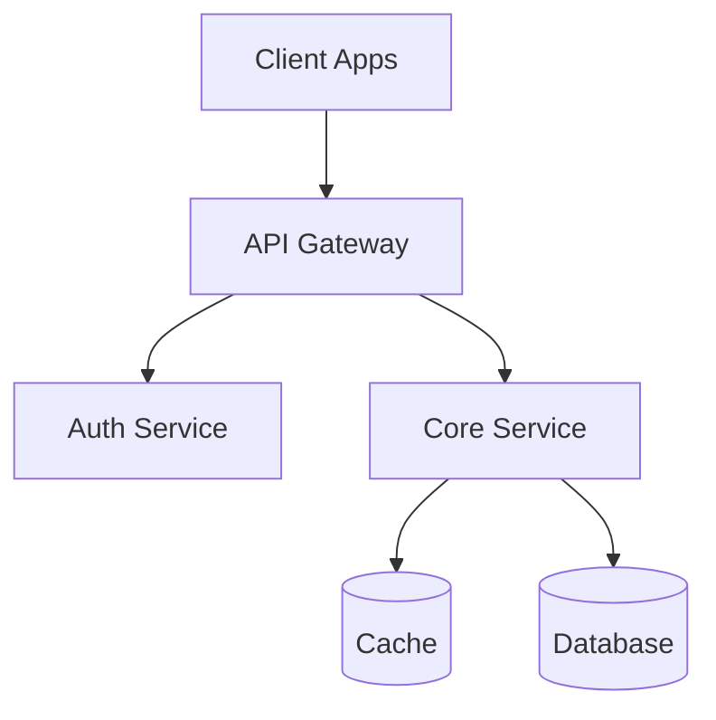

# System Design

## Overview

This skill helps you create comprehensive, production-ready system design specifications. When a user asks you to design a system, use this skill to generate a complete `spec/` folder containing professional documentation covering all aspects of the system architecture.

## Workflow

### Step 1: Gather Requirements

Before generating the spec folder, understand the system requirements:

**Key Questions:**
- What is the system's purpose?
- Who are the users?
- What are the core features?
- What is the expected scale (users, requests, data)?
- What are the constraints (budget, timeline, technology)?
- Are there specific non-functional requirements (performance, security, compliance)?

**If requirements are unclear**, ask the user for clarification using specific questions based on the system type.

### Step 2: Initialize Spec Folder

Use the `init_spec.py` script to create the specification folder structure:

```bash
python scripts/init_spec.py <system-name> --path ./spec
```

**What this creates:**
- Complete folder structure with template markdown files
- All standard sections (overview, requirements, architecture, data model, API design, scalability, security, monitoring, deployment)
- `diagrams/` folder for architecture diagrams
- README with navigation and status tracking

**The script generates 10 comprehensive template files:**
1. `README.md` - Document overview and navigation
2. `01-overview.md` - Executive summary, problem statement, goals
3. `02-requirements.md` - Functional and non-functional requirements
4. `03-architecture.md` - System architecture and design decisions
5. `04-data-model.md` - Database schemas and data design
6. `05-api-design.md` - API specifications and contracts
7. `06-scalability.md` - Scaling strategy and performance
8. `07-security.md` - Security architecture and threat model
9. `08-monitoring.md` - Observability and operational monitoring
10. `09-deployment.md` - Deployment strategy and CI/CD

### Step 3: Complete the Specification

Work through each template file systematically, filling in details based on the system requirements. Use the reference files for guidance:

#### 3.1 Overview and Requirements (Files 01-02)

Fill in:
- Problem statement and goals
- Functional requirements (features, user stories)
- Non-functional requirements (performance, scalability, security, availability)
- Constraints and assumptions

**Tip**: Be specific with numbers (e.g., "Support 100,000 concurrent users" not "Support many users")

#### 3.2 Architecture Design (File 03)

**Reference**: See `references/architectural-patterns.md` for pattern guidance

Choose appropriate architecture style:
- **Simple systems**: Monolithic architecture
- **Complex systems**: Microservices
- **Variable traffic**: Serverless
- **Real-time systems**: Event-driven

Document:
- System components and responsibilities
- Communication patterns (sync vs async)
- Design decisions with rationale
- Architecture diagrams (use Mermaid)

**Example Mermaid Diagram:**


#### 3.3 Data Model (File 04)

Design:
- Database schema with tables and relationships
- Entity-Relationship Diagrams (ERD)
- Indexes for performance
- Partitioning/sharding strategy

**Include:**
- SQL CREATE TABLE statements
- Index definitions
- Relationships and foreign keys
- Data access patterns

#### 3.4 API Design (File 05)

Specify:
- API style (REST, GraphQL, gRPC)
- All endpoints with request/response examples
- Authentication and authorization
- Error handling
- Rate limiting

**Be comprehensive**: Include actual JSON examples, error codes, and edge cases

#### 3.5 Scalability (File 06)

**Reference**: See `references/system-design-workflow.md` for scalability planning

Plan:
- Horizontal and vertical scaling strategies
- Caching strategy (CDN, application cache, database cache)
- Load balancing approach
- Database scaling (read replicas, sharding)
- Capacity planning

**Include numbers**: Current capacity, growth projections, scaling thresholds

#### 3.6 Security (File 07)

Design:
- Threat model (assets, actors, attack vectors)
- Authentication and authorization mechanisms
- Data encryption (at rest, in transit)
- Network security (VPC, security groups)
- Compliance requirements

**Be specific**: Name actual technologies (e.g., "JWT tokens with 15-minute expiry")

#### 3.7 Monitoring (File 08)

Define:
- Logging strategy (what to log, format)
- Metrics to track (Golden Signals: latency, traffic, errors, saturation)
- Distributed tracing setup
- Alerting rules
- SLIs and SLOs

#### 3.8 Deployment (File 09)

Plan:
- Deployment strategy (blue-green, canary, rolling)
- CI/CD pipeline
- Infrastructure as code
- Rollback procedures
- Disaster recovery

### Step 4: Add Diagrams

Create architecture diagrams in the `diagrams/` folder:

**Essential diagrams:**
- High-level architecture
- Component diagram
- Data flow diagrams
- Sequence diagrams for key operations
- ERD (Entity-Relationship Diagram)
- Deployment diagram

**Use Mermaid** for markdown-based diagrams (can be embedded in markdown files or saved as `.mmd` files)

### Step 5: Technology Selection

**Reference**: See `references/tech-stack-guide.md` for technology choices

Choose technologies for:
- Frontend framework
- Backend language/framework
- Database (relational vs NoSQL)
- Cache
- Message queue
- Cloud provider
- Container orchestration
- Monitoring tools

**Document rationale** for each choice in the architecture section.

### Step 6: Validate Completeness

Use the validation script to check for completeness:

```bash
python scripts/validate_spec.py ./spec/<system-name>
```

**What it checks:**
- All required files present
- Required sections in each file
- No TODOs or placeholders remaining
- Diagrams folder populated

**Address any errors or warnings** before finalizing.

### Step 7: Review and Finalize

- Review all sections for consistency
- Ensure all design decisions have rationale
- Verify numbers are realistic
- Check that diagrams match text descriptions
- Update README status (Draft → In Review → Approved)

---

## Reference Files

This skill includes comprehensive reference guides to consult during system design:

### `architectural-patterns.md`
**When to read**: Choosing architecture style (Step 3.2)

Covers:
- Monolithic, Microservices, Serverless, Event-Driven architectures
- Layered, Hexagonal, CQRS, Event Sourcing patterns
- When to use each pattern
- Pros, cons, and trade-offs
- Pattern selection guidance

### `tech-stack-guide.md`
**When to read**: Selecting technologies (Step 5)

Covers:
- Frontend frameworks (React, Vue, Angular, Svelte)
- Backend languages (Node.js, Python, Go, Java, Rust)
- Databases (PostgreSQL, MySQL, MongoDB, DynamoDB)
- Message queues (RabbitMQ, Kafka, SQS)
- Cloud providers (AWS, GCP, Azure)
- Technology decision framework

### `system-design-workflow.md`
**When to read**: Understanding the overall process (Step 0)

Covers:
- Complete system design workflow
- Phase-by-phase guidance
- Best practices and pitfalls
- Checklists for completeness
- Common mistakes to avoid

---

## Example Usage

**User Request:**
> "Design a scalable chat application system"

**Your Process:**

1. **Gather Requirements** (ask clarifying questions):
   - How many concurrent users? (e.g., 100,000)
   - What features? (e.g., 1-on-1 chat, group chat, file sharing)
   - Any special requirements? (e.g., end-to-end encryption)

2. **Initialize Spec**:
   ```bash
   python scripts/init_spec.py chat-application --path ./spec
   ```

3. **Fill in Requirements** (01-02):
   - Problem: Real-time messaging for 100,000 users
   - Features: 1-on-1 chat, group chat, file sharing, read receipts
   - Performance: <100ms message delivery, 99.9% uptime
   - Security: End-to-end encryption, OAuth authentication

4. **Design Architecture** (03):
   - Event-driven architecture (WebSocket + message queue)
   - Components: API Gateway, Chat Service, Message Queue (Kafka), Database (PostgreSQL), Cache (Redis)
   - Diagrams: High-level architecture, message flow

5. **Design Data Model** (04):
   - Tables: users, conversations, messages, participants
   - Indexes: message_timestamp, conversation_id
   - Sharding strategy: By conversation_id

6. **Design APIs** (05):
   - WebSocket for real-time messages
   - REST for user management
   - Endpoints: POST /conversations, GET /messages, etc.

7. **Plan Scalability** (06):
   - Horizontal scaling of chat services
   - Redis for online user presence
   - Kafka for message distribution
   - Read replicas for message history

8. **Design Security** (07):
   - OAuth 2.0 authentication
   - End-to-end encryption for messages
   - Rate limiting to prevent spam

9. **Plan Monitoring** (08):
   - Metrics: Message delivery time, WebSocket connections
   - Alerts: High message queue lag, connection drops

10. **Plan Deployment** (09):
    - Kubernetes on AWS
    - Blue-green deployment
    - Auto-scaling based on connection count

11. **Validate**:
    ```bash
    python scripts/validate_spec.py ./spec/chat-application
    ```

12. **Deliver**: Present the complete `spec/chat-application/` folder to the user

---

## Tips for Effective System Design

### Do's

✅ **Start with requirements** - Understand what you're building before designing
✅ **Be specific with numbers** - Use actual metrics (100,000 users, <200ms latency)
✅ **Document trade-offs** - Explain why you chose option A over option B
✅ **Use diagrams** - Visual representations are clearer than text
✅ **Think about failure** - Design for component failures and degradation
✅ **Keep it realistic** - Don't over-engineer or under-estimate
✅ **Reference best practices** - Use the reference files for guidance
✅ **Validate completeness** - Use the validation script

### Don'ts

❌ **Don't be vague** - "Handle many users" → "Support 100,000 concurrent users"
❌ **Don't skip sections** - Complete all 9 specification files
❌ **Don't copy-paste without customization** - Adapt to specific requirements
❌ **Don't forget diagrams** - Architecture diagrams are essential
❌ **Don't ignore non-functional requirements** - Performance, security, scalability matter
❌ **Don't leave placeholders** - Replace all TODOs with actual content
❌ **Don't design in isolation** - Consider the user's constraints and context

---

## Common System Design Patterns

### Small Application (MVP)
**Architecture**: Monolithic
**Stack**: Next.js + PostgreSQL + Vercel
**Scale**: <10,000 users

### Medium Application (Growing Startup)
**Architecture**: Modular Monolith → Microservices transition
**Stack**: Node.js/Python + PostgreSQL + Redis + AWS
**Scale**: 10,000-500,000 users

### Large Application (Enterprise)
**Architecture**: Microservices + Event-Driven
**Stack**: Polyglot (Go/Java/Node.js) + PostgreSQL + Kafka + Kubernetes
**Scale**: 500,000+ users

### Real-Time Application
**Architecture**: Event-Driven + WebSockets
**Stack**: Node.js + Redis + Kafka + PostgreSQL
**Examples**: Chat, Live Dashboard, Collaborative Editing

### High-Traffic Application
**Architecture**: Microservices + CDN + Multi-Region
**Stack**: CDN + Load Balancer + Horizontal Services + Database Replicas
**Examples**: E-commerce, Social Media, Video Streaming

---

## Output Format

Always create a folder structure like this:

```
spec/
└── <system-name>/
    ├── README.md
    ├── 01-overview.md
    ├── 02-requirements.md
    ├── 03-architecture.md
    ├── 04-data-model.md
    ├── 05-api-design.md
    ├── 06-scalability.md
    ├── 07-security.md
    ├── 08-monitoring.md
    ├── 09-deployment.md
    └── diagrams/
        ├── architecture-overview.mmd
        ├── data-flow.mmd
        └── erd.mmd
```

All files should be comprehensive, professional, and production-ready. Each section should contain specific, actionable information rather than placeholders or generic descriptions.

---

## Summary

This skill enables you to create **complete, professional system design specifications** covering:

- Requirements (functional and non-functional)
- Architecture (components, patterns, decisions)
- Data modeling (schemas, relationships, indexing)
- API design (endpoints, contracts, authentication)
- Scalability (caching, load balancing, capacity planning)
- Security (threat model, encryption, access control)
- Monitoring (logging, metrics, alerting, SLOs)
- Deployment (CI/CD, infrastructure, disaster recovery)

Use the scripts to initialize and validate, and reference the guides for best practices. Always tailor the design to the specific requirements and constraints provided by the user.
