# Fenrir Ledger Team Pipeline — Kanban Workflow

This pipeline orchestrates the four Fenrir Ledger team agents in a Kanban flow. Work moves through the board from left to right, with each stage building on the previous stage's output.

## Diagrams

All diagrams produced by any team member must use Mermaid syntax following the style guide at:
`fenrir-ledger-team/ux-designer/ux-assets/mermaid-style-guide.md`

Every agent must read this guide before creating diagrams in any deliverable.

## Model Assignments

| Agent | Name | Model | Rationale |
|-------|------|-------|-----------|
| Product Owner | **Freya** | **Sonnet** | Strategic thinking, product vision, priority calls |
| UX Designer | **Luna** | **Sonnet** | Rapid wireframing, interaction design |
| Principal Engineer | **FiremanDecko** | **Sonnet** | Complex technical decisions, system design, and implementation |
| QA Tester | **Loki** | **Haiku** | Efficient test script generation, validation |

When spawning agents, use the model specified above for each role.

## Kanban Board

*The pack hunts in order. No wolf runs ahead of the chain.*

```mermaid
graph LR
    classDef primary fill:#03A9F4,stroke:#0288D1,color:#FFF
    classDef warning fill:#FF9800,stroke:#F57C00,color:#FFF
    classDef healthy fill:#4CAF50,stroke:#388E3C,color:#FFF
    classDef neutral fill:#F5F5F5,stroke:#E0E0E0,color:#212121

    %% Stages
    backlog[ᚠ Backlog<br/>Freya writes<br/>the stories]
    design[ᚱ Design<br/>Freya + Luna<br/>collaborate]
    build[ᚲ Build<br/>FiremanDecko<br/>forges the chain]
    validate[ᛏ Validate<br/>Loki tests<br/>the binding]
    done([ᛟ Done<br/>Ship / Hold])

    %% Flow
    backlog -->|story pulled| design
    design -->|brief handed off| build
    build -->|asks if unclear| design
    build -->|implementation ready| validate
    validate -->|ship / no-ship| done

    class backlog neutral
    class design primary
    class build primary
    class validate warning
    class done healthy
```



## Pipeline Execution

### Input
The pipeline accepts:
- A **product brief** (for initial project setup)
- A **feature request or story** (for new work)
- A **change request** (for modifications)

### Stage 1: DESIGN — Product Owner + UX Designer

Read both agent skills:
- `fenrir-ledger-team/product-owner/SKILL.md`
- `fenrir-ledger-team/ux-designer/SKILL.md`

These two agents collaborate together to produce a **Product Design Brief** that covers:
- Problem statement and target user
- User interactions and flows
- Look and feel direction
- Market fit and differentiation
- Wireframes (ASCII)
- Acceptance criteria (testable)
- Open questions for the Principal Engineer

This is a conversation between two perspectives — the PO brings the business/user context, the UX Designer brings the interaction and visual expertise. They should push back on each other where appropriate.

**Output**: Product Design Brief saved to the sprint directory.

### Stage 2: BUILD — Principal Engineer Design + Implementation

Read: `fenrir-ledger-team/principal-engineer/SKILL.md`

The Principal Engineer receives the Product Design Brief and produces both the technical architecture and the working implementation.

**Important**: If anything in the brief is ambiguous or technically concerning, the Principal Engineer asks the UX Designer or Product Owner directly before proceeding. Frame questions clearly with context, options, and impact.

**Output**:
- Architecture Decision Records (ADRs)
- System design with component diagrams
- API contracts (endpoints, message formats, data shapes)
- Sprint stories (max 5) with technical notes
- Working code files in the project structure
- Implementation plan documenting what was built
- Code specifications for each module
- Handoff notes for QA Tester (how to deploy, what to test)

### Stage 3: VALIDATE — QA Tester

Read: `fenrir-ledger-team/qa-tester/SKILL.md`

The QA Tester validates everything from a devil's advocate perspective. Creates **idempotent, reusable scripts** for:

1. **Deployment** — Scripts to deploy to a stable test environment. Safe to run repeatedly.
2. **Backend API testing** — Automated tests for every API endpoint.
3. **Frontend UI testing** — Browser automation tests for the UI.

All scripts must be idempotent — running them twice produces the same result with no side effects.

**Infrastructure constraints:**
- All testing runs against a **predefined test server** (not local dev)
- All secrets (SSH keys, tokens, server addresses) stored in a **`.env` file** loaded at runtime
- `.env` is in `.gitignore` — never committed. A `.env.example` template is committed for reference.
- Every script validates that `.env` exists and all required variables are set before proceeding

**Output**:
- Deployment scripts (`scripts/deploy.sh`, `setup-test-env.sh`, etc.) — all loading secrets from `.env`
- Backend test suite
- Frontend test suite
- Test plan and quality report
- Ship / No Ship recommendation

## Output Directory Structure

```
sprints/sprint-{N}/
├── design/
│   ├── product-design-brief.md    # PO + UX collaboration output
│   ├── wireframes.md              # UX wireframes
│   ├── interactions.md            # UX interaction specs
│   └── components.md              # UX component specs
├── architecture/
│   ├── adrs/                      # Architecture Decision Records
│   ├── system-design.md           # System design doc
│   └── api-contracts.md           # API contracts
├── development/
│   ├── implementation-plan.md     # What was built and how
│   ├── code-specs.md              # Module specifications
│   └── src/                       # Actual source code
├── quality/
│   ├── test-plan.md               # Test plan
│   ├── test-cases.md              # Detailed test cases
│   ├── quality-report.md          # Final quality report
│   └── scripts/                   # Idempotent test/deploy scripts
│       ├── deploy.sh
│       ├── setup-test-env.sh
│       ├── teardown-test-env.sh
│       ├── run-api-tests.sh
│       ├── run-ui-tests.sh
│       └── run-all-tests.sh
└── sprint-summary.md              # Overall sprint summary
```

## Kanban Rules

1. **WIP Limit**: One story moves through the pipeline at a time. Don't start the next story until the current one reaches DONE or is explicitly parked.
2. **Pull, Don't Push**: Each stage pulls work when ready, doesn't have work pushed onto it.
3. **Blocker Escalation**: If any stage is blocked, escalate to the previous stage (Principal Engineer asks PO/UX, QA asks Principal Engineer).
4. **Max 5 Stories per Sprint**: From the product brief. The PO enforces this constraint.
5. **Definition of Done**: A story is DONE when QA signs off with a Ship recommendation and all idempotent test scripts pass.
