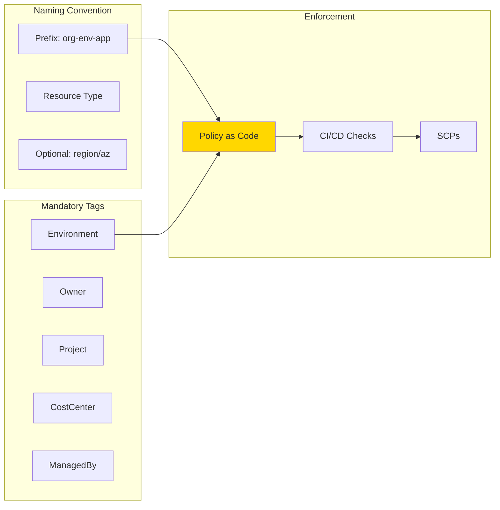

# Naming & Tagging Standards

## Overview

Consistent **naming conventions** and **mandatory tags** are essential for:
- **Cost allocation** and tracking across teams, projects, and environments
- **Security** and ownership identification
- **Automation** and resource discovery
- **Compliance** and audit trails

Without standards, infrastructure becomes unmanageable at scale.



## Key Concepts

### Naming Pattern
A consistent pattern like `{org}-{env}-{app}-{resource}-{suffix}` ensures predictability:
- **org**: Organization or team prefix (e.g., `acme`)
- **env**: Environment (e.g., `dev`, `staging`, `prod`)
- **app**: Application name (e.g., `api`, `web`)
- **resource**: Resource type (e.g., `vpc`, `subnet`, `role`)
- **suffix**: Optional disambiguator (e.g., region, AZ, counter)

### Tag Categories
1. **Technical Tags**: Environment, Version, ManagedBy
2. **Business Tags**: Project, CostCenter, Owner
3. **Security Tags**: DataClassification, Compliance
4. **Automation Tags**: Backup, Schedule, Terraform

### Case Sensitivity
- **Resource names**: Use lowercase with hyphens (`my-vpc`)
- **Tag keys**: Use PascalCase (`CostCenter`, `Environment`)
- **Tag values**: Use lowercase (`production`, `team-a`)

## Best Practices

1. **Enforce via Policy as Code** - Use OPA/Conftest to validate naming and tags
2. **Default tags at provider level** - Apply common tags to all resources
3. **Document standards** - Maintain a living document with examples
4. **Validate in CI/CD** - Block non-compliant resources before apply
5. **Use tag policies** - AWS Organizations tag policies for enforcement
6. **Automate tagging** - Use Terraform locals/CDK aspects for consistency
7. **Reserved prefixes** - Protect system prefixes like `aws:` or `k8s:`
8. **Length limits** - Stay within AWS limits (256 chars for names, 128 for tags)

## Anti-Patterns to Avoid

❌ Inconsistent capitalization (`MyVPC` vs `my-vpc`)
❌ Using spaces in resource names
❌ Hardcoding tags in every resource (use defaults)
❌ Optional tags for required metadata (Owner, Environment)
❌ Mixing naming conventions across the same project
❌ Using generic names like `main`, `default`, `test`

---

## Example 1: Terraform - Default Tags + Naming Convention

This example demonstrates:
- Provider-level default tags applied to all resources
- Consistent naming using local variables
- Validation of naming pattern and tags via Conftest

📁 **Location**: Inline example (apply to your Terraform modules)

### Key Features

```hcl
# Provider with default tags
provider "aws" {
  region = var.aws_region

  default_tags {
    tags = {
      Environment       = var.environment
      ManagedBy        = "Terraform"
      Owner            = var.owner_email
      Project          = var.project_name
      CostCenter       = var.cost_center
      TerraformWorkspace = terraform.workspace
    }
  }
}

# Naming convention using locals
locals {
  # Pattern: {org}-{env}-{app}-{resource}
  name_prefix = "${var.org_prefix}-${var.environment}-${var.app_name}"

  # Common tags (merged with default_tags)
  common_tags = {
    Application      = var.app_name
    DataClassification = var.data_classification
    BackupPolicy     = var.backup_enabled ? "daily" : "none"
  }
}

# VPC with consistent naming
resource "aws_vpc" "main" {
  cidr_block = var.vpc_cidr

  tags = merge(local.common_tags, {
    Name = "${local.name_prefix}-vpc"
  })
}

# Subnet with AZ suffix
resource "aws_subnet" "private" {
  count             = length(var.availability_zones)
  vpc_id            = aws_vpc.main.id
  cidr_block        = cidrsubnet(var.vpc_cidr, 4, count.index)
  availability_zone = var.availability_zones[count.index]

  tags = merge(local.common_tags, {
    Name = "${local.name_prefix}-private-${var.availability_zones[count.index]}"
    Tier = "private"
  })
}

# IAM Role with descriptive name
resource "aws_iam_role" "lambda_execution" {
  name = "${local.name_prefix}-lambda-exec-role"

  assume_role_policy = jsonencode({
    Version = "2012-10-17"
    Statement = [{
      Action = "sts:AssumeRole"
      Effect = "Allow"
      Principal = {
        Service = "lambda.amazonaws.com"
      }
    }]
  })

  tags = merge(local.common_tags, {
    ServiceType = "Lambda"
  })
}
```

### Variables Definition

```hcl
variable "org_prefix" {
  description = "Organization prefix for resource naming"
  type        = string
  default     = "acme"

  validation {
    condition     = can(regex("^[a-z0-9-]+$", var.org_prefix))
    error_message = "org_prefix must be lowercase alphanumeric with hyphens only"
  }
}

variable "environment" {
  description = "Environment name"
  type        = string

  validation {
    condition     = contains(["dev", "staging", "prod"], var.environment)
    error_message = "environment must be dev, staging, or prod"
  }
}

variable "owner_email" {
  description = "Email of the team/person responsible"
  type        = string

  validation {
    condition     = can(regex("^[a-zA-Z0-9._%+-]+@[a-zA-Z0-9.-]+\\.[a-zA-Z]{2,}$", var.owner_email))
    error_message = "owner_email must be a valid email address"
  }
}
```

---

## Example 2: CDK - Tag Aspect + Naming Helper

This example creates:
- A CDK Aspect that automatically tags all resources
- A naming helper construct for consistent names
- Validation of required tags

📁 **Location**: Inline example (apply to your CDK apps)

### Key Features

```typescript
import * as cdk from 'aws-cdk-lib';
import { Construct, IConstruct } from 'constructs';
import { IAspect } from 'aws-cdk-lib';

// Naming helper class
export class NamingConvention {
  private readonly prefix: string;

  constructor(
    private readonly org: string,
    private readonly environment: string,
    private readonly app: string
  ) {
    this.prefix = `${org}-${environment}-${app}`;
  }

  public resource(resourceType: string, suffix?: string): string {
    const parts = [this.prefix, resourceType];
    if (suffix) parts.push(suffix);
    return parts.join('-');
  }

  public validate(): void {
    const pattern = /^[a-z0-9-]+$/;
    if (!pattern.test(this.prefix)) {
      throw new Error(`Invalid naming prefix: ${this.prefix}. Must be lowercase alphanumeric with hyphens.`);
    }
  }
}

// Mandatory tagging aspect
export class MandatoryTagsAspect implements IAspect {
  constructor(
    private readonly environment: string,
    private readonly owner: string,
    private readonly project: string,
    private readonly costCenter: string
  ) {}

  public visit(node: IConstruct): void {
    if (cdk.TagManager.isTaggable(node)) {
      cdk.Tags.of(node).add('Environment', this.environment);
      cdk.Tags.of(node).add('Owner', this.owner);
      cdk.Tags.of(node).add('Project', this.project);
      cdk.Tags.of(node).add('CostCenter', this.costCenter);
      cdk.Tags.of(node).add('ManagedBy', 'CDK');
      cdk.Tags.of(node).add('DeployedAt', new Date().toISOString().split('T')[0]);
    }
  }
}

// Usage in a stack
export class NetworkStack extends cdk.Stack {
  constructor(scope: Construct, id: string, props?: cdk.StackProps) {
    super(scope, id, props);

    // Initialize naming convention
    const naming = new NamingConvention('acme', 'prod', 'api');
    naming.validate();

    // Apply mandatory tags to entire stack
    cdk.Aspects.of(this).add(new MandatoryTagsAspect(
      'production',
      'platform-team@acme.com',
      'customer-api',
      'eng-1001'
    ));

    // Create VPC with consistent naming
    const vpc = new ec2.Vpc(this, 'VPC', {
      vpcName: naming.resource('vpc'),
      maxAzs: 3,
      natGateways: 2,
    });

    // Additional tags specific to VPC
    cdk.Tags.of(vpc).add('NetworkTier', 'application');
    cdk.Tags.of(vpc).add('DataClassification', 'confidential');

    // S3 bucket with naming
    const bucket = new s3.Bucket(this, 'DataBucket', {
      bucketName: naming.resource('data-bucket', cdk.Stack.of(this).region),
      encryption: s3.BucketEncryption.S3_MANAGED,
    });

    cdk.Tags.of(bucket).add('DataRetention', '90-days');

    // IAM Role with naming
    const lambdaRole = new iam.Role(this, 'LambdaRole', {
      roleName: naming.resource('lambda-exec-role'),
      assumedBy: new iam.ServicePrincipal('lambda.amazonaws.com'),
    });

    cdk.Tags.of(lambdaRole).add('ServiceType', 'Lambda');
  }
}
```

### Application Entry Point

```typescript
#!/usr/bin/env node
import * as cdk from 'aws-cdk-lib';
import { NetworkStack } from '../lib/network-stack';

const app = new cdk.App();

// Stack-level tags (inherited by all resources)
cdk.Tags.of(app).add('Repository', 'github.com/acme/infrastructure');
cdk.Tags.of(app).add('TeamSlack', '#platform-team');

new NetworkStack(app, 'acme-prod-api-network', {
  env: {
    account: process.env.CDK_DEFAULT_ACCOUNT,
    region: 'us-east-1'
  },
  description: 'Production API network infrastructure',
  tags: {
    Compliance: 'SOC2',
    BackupPolicy: 'daily'
  }
});

app.synth();
```

---

## Validation Checklist

- [ ] All resources follow naming convention: `{org}-{env}-{app}-{resource}`
- [ ] Required tags present: Environment, Owner, Project, CostCenter, ManagedBy
- [ ] Tag keys use PascalCase, values use lowercase
- [ ] Default tags configured at provider/app level
- [ ] CI/CD pipeline validates naming and tags via Conftest
- [ ] Documentation updated with examples
- [ ] AWS Organizations tag policies enabled (if applicable)
- [ ] No hardcoded tags in individual resources

## Related Skills

- [Compliance Tagging](../compliance-tagging/SKILL.md) - Enforce tags for compliance
- [Cost Governance](../cost-governance/SKILL.md) - Use tags for cost allocation
- [Policy as Code](../policy-as-code/SKILL.md) - Validate naming with OPA
- [GitOps Workflow](../gitops-workflow/SKILL.md) - Automated validation in PR checks
