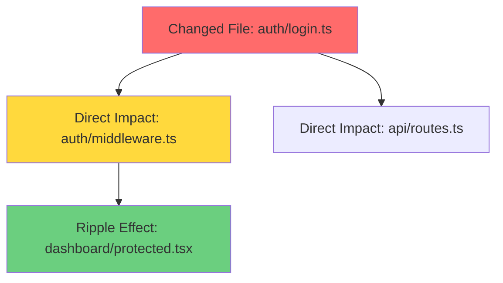

# Smart PR Documentation Generator

This skill automatically generates comprehensive PR documentation that tracks what changed, why it changed, and the ripple effects across your entire codebase.

## Instructions

### Step 0: Load Architecture Context (Elite Mode)

Before analyzing changes, check if the project has an architecture map.

1. Look for `architecture-config.json` in the root.
2. If found, use it to map modified files to their respective **Systems**.
3. Identify **Business Rules** and **Consumers** for those systems.

> [!IMPORTANT]
> **System-Aware PRs:** This is the "God Mode" of documentation. Instead of "modified logic.ts", you say "modified **P2P system** (Critical business rule: No negative balance)".

### Step 1: Analyze Active Branch Changes

First, scan all changes in the current branch:

```bash
# Get all changed files
git diff --name-only main...HEAD

# Get detailed changes
git diff main...HEAD
```

**Why this approach:** Git is the source of truth. It knows exactly what changed without guessing.

### Step 2: Map Feature Ownership

For each changed file, determine which feature(s) it belongs to:

1. Look for existing `claude.md` files in the project
2. Read each `claude.md` to understand feature boundaries
3. Match changed files to their feature(s)

> [!TIP]
> **claude.md files** act as feature handbooks that Claude automatically reads. They store context so you don't have to re-explain every time.

### Step 3: Analyze Ripple Effects (CRITICAL)

For each changed file, identify **what else is affected**:

**Check for:**
- Functions/classes that import this file
- Components that use these functions
- API endpoints that depend on this code

```bash
# Find all files that import a specific file
grep -r "import.*from.*<file-path>" . --include="*.ts" --include="*.tsx"
```

**Trade-off:** This grep-based approach is fast but may miss dynamic imports. For 100% accuracy, use a static analysis tool like `ts-morph`.

> [!IMPORTANT]
> **The Blast Radius:** This step reveals the domino effect of your changes. Most developers don't realize that changing one file affects 15+ others.

### Step 4: Generate Mermaid Diagrams

**A. Change Flow Diagram**


**Color coding methodology:**
- Red (#ff6b6b): Primary changes (what you modified)
- Yellow (#ffd93d): Direct dependencies (files that import your changes)
- Green (#6bcf7f): Ripple effects (indirect dependencies)

**Why visual maps:** Humans process visual information 60,000x faster than text. A diagram beats a text list for understanding complex dependencies.

### Step 5: Update claude.md Files

For each affected feature, update its `claude.md` file:

**Structure for each claude.md:**
```markdown
# [Feature Name] - Last Updated: [Date]

## Recent Changes
### [Date] - [Change Title]
**What Changed:**
- [file]: [description]

**Why:**
- [Business context and reasoning]

**Ripple Effects:**
- Affects: [Feature] - [Impact description]
- Breaking changes: [Yes/No - Details]
```

**Edge case:** If a `claude.md` doesn't exist for a feature, create one. This is an opportunity to establish context for future work.

### Step 6: Generate PR Documentation

## 🏗️ Architectural Impact (if system-aware)

### 📦 [System Name]
**Role:** [Description from architecture-config.json]
**Changes:** [Summary of changes in this system]
**⚠️ Critical Rules:**
- [Rule 1 from config]
- [Rule 2 from config]

**🔗 Ripple Effect:**
This system is consumed by **[Consumers list]**.

---

## 🎯 What Changed
[High-level summary]

## 📝 Detailed Changes
- [file]: [description]

## 🔄 Ripple Effects & Dependencies

### Dependency Map
```mermaid
[Full dependency diagram]
```

### Direct Impact
- **[Feature]**: [Impact description]

### Indirect Impact
- **[Feature]**: [Impact description]

## ⚠️ Breaking Changes
[Yes/No - Migration guide if yes]

## 🧪 Testing Checklist
- [ ] [Test case 1]
- [ ] [Test case 2]

## 📚 Documentation Updated
- [x] [file] - [what was updated]
```

### Step 7: Validate Documentation

**Completeness Check:**
- All changed files documented?
- All ripple effects identified?
- Mermaid diagrams render correctly?

```bash
# Validate Markdown syntax
find . -name "claude.md" -exec markdown-lint {} \;

# Check for unfinished work
grep -r "TODO\|FIXME" */claude.md
```

## Methodology: The Ripple Effect Analysis

The core philosophy is **Contextual Certainty**. Before documenting, build a complete mental model of the system.

**Approach:**
1. **Bottom-up exploration**: Start with git diff, move to dependency analysis
2. **Layered impact**: Direct → Indirect → System-wide
3. **Visual synthesis**: Convert data to diagrams for instant comprehension

**Principles:**
- **Deep Context First**: Never guess dependencies. Use grep/scripts to find actual imports.
- **Self-Correction**: If a diagram doesn't render, validate Mermaid syntax before proceeding.
- **User-First Lens**: Every PR doc should be readable by non-technical stakeholders (PMs, designers).

## Advanced Technical Nuance

**Memory vs. Speed Trade-off:**
- Grep-based dependency search is fast (< 1 second) but may miss edge cases
- AST-based analysis (ts-morph, babel) is 100% accurate but slower (5-10 seconds)
- **Recommendation**: Use grep for most cases, AST for critical production changes

**Edge Case: Monorepos**
- In monorepos with 100+ packages, limit dependency search to relevant workspaces
- Use `--include` flags to filter by file type and avoid scanning node_modules

```bash
# Efficient monorepo search
grep -r "import.*auth" packages/web packages/api --include="*.ts*"
```

**The 80/20 Rule:**
- 80% of bugs come from 20% of dependencies
- Focus ripple effect analysis on high-traffic files (API routes, auth, payments)
