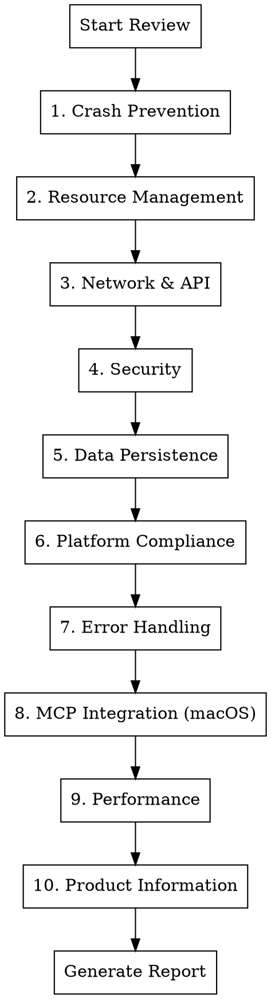

# App Store Readiness Code Review

## Overview

Systematic code review process for applications targeting Apple App Store, Google Play, or desktop distribution. Identifies crash risks, security vulnerabilities, resource leaks, and compliance issues that cause rejection or poor user experience.

This skill now includes a mandatory cross-repo consistency pass for macOS app websites + README licensing language before release.

## Repository Layout (Mandatory in This Workspace)

All macOS app projects must follow this structure under `artifacts/code`:

- `artifacts/code/<AppName>PRJ/<AppName>CODE` - source code repository
- `artifacts/code/<AppName>PRJ/<AppName>WEB` - static website repository (moved from `artifacts/all-web`)

For licensing and legal checks, always use these surfaces:

- **README surface:** `<AppName>CODE/README.md`
- **Flutter app surface:** `<AppName>CODE/flutter_app/` (legal screens + bundled app resources)
- **Website surface:** `<AppName>WEB/` (`index.html`, `license.html`, `privacy.html`, `terms.html`, `privacy-consent.js`)

Do not create or update app sites in `artifacts/all-web` for these macOS apps.

## When to Use

- Before App Store/Play Store submission
- Before any production release
- When user says "ship", "release", "production ready", "App Store"
- After major feature completion
- When reviewing cross-platform apps (Flutter, React Native, etc.)

## iOS/iPad Baseline (Current)

For iOS/iPad submissions, enforce these before final sign-off:

- [ ] Run `bash ./skills/osx-ios/scripts/check_ios_dist.sh --app-root <APP_ROOT>` and resolve all `FAIL` findings
- [ ] Archive/upload baseline matches current App Store Connect tooling requirements
- [ ] TestFlight constraints checked (tester caps, build age, beta review flow)
- [ ] Screenshot coverage satisfies current iPhone + iPad minimum requirements
- [ ] Privacy manifest and required-reason API declarations validated

## Review Categories

Review ALL categories systematically. Do not skip any.



## Severity Classification

| Severity | Definition | Action |
|----------|------------|--------|
| **Critical** | Will cause crashes, data loss, or rejection | Must fix before submission |
| **High** | Likely to cause issues under normal use | Should fix before submission |
| **Medium** | Edge cases, degraded experience | Fix in next release |
| **Low** | Code quality, best practices | Nice to have |

## 1. Crash Prevention Checklist

### Flutter/Dart
- [ ] All async callbacks check `mounted` before `setState()`
- [ ] `StreamSubscription` cancelled in `dispose()`
- [ ] `Timer` cancelled in `dispose()`
- [ ] `AnimationController` disposed
- [ ] `TextEditingController` disposed
- [ ] `ScrollController` disposed
- [ ] `FocusNode` disposed
- [ ] Null safety: no force unwraps (`!`) without guaranteed non-null
- [ ] List/Map access with bounds checking or `.elementAtOrNull()`

### Flutter UI Patterns (Reference: flutter-python-fullstack)
- [ ] **Theme**: Uses `ColorScheme.fromSeed()` with Material 3
- [ ] **Dark mode**: Supports `ThemeMode.system` (respects OS preference)
- [ ] **Backend check**: Health check on startup with loading/disconnected states
- [ ] **Bundled backend autostart**: If backend is down and app is bundled, UI attempts backend startup automatically (no manual CLI prerequisite for end users)
- [ ] **Startup status UX**: UI shows backend startup progress/status (for example: starting/waiting/failed)
- [ ] **Exit shutdown hook**: App intercepts desktop window-close/exit requests and runs graceful backend shutdown before process exit
- [ ] **Shutdown UX**: During close, app shows a blocking "Stopping server/backend..." progress dialog until shutdown finishes or timeout path is handled
- [ ] **Production messaging**: Disconnected-state copy does not instruct end users to run terminal commands
- [ ] **Stats polling**: Uses `Future.doWhile()` with `mounted` guard
- [ ] **Status chips**: Color-coded (green/orange/red) using `withValues(alpha:)`
- [ ] **Deprecated APIs**: No `withOpacity()` (use `withValues(alpha:)` instead)
- [ ] **ApiService**: Centralized HTTP client with typed endpoints
- [ ] **System log visibility**: App exposes a user-visible system log panel (not only startup status text)
- [ ] **System log actions**: Users can copy logs and export logs directly from UI controls
- [ ] **Footer log console**: App includes a footer system-log area that is collapsible and resizable
- [ ] **Footer parity**: Footer log area also provides copy/export actions without navigating to settings
- [ ] **Log export surface**: Backend provides a plain-text system log export endpoint (separate from full diagnostics bundle)

### iOS/Swift
- [ ] No force unwraps (`!`) on optionals from external data
- [ ] `weak self` in closures to prevent retain cycles
- [ ] `deinit` called (add print to verify during testing)
- [ ] No unhandled `fatalError()` or `preconditionFailure()`

### Android/Kotlin
- [ ] Null checks on Intent extras
- [ ] Activity lifecycle handled (no operations on destroyed activity)
- [ ] Fragment lifecycle handled
- [ ] No `!!` on nullable external data

### Backend/Python
- [ ] All exceptions caught at API boundary
- [ ] No bare `except:` clauses (catch specific exceptions)
- [ ] Thread safety for shared resources
- [ ] Connection pool limits configured

## 2. Resource Management Checklist

### Memory Leaks
- [ ] Large objects released when not needed
- [ ] Image/media caching bounded
- [ ] Listeners/observers removed
- [ ] Background tasks cancelled on screen exit
- [ ] File handles closed in finally blocks
- [ ] Voice-clone pipelines profiled with Instruments (Allocations + Leaks) for full clone lifecycle (load model -> clone -> teardown)
- [ ] Add standalone clone regression tests using `Natasha` and `Suzan` voices to detect runaway memory growth or unreleased buffers

### File System
- [ ] Temp files cleaned up
- [ ] File existence checked before read
- [ ] File permissions checked
- [ ] Path sanitization (no `../` injection)
- [ ] Disk space checked before large writes
- [ ] Runtime writes never target `.app/Contents/...` or mounted `.dmg` paths
- [ ] Mutable runtime storage uses user-writable locations (`~/Library/Application Support/<App>`, `~/Library/Caches/<App>`, `~/Library/Logs/<App>`)

### Audio/Video
- [ ] Players disposed when done
- [ ] Audio session properly configured
- [ ] Background audio handled correctly
- [ ] Interruption handling (phone calls)

## 3. Network & API Checklist

### Timeouts
- [ ] All HTTP requests have timeout configured
- [ ] Reasonable timeout values (10-30s for normal, 60-120s for uploads)
- [ ] Timeout errors handled gracefully

### Error Handling
- [ ] Network unavailable handled
- [ ] Server errors (5xx) handled
- [ ] Client errors (4xx) handled with user feedback
- [ ] Malformed response handled
- [ ] Empty response handled

### Resilience
- [ ] Retry logic with exponential backoff
- [ ] Circuit breaker for failing services
- [ ] Offline mode / cached data fallback
- [ ] Request cancellation on screen exit

### Configuration
- [ ] Base URL configurable (not hardcoded localhost)
- [ ] API version handling
- [ ] Certificate pinning (if required)
- [ ] Bundled desktop apps can fully start backend without any external shell command
- [ ] Port-conflict path handled (if port already bound, user gets clear action instead of silent failure)

## 4. Security Checklist

### Input Validation
- [ ] All user input validated
- [ ] Path traversal prevention (`../`)
- [ ] SQL injection prevention (parameterized queries)
- [ ] XSS prevention (output encoding)
- [ ] File type validation for uploads

### Authentication
- [ ] Tokens stored securely (Keychain/Keystore)
- [ ] Token refresh logic
- [ ] Session expiration handling
- [ ] Logout clears all sensitive data

### Network Security
- [ ] HTTPS only (no HTTP except localhost)
- [ ] CORS configured properly (not `*` in production)
- [ ] Sensitive data not logged
- [ ] API keys not in source code

### Data Protection
- [ ] Sensitive data encrypted at rest
- [ ] No sensitive data in logs
- [ ] No sensitive data in crash reports
- [ ] Clipboard cleared after paste of sensitive data

## 5. Data Persistence Checklist

### Database
- [ ] Schema migrations for updates
- [ ] Database connection pooling
- [ ] Thread-safe access (locking or connection per thread)
- [ ] Backup/restore capability
- [ ] Corruption recovery
- [ ] Database path resolves to user-writable runtime directory (not app bundle path)

### Preferences/Settings
- [ ] Default values for all settings
- [ ] Settings validation on load
- [ ] Settings migration for app updates

### Cache
- [ ] Cache size limits
- [ ] Cache expiration
- [ ] Cache invalidation logic
- [ ] Graceful handling of corrupted cache
- [ ] ML/model cache path is app-scoped for bundled builds (avoid accidental reuse of developer/global cache unless explicitly intended)
- [ ] Model-download detection logic honors runtime cache environment variables (`HUGGINGFACE_HUB_CACHE` / `HF_HOME` / `XDG_CACHE_HOME`)

## 6. Platform Compliance Checklist

### Apple App Store
- [ ] Privacy manifest (PrivacyInfo.xcprivacy) present
- [ ] Required-reason API declarations and third-party SDK manifests validated
- [ ] Required device capabilities declared
- [ ] App Transport Security configured
- [ ] No private API usage
- [ ] Proper entitlements configured
- [ ] App icons all sizes present
- [ ] Launch screen configured
- [ ] Build uploaded with current supported Xcode/SDK baseline
- [ ] TestFlight readiness verified (internal/external path + beta review expectations)
- [ ] iPhone and iPad screenshot requirements satisfied for enabled device families

### Google Play
- [ ] Target SDK meets requirements
- [ ] Permissions declared and justified
- [ ] Data safety form ready
- [ ] 64-bit support
- [ ] App bundle (not APK)

### macOS App Store
- [ ] Sandboxing configured
- [ ] Hardened runtime enabled
- [ ] Notarization ready
- [ ] Entitlements minimal and justified

### macOS Distribution
- [ ] DMG builder script present (`scripts/build_dmg.sh`)
- [ ] DMG includes app bundle, Applications symlink, and background image
- [ ] `hdiutil` fallback packages the DMG staging directory (not only the `.app`) so Applications symlink survives fallback builds
- [ ] Code signing for DMG distribution
- [ ] Notarization of DMG for Gatekeeper
- [ ] If DMG is unsigned, release notes + README + website include explicit Gatekeeper bypass steps with concrete date and `Open Anyway` path
- [ ] Volume name and window layout configured
- [ ] SHA256 hash generated alongside DMG (`.dmg.sha256`)
- [ ] Version extracted from centralized version file
- [ ] DMG root includes `LICENSE` (source) and `BINARY-LICENSE.txt` (binary/EULA)
- [ ] App bundle embeds `Contents/Resources/LICENSE` and `Contents/Resources/BINARY-LICENSE.txt`
- [ ] DMG license agreement configured (when supported by the DMG toolchain)
- [ ] Bundled-app smoke test validates `GET /api/health`, `GET /api/pdf/list`, and direct `GET /pdf/<bundled-file>` after launch from `/Applications`
- [ ] Bundled PDF/runtime assets resolve via app-relative paths (no hardcoded source checkout paths)

### Bundled Python Backend (Mandatory for macOS Desktop Distribution)
- [ ] Backend process is launched by the app itself on first run (no terminal dependency for end users)
- [ ] Launch uses bundled Python runtime, not system Python
- [ ] Backend startup path works when app is run from `/Applications` and does not rely on source checkout paths
- [ ] Backend runtime env config sets app-specific writable paths for logs/data/outputs/cache
- [ ] Backend does not require writing launcher logs into app bundle directories
- [ ] Backend model/cache env vars are set for app-scoped storage (`HF_HOME`, `HUGGINGFACE_HUB_CACHE`, `TRANSFORMERS_CACHE`)
- [ ] Backend health check retries include clear startup status and failure state
- [ ] First-launch UI includes explicit startup/waiting log state while bundled backend warms up
- [ ] Disconnected-state primary action is a user-safe restart flow (for example `Restart Server`) and avoids shell-command instructions
- [ ] Backend port-conflict path is handled explicitly (detect in-use port, prompt/confirm stop conflicting process, then retry)
- [ ] First-run behavior tested with no existing localhost backend process running
- [ ] Closing the app window must terminate bundled backend child processes (no orphan backend after UI exit)

### Project Scripts (Reference: flutter-python-fullstack pattern)
- [ ] **Control script** (`bin/appctl`):
  - `appctl up` - Start all services
  - `appctl down` - Stop all services
  - `appctl status` - Show running/stopped with colors
  - `appctl logs` - Tail log files
  - `appctl clean` - Clean logs and temp files
- [ ] **Install script** (`install.sh`):
  - Check/install dependencies (Homebrew, Flutter, etc.)
  - Create virtual environments
  - Download required models
  - Colored output with status indicators
- [ ] **Diagnostic script** (`issues.sh`):
  - System info (OS, architecture, disk space)
  - Tool versions (Flutter, Python, git)
  - Port status checks
  - Network/health checks
  - Last 50 lines of runtime logs
  - Timestamped output file

### Release Scripts (Mandatory for All macOS Apps)

Every macOS app MUST have a `scripts/release.sh` that automates the full release workflow. Manual releases are error-prone and forbidden.

#### Release Script Requirements
- [ ] **Release script** (`scripts/release.sh`) exists and is executable
- [ ] Script extracts version from `pubspec.yaml` automatically (no hardcoded versions)
- [ ] Script supports `--upload` flag for GitHub release upload
- [ ] Script supports `--sync-website` flag for website download link updates
- [ ] Script generates SHA256 checksum alongside DMG
- [ ] Script creates or updates GitHub release for the current tag (never leave tag-only/empty release pages)
- [ ] Script uploads full asset set: DMG + DMG SHA256 + source ZIP + source ZIP SHA256 + release notes + release notes SHA256
- [ ] Script updates website download URLs with new version
- [ ] Script updates website download URLs to direct DMG asset links (not generic release listing pages)
- [ ] Script commits and pushes website changes automatically
- [ ] Script provides clear success/failure output with colored status

#### Version Advancement Protocol
- [ ] Version follows semantic versioning: `MAJOR.MINOR.PATCH` (e.g., `1.0.0`, `1.1.0`, `2.0.0`)
- [ ] Version is stored in a single source of truth: `pubspec.yaml` for Flutter apps
- [ ] Build number increments with each release (e.g., `1.0.0+1` → `1.0.0+2`)
- [ ] Release tag format: `v{VERSION}` (e.g., `v1.0.0`, `v1.1.0`)
- [ ] Never reuse version numbers - always increment
- [ ] PATCH version for bug fixes (1.0.0 → 1.0.1)
- [ ] MINOR version for new features (1.0.0 → 1.1.0)
- [ ] MAJOR version for breaking changes (1.0.0 → 2.0.0)

#### Release Script Pattern
```bash
#!/usr/bin/env bash
# scripts/release.sh - Full Release Script
set -euo pipefail

SCRIPT_DIR="$(cd "$(dirname "${BASH_SOURCE[0]}")" && pwd)"
PROJECT_DIR="$(dirname "$SCRIPT_DIR")"
WEBSITE_DIR="$(dirname "$PROJECT_DIR")/${APP_NAME}WEB"

# Extract version from pubspec.yaml
VERSION=$(grep 'version:' "$PROJECT_DIR/pubspec.yaml" | head -1 | cut -d'+' -f1 | cut -d':' -f2 | xargs)

# Parse flags
UPLOAD_TO_GITHUB=false
SYNC_WEBSITE=false
for arg in "$@"; do
    case $arg in
        --upload) UPLOAD_TO_GITHUB=true ;;
        --sync-website) SYNC_WEBSITE=true ;;
    esac
done

# 1. Build DMG
"$SCRIPT_DIR/build_dmg.sh" || "$SCRIPT_DIR/build-dmg.sh"

# 2. Generate SHA256
DMG_PATH="$PROJECT_DIR/build/${APP_NAME}-${VERSION}.dmg"
shasum -a 256 "$DMG_PATH" > "$DMG_PATH.sha256"

# 3. Upload to GitHub (if --upload)
if [ "$UPLOAD_TO_GITHUB" = true ]; then
    TAG="v$VERSION"
    if ! gh release view "$TAG" &> /dev/null; then
        gh release create "$TAG" --title "$APP_NAME $VERSION" --notes "Release notes..." --draft
    fi
    gh release upload "$TAG" "$DMG_PATH" "$DMG_PATH.sha256" --clobber
fi

# 4. Sync website (if --sync-website)
if [ "$SYNC_WEBSITE" = true ]; then
    sed -i '' -E "s|/releases/download/v[0-9.]+/${APP_NAME}-[0-9.]+|/releases/download/v$VERSION/${APP_NAME}-$VERSION|g" "$WEBSITE_DIR/index.html"
    cd "$WEBSITE_DIR"
    git add index.html && git commit -m "Update to v$VERSION" && git push
fi
```

#### Release Checklist (Execute in Order)
1. [ ] Verify all tests pass
2. [ ] Update version in `pubspec.yaml` if needed
3. [ ] Run `./scripts/release.sh --upload --sync-website`
4. [ ] Verify DMG created and checksum generated
5. [ ] Verify GitHub release exists for the tag and is not empty
6. [ ] Verify release assets uploaded (DMG, DMG SHA256, source ZIP, source ZIP SHA256, release notes, release notes SHA256)
7. [ ] If unsigned/not notarized, verify release notes include the Gatekeeper section with current date and launch steps
8. [ ] Verify website download links updated and point directly to current DMG asset URL
9. [ ] Verify website changes committed and pushed
10. [ ] Test DMG direct-download URL (for example with `curl -I -L`) and confirm HTTP 200
11. [ ] Run fresh-user smoke test (no old app in `/Applications`, no pre-downloaded model cache assumptions)

#### Release Script Red Flags
| Issue | Pattern | Fix |
|-------|---------|-----|
| No release script | Manual DMG + upload | Create `scripts/release.sh` |
| Hardcoded version | `VERSION="1.0.0"` | Extract from `pubspec.yaml` |
| No --upload flag | Separate manual upload | Add GitHub release upload |
| No --sync-website | Manual website edit | Add website URL update |
| No checksum | DMG only | Generate `.sha256` file |
| Empty release page | Tag exists but no assets | Enforce upload of full asset set in `release.sh` |
| Missing source/notes artifacts | DMG uploaded without source zip/release notes checksums | Upload source ZIP + notes + both SHA256 files |
| Non-direct download links | Website points to generic `/releases` page | Point website CTAs to `/releases/download/<tag>/<asset>.dmg` |
| No website commit | Website not updated | Auto-commit and push |
| Version reuse | Same tag twice | Always increment version |

### General
- [ ] Version number format correct
- [ ] Build number incremented
- [ ] Release notes prepared
- [ ] Screenshots current

## 7. Error Handling Checklist

### User Feedback
- [ ] All errors show user-friendly message
- [ ] Error messages actionable (what user can do)
- [ ] No technical jargon in user-facing errors
- [ ] Loading states for all async operations
- [ ] Empty states for lists

### Logging
- [ ] Errors logged with context
- [ ] No sensitive data in logs
- [ ] Log levels appropriate
- [ ] Crash reporting configured

### Recovery
- [ ] Retry option for transient failures
- [ ] Data preserved on error
- [ ] App state recoverable after crash
- [ ] Graceful degradation when features unavailable

## 8. MCP Tool Integration Checklist (Required for macOS Apps)

macOS apps MUST expose full functionality via MCP (Model Context Protocol) tools to enable Claude integration. This ensures AI assistants can interact with the app programmatically.

### MCP Server Requirements
- [ ] MCP server script exists at `bin/<appname>_mcp_server.py` or similar
- [ ] Server implements JSON-RPC 2.0 over HTTP protocol
- [ ] Server handles MCP methods: `initialize`, `tools/list`, `tools/call`
- [ ] Server binds to configurable host/port (default: `127.0.0.1:80XX`)
- [ ] Server logs to `runs/logs/<appname>_mcp_server.log` with rotation
- [ ] Backend URL configurable via environment variable (e.g., `<APPNAME>_BACKEND_URL`)

### MCP Tool Definitions
- [ ] `MCP_TOOLS` list contains all available tools
- [ ] Each tool has required keys: `name`, `description`, `inputSchema`
- [ ] Tool names are unique and follow `<domain>_<action>` pattern (e.g., `tts_generate_kokoro`)
- [ ] `inputSchema` is a valid JSON Schema with `type: "object"`
- [ ] Required parameters listed in `inputSchema.required` array
- [ ] Tool descriptions are clear and explain what the tool does

### Required MCP Tools (minimum set)
- [ ] `health_check` - Check if backend is running and healthy
- [ ] `<domain>_status` or `system_info` - Get system/service information
- [ ] `<domain>_list_*` - List available resources (voices, models, files, etc.)
- [ ] `<domain>_<primary_action>` - Core functionality (generate, process, create)

### MCP Tool Schema Pattern
```python
MCP_TOOLS = [
    {
        "name": "app_speak",
        "description": "Generate and play speech with specified text and voice.",
        "inputSchema": {
            "type": "object",
            "properties": {
                "text": {"type": "string", "description": "Text to speak"},
                "speaker": {"type": "string", "description": "Voice/speaker name"},
                "quality_mode": {
                    "type": "string",
                    "enum": ["fast", "balanced", "quality"],
                    "description": "Quality mode (fast=realtime)"
                }
            },
            "required": ["text"]
        }
    },
    {
        "name": "app_speak_streaming",
        "description": "Generate speech with sentence-by-sentence streaming.",
        "inputSchema": {
            "type": "object",
            "properties": {
                "text": {"type": "string", "description": "Text to speak (supports multiple sentences)"}
            },
            "required": ["text"]
        }
    },
    {
        "name": "app_status",
        "description": "Check service status and available resources.",
        "inputSchema": {"type": "object", "properties": {}}
    }
]
```

### HTTP API Parity
- [ ] All MCP tools have corresponding HTTP API endpoints
- [ ] HTTP API follows RESTful conventions:
  - `GET /api/<domain>/status` - Status check
  - `GET /api/<domain>/<resources>` - List resources
  - `POST /api/<domain>/<action>` - Perform actions
  - `DELETE /api/<domain>/<resource>/<id>` - Delete resources
- [ ] HTTP API example (curl):
```bash
# Generate speech
curl -X POST http://localhost:8000/speak \
  -H "Content-Type: application/json" \
  -d '{"text": "Hello", "speaker": "default", "quality_mode": "balanced"}'

# Check status
curl http://localhost:8000/status

# List voices
curl http://localhost:8000/voices
```

### MCP Server Handler Pattern
```python
class MCPHandler(BaseHTTPRequestHandler):
    def do_POST(self):
        # Parse JSON-RPC request
        obj = json.loads(self.rfile.read(...))
        method = obj.get("method")
        params = obj.get("params") or {}

        if method == "initialize":
            # Return server info and capabilities
            return {"protocolVersion": "...", "serverInfo": {...}, "capabilities": {...}}

        if method in ("tools/list", "tools.list"):
            return {"tools": MCP_TOOLS}

        if method in ("tools/call", "tools.call"):
            result = handle_tool_call(params.get("name"), params.get("arguments"))
            return {"content": [{"type": "text", "text": result}]}
```

### MCP Tests
- [ ] Unit tests for tool definitions (`test_mcp_server.py`)
- [ ] Test each tool has required keys
- [ ] Test tool names are unique
- [ ] Test tool call handler dispatches correctly
- [ ] Test JSON-RPC protocol handling (initialize, tools/list, tools/call)
- [ ] Test error handling for unknown tools and malformed requests

### Claude Code Configuration
- [ ] MCP server registered in Claude Code settings or documented for user setup
- [ ] Configuration example provided in README:
```json
{
  "mcpServers": {
    "<appname>": {
      "command": "python3",
      "args": ["/path/to/bin/<appname>_mcp_server.py", "--port", "80XX"],
      "env": {
        "<APPNAME>_BACKEND_URL": "http://localhost:8000"
      }
    }
  }
}
```

### MCP UI Screen (Required for macOS Apps with MCP)
Every macOS app with MCP integration MUST include a dedicated MCP management screen accessible from Settings or main navigation.

#### MCP Screen Structure
- [ ] MCP screen exists at `lib/pages/mcp_page.dart` or `lib/screens/mcp_screen.dart`
- [ ] MCP screen accessible from Settings page or main navigation sidebar
- [ ] MCP screen header shows "MCP Integration" or "Claude Integration" title

#### MCP Server Status Section
- [ ] Server status indicator (Running/Stopped/Error) with color-coded chip
- [ ] Server host and port display (e.g., `127.0.0.1:8087`)
- [ ] Start/Stop server toggle or buttons
- [ ] Server uptime display (optional)
- [ ] Last activity timestamp (optional)

#### Available Tools Section
- [ ] List of all MCP tools with names and descriptions
- [ ] Tool count badge (e.g., "10 tools available")
- [ ] Expandable tool cards showing:
  - Tool name (e.g., `quantum_run_benchmark`)
  - Tool description
  - Input parameters (from inputSchema)
  - Required vs optional parameters indicator
- [ ] Tool category grouping (optional, e.g., "System", "Benchmarks", "Queue")

#### Configuration Section
- [ ] Backend URL field (editable, defaults to environment variable)
- [ ] MCP server port field (editable)
- [ ] Auto-start MCP server toggle
- [ ] Connection test button with success/failure feedback

#### Claude Code Setup Section
- [ ] Copy-to-clipboard button for Claude Code MCP configuration JSON
- [ ] Pre-filled configuration template with correct paths
- [ ] Instructions for adding to Claude Code settings
- [ ] Link to Claude Code MCP documentation (if available)

#### MCP Logs Section (Optional but Recommended)
- [ ] Recent MCP server log entries (last 20-50 lines)
- [ ] Log level filter (Debug/Info/Warning/Error)
- [ ] Clear logs button
- [ ] Export logs button

#### MCP Screen Pattern (Reference Implementation)
```dart
// lib/pages/mcp_page.dart
class McpPage extends StatefulWidget {
  const McpPage({super.key});
  @override
  State<McpPage> createState() => _McpPageState();
}

class _McpPageState extends State<McpPage> {
  bool _serverRunning = false;
  List<Map<String, dynamic>> _tools = [];

  @override
  void initState() {
    super.initState();
    _loadMcpStatus();
    _loadTools();
  }

  @override
  Widget build(BuildContext context) {
    return SingleChildScrollView(
      padding: const EdgeInsets.all(24),
      child: Column(
        crossAxisAlignment: CrossAxisAlignment.start,
        children: [
          // Header
          _buildHeader(),
          const SizedBox(height: 24),

          // Server Status Card
          _buildServerStatusCard(),
          const SizedBox(height: 24),

          // Available Tools Card
          _buildToolsCard(),
          const SizedBox(height: 24),

          // Configuration Card
          _buildConfigCard(),
          const SizedBox(height: 24),

          // Claude Code Setup Card
          _buildClaudeCodeSetupCard(),
        ],
      ),
    );
  }

  Widget _buildServerStatusCard() {
    return Card(
      child: Padding(
        padding: const EdgeInsets.all(16),
        child: Column(
          crossAxisAlignment: CrossAxisAlignment.start,
          children: [
            Row(
              children: [
                Icon(Icons.dns, color: Theme.of(context).colorScheme.primary),
                const SizedBox(width: 12),
                const Text('MCP Server Status', style: TextStyle(fontWeight: FontWeight.bold)),
                const Spacer(),
                Chip(
                  label: Text(_serverRunning ? 'Running' : 'Stopped'),
                  backgroundColor: _serverRunning ? Colors.green.shade100 : Colors.grey.shade200,
                  labelStyle: TextStyle(color: _serverRunning ? Colors.green.shade800 : Colors.grey.shade700),
                ),
              ],
            ),
            const SizedBox(height: 16),
            Text('Host: 127.0.0.1:8087'),
            const SizedBox(height: 8),
            Row(
              children: [
                FilledButton.icon(
                  onPressed: _toggleServer,
                  icon: Icon(_serverRunning ? Icons.stop : Icons.play_arrow),
                  label: Text(_serverRunning ? 'Stop Server' : 'Start Server'),
                ),
                const SizedBox(width: 8),
                OutlinedButton.icon(
                  onPressed: _testConnection,
                  icon: const Icon(Icons.refresh),
                  label: const Text('Test Connection'),
                ),
              ],
            ),
          ],
        ),
      ),
    );
  }

  Widget _buildToolsCard() {
    return Card(
      child: Padding(
        padding: const EdgeInsets.all(16),
        child: Column(
          crossAxisAlignment: CrossAxisAlignment.start,
          children: [
            Row(
              children: [
                Icon(Icons.build, color: Theme.of(context).colorScheme.primary),
                const SizedBox(width: 12),
                const Text('Available Tools', style: TextStyle(fontWeight: FontWeight.bold)),
                const SizedBox(width: 8),
                Chip(label: Text('${_tools.length} tools')),
              ],
            ),
            const SizedBox(height: 16),
            ..._tools.map((tool) => ExpansionTile(
              title: Text(tool['name']),
              subtitle: Text(tool['description'], maxLines: 1, overflow: TextOverflow.ellipsis),
              children: [
                Padding(
                  padding: const EdgeInsets.all(16),
                  child: Column(
                    crossAxisAlignment: CrossAxisAlignment.start,
                    children: [
                      Text('Parameters:', style: TextStyle(fontWeight: FontWeight.bold)),
                      // Show inputSchema properties
                    ],
                  ),
                ),
              ],
            )),
          ],
        ),
      ),
    );
  }

  Widget _buildClaudeCodeSetupCard() {
    final config = '''
{
  "mcpServers": {
    "appname": {
      "command": "python3",
      "args": ["/path/to/bin/appname_mcp_server.py"],
      "env": {
        "APPNAME_BACKEND_URL": "http://localhost:8000"
      }
    }
  }
}''';

    return Card(
      child: Padding(
        padding: const EdgeInsets.all(16),
        child: Column(
          crossAxisAlignment: CrossAxisAlignment.start,
          children: [
            Row(
              children: [
                Icon(Icons.terminal, color: Theme.of(context).colorScheme.primary),
                const SizedBox(width: 12),
                const Text('Claude Code Setup', style: TextStyle(fontWeight: FontWeight.bold)),
              ],
            ),
            const SizedBox(height: 16),
            const Text('Add this configuration to your Claude Code settings:'),
            const SizedBox(height: 12),
            Container(
              padding: const EdgeInsets.all(12),
              decoration: BoxDecoration(
                color: Colors.grey.shade100,
                borderRadius: BorderRadius.circular(8),
              ),
              child: SelectableText(config, style: const TextStyle(fontFamily: 'monospace', fontSize: 12)),
            ),
            const SizedBox(height: 12),
            FilledButton.icon(
              onPressed: () => Clipboard.setData(ClipboardData(text: config)),
              icon: const Icon(Icons.copy),
              label: const Text('Copy Configuration'),
            ),
          ],
        ),
      ),
    );
  }
}
```

#### MCP UI Accessibility
- [ ] All MCP tool names readable by screen readers
- [ ] Status indicators have text alternatives (not color-only)
- [ ] Copy buttons have clear labels
- [ ] Expandable sections properly announce state

### Common MCP Integration Issues
| Issue | Pattern | Fix |
|-------|---------|-----|
| Missing tools | No MCP server | Create `bin/<appname>_mcp_server.py` |
| No tool schemas | Tools missing inputSchema | Add JSON Schema for each tool |
| Backend not proxied | MCP calls backend directly | Use `_call_backend()` helper pattern |
| No error handling | Exceptions crash server | Wrap tool calls in try/except |
| No logging | Silent failures | Add rotating file logger |
| Hardcoded ports | Port conflicts | Make host/port configurable |

## 9. Performance Checklist

### Startup
- [ ] Cold start < 3 seconds
- [ ] No blocking operations on main thread at startup
- [ ] Lazy loading for non-essential features

### UI Responsiveness
- [ ] No jank (dropped frames)
- [ ] Heavy work on background threads
- [ ] UI updates batched
- [ ] Large lists virtualized

### Memory
- [ ] Memory usage stable (no growth over time)
- [ ] Large assets loaded on demand
- [ ] Image resolution appropriate for display

### Battery
- [ ] Location updates minimal
- [ ] Background refresh minimal
- [ ] No unnecessary polling

## 10. Product Information Checklist

### Required App Information
- [ ] Version number displayed in app (Settings or About page)
- [ ] Build number accessible for support purposes
- [ ] Centralized version file pattern:
  ```dart
  // lib/version.dart
  const String appVersion = "2026.02.1";
  const int buildNumber = 1;
  const String versionName = "Initial Release";
  String get versionString => "$appVersion (build $buildNumber)";
  ```
- [ ] About page present and accessible from main navigation

### About Page Contents
- [ ] App logo/icon prominently displayed
- [ ] App name as headline
- [ ] Version number from centralized version file (e.g., `version.dart`)
- [ ] Version codename (optional, e.g., "Sunrise")
- [ ] Brief app description/tagline
- [ ] **Links section** with buttons for:
  - [ ] Website: https://qneura.ai/apps.html
  - [ ] GitHub repository (if open source)
  - [ ] Report Issue / Bug tracker
- [ ] License link (in-app License screen or repo license overview)
- [ ] **Credits/Powered By section** listing dependencies with clickable links
- [ ] **Footer** with:
  - [ ] License type (e.g., "Licensed under BSL-1.1")
  - [ ] Binary distribution restriction summary (if applicable)
  - [ ] Copyright: "© [YEAR] Qneura.ai"
  - [ ] Clickable Qneura.ai link to https://qneura.ai

### Legal Pages
- [ ] Privacy Policy page (required by App Store)
- [ ] Terms of Service / EULA page
- [ ] License overview page (source vs binary terms, plain English)
- [ ] Binary distribution license / EULA page (DMG/executable terms)
- [ ] Repo `LICENSE` file present and referenced in README
- [ ] All legal pages accessible from Settings or About
- [ ] Website legal pages exist in `<AppName>WEB`: `index.html`, `license.html`, `privacy.html`, `terms.html`

### License Integration (Source vs Binary)
- [ ] Create `<AppName>CODE/LICENSE` for source code (BSL-style, parameterized)
- [ ] Create `<AppName>CODE/BINARY-LICENSE.txt` (or `EULA-DMG.txt`) for DMG/executable
- [ ] Add `<AppName>CODE/LICENSE.md` (or `<AppName>CODE/docs/licensing.md`) explaining source vs binary terms
- [ ] Update `<AppName>CODE/README.md` License section with links to `LICENSE`, `BINARY-LICENSE.txt`, and `LICENSE.md`
- [ ] UI integration: About footer mentions license + binary restriction; Legal section links to License page
- [ ] Terms of Service includes binary distribution restrictions and link to `BINARY-LICENSE.txt`
- [ ] Bundle both license files into the app (`Contents/Resources/`) and DMG root
- [ ] Website license page `<AppName>WEB/license.html` matches README and repo license files

### Three-Surface License Completeness (Required)
- [ ] Website licenses are written and published in `<AppName>WEB/license.html` (not placeholders) and clearly state source + binary terms.
- [ ] Website hero/meta references to licensing (`Open Source`, `License`) link to `<AppName>WEB/license.html`.
- [ ] Flutter macOS app licenses are written and visible in `<AppName>CODE/flutter_app` legal screens; source + binary terms are discoverable in-app.
- [ ] Flutter macOS app bundle contains written license files: `Contents/Resources/LICENSE` and `Contents/Resources/BINARY-LICENSE.txt`.
- [ ] Git repository licenses are written and versioned in `<AppName>CODE`: `LICENSE` + `BINARY-LICENSE.txt` + license overview doc (`LICENSE.md` or `docs/licensing.md`).
- [ ] `<AppName>CODE/README.md` top section and License section both link to the repo license files and website license page.
- [ ] Release is blocked if any one of the three surfaces (website, app, repo) is missing written license content.

### Cross-Repo Website + README Consistency (Mandatory)
- [ ] Use this canonical sentence (copy exactly, replace app name only):
  - `License: Source code is licensed under Business Source License 1.1 (BSL-1.1), and binary distributions are licensed under the [APP_NAME] Binary Distribution License. See LICENSE, BINARY-LICENSE.txt, and the website License page.`
- [ ] Place the canonical sentence in README near the top, immediately after the primary app-description paragraph.
- [ ] Keep the binary-availability sentence explicit in README and website CTA/meta:
  - `The codebase is cross-platform, but we currently provide macOS binaries only.`
- [ ] Link `we currently provide macOS binaries only.` in README top block to the app website home page.
- [ ] Link `Open Source` labels in website hero/meta rows to `license.html` (not plain text).
- [ ] In website hero badges/benefits, remove `Lifetime Updates` and avoid reintroducing it in future copy revisions.
- [ ] Add a primary `Download for macOS` CTA on the left hero column before `Get Started` / `View on GitHub` style links.
- [ ] Primary nav `Download` and hero `Download` CTA both point directly to the current DMG asset URL for the latest tag.
- [ ] Ensure each macOS app site under `<AppName>WEB` uses the same wording pattern (only app name varies).
- [ ] Verify `<AppName>CODE/LICENSE`, `<AppName>CODE/BINARY-LICENSE.txt`, and `<AppName>WEB/license.html` all exist and are mutually consistent.
- [ ] In multi-repo updates, stage and commit only intended files from `<AppName>CODE` and `<AppName>WEB` when worktrees are already dirty.
- [ ] Keep `README.md` and website `Supported Models` tables fully synchronized with the app's runtime model registry (include aliases, quantized variants, and namespace-specific surfaces like CosyVoice/Supertonic when present).
- [ ] Keep README pregenerated-example index synchronized with shipped files in `backend/data/pregenerated` (no missing demos).
- [ ] If DMG is unsigned/not notarized, publish matching Gatekeeper bypass instructions in both README and website install docs.

### Website Privacy Consent Popup (Mandatory Across All App Sites)
- [ ] Every app website in `<AppName>WEB` includes a GDPR consent popup script at `<AppName>WEB/privacy-consent.js`.
- [ ] `privacy-consent.js` is loaded on all public pages (minimum): `index.html`, `license.html`, `privacy.html`, `terms.html`.
- [ ] Popup provides **both** actions: `Accept` and `Reject` (no single-button consent).
- [ ] Consent is persisted in `localStorage` with app-specific keys (do not reuse another app's key names).
- [ ] Privacy popup text links to the app's own `privacy.html` and `terms.html`.
- [ ] Analytics or tracking initialization runs **only after explicit Accept**.
- [ ] Banner remains hidden after a saved decision and reappears only when no decision exists.
- [ ] Mobile layout is responsive and readable (buttons accessible on narrow screens).
- [ ] Release is blocked if any `<AppName>WEB` site lacks this popup behavior.

### Contributor Identity Hygiene (Git)
- [ ] Audit contributors before release:
  - `git shortlog -sne --all`
  - `git log --all --format='%H%x09%an%x09%ae'`
  - scan commit bodies for `Co-authored-by`
- [ ] If alias/noise identities exist, add `.mailmap` canonical mappings to the project owner identity.
- [ ] Re-check shortlog after `.mailmap` update to confirm consolidation.
- [ ] Verify remote contributor view (`/contributors` API or GitHub UI) before attempting history rewrite.
- [ ] Do **not** rewrite published git history unless explicitly requested and approved by the user.

### Support & Contact
- [ ] Support email or contact form
- [ ] Help/FAQ section or link
- [ ] Bug report mechanism

### Accessibility
- [ ] VoiceOver/TalkBack support tested
- [ ] Dynamic font scaling supported
- [ ] Sufficient color contrast (WCAG AA)
- [ ] Touch targets minimum 44x44 points

### User Experience
- [ ] Onboarding/first-run experience for new users
- [ ] Update notification mechanism (in-app or store redirect)
- [ ] Data export capability (GDPR compliance)
- [ ] Account deletion option (if applicable)

## 11. First-Run Distribution Smoke Test (Mandatory for DMG Apps)

- [ ] Open the built DMG and verify both app icon and `Applications` drag target are visible
- [ ] Copy app to `/Applications` and launch from there (do not validate only from mounted DMG)
- [ ] Verify app starts its bundled backend automatically on first launch
- [ ] Verify no UI instruction requires running shell commands for normal users
- [ ] Verify backend writes logs/data/cache to user-writable runtime locations
- [ ] Verify first-run model status is clean for a fresh macOS user profile
- [ ] Verify model download/delete works and persists across relaunch
- [ ] Verify behavior when another process is already listening on backend port
- [ ] Close the app window and verify a visible "Stopping server/backend..." shutdown dialog appears before exit
- [ ] After close, verify backend process/port is no longer running (`lsof -iTCP:<port> -sTCP:LISTEN` shows nothing for the app backend)
- [ ] Repeat smoke test on a fresh account or clean-home environment before release tag

### Settings Screen
- [ ] Output folder selection (with folder picker)
- [ ] Theme preference (Light/Dark/System)
- [ ] Clear cache option
- [ ] Reset to defaults option
- [ ] Diagnostics section includes one-click `Export Diagnostic Logs` action from Settings (downloads a ZIP bundle from backend logs)
- [ ] App includes a visible `Pro`/Licensing surface with `Buy License` CTA.
- [ ] Default trial is 7 days and the UI shows live `days left` countdown (e.g., `You have X days left in your trial`) for paid apps.
- [ ] Trial banner includes `Enter License` action and transitions to an activated/Pro state after successful key entry.
- [ ] Pro screen includes editable checkout + customer portal URL fields for both `Polar.sh` and `LemonSqueezy`.
- [ ] Pro screen supports buying licenses from either provider directly in-app (`Buy with Polar`, `Buy with LemonSqueezy` or equivalent).
- [ ] Activation flow records licensing metadata (`license_provider=polar|lemonsqueezy`, activation timestamp).
- [ ] Backend connection status indicator
- [ ] Model/engine management (if applicable)

### Trial + Licensing Rationale (Required)
- [ ] The app must surface trial state in-product so users understand remaining evaluation time without contacting support.
- [ ] The app must expose explicit purchase and activation actions to avoid hidden conversion paths.
- [ ] The app must support both Polar.sh and LemonSqueezy URL configuration without recompiling so checkout/portal links can be changed post-release.
- [ ] Website and app must both offer purchase paths for paid apps to minimize checkout friction.
- [ ] Free apps must explicitly disable trial-expiry and paid-license gating.

### About Screen Standard (Mandatory)
- [ ] Every app has a dedicated About screen/page reachable from primary navigation or Settings.
- [ ] About screen includes an **Important Notice** card (scope + non-advice disclaimer).
- [ ] About screen includes **What This Project Does** with concrete bullets (not marketing-only text).
- [ ] About screen includes **Model Credits & Licenses** section with model/library names and license labels.
- [ ] About screen includes a **Legal** section with buttons/links to Privacy, Terms, and License surfaces.
- [ ] In Flutter apps, About-screen Legal buttons route to in-app legal screens (Privacy / Terms / License), not directly to external website legal pages.
- [ ] Brand footer text `Qneura.ai` is clickable and opens the official website (`https://qneura.ai` or `https://qneura.ai/apps.html`).
- [ ] About screen footer includes ownership/copyright line and license summary.
- [ ] Layout follows readable card stack pattern (max-width constrained, high contrast, desktop-safe spacing).
- [ ] Changes must be additive: preserve existing app-specific details and links while adding missing compliance sections.

### Branding & Assets
- [ ] App icon at all required sizes
- [ ] Custom branded icon exists for this app (no reused template/stock icon from another app)
- [ ] Canonical icon source is versioned in `<AppName>CODE/assets/` (e.g., `app_icon_source.png` at 1024x1024)
- [ ] macOS icon set in `<AppName>CODE/flutter_app/macos/Runner/Assets.xcassets/AppIcon.appiconset/` is generated from that canonical source
- [ ] Website favicon/icons are generated from the same canonical icon source to keep branding consistent
- [ ] Consistent branding throughout app
- [ ] Splash/launch screen matches branding

### Flutter Icon Gate (Mandatory - Release Blocker)
- [ ] Every Flutter app in scope has its own branded icon (subject-matched visual identity).
- [ ] Reject release if app icon hash matches Flutter default icon assets.
- [ ] Reject release if two different apps share the exact same icon hash unless explicitly approved by user.
- [ ] Store/update canonical source as `<repo>/assets/app_icon_source.png` and regenerate icon set from it.
- [ ] Regenerate macOS icon files:
  - `<repo>/macos/Runner/Assets.xcassets/AppIcon.appiconset/app_icon_{16,32,64,128,256,512,1024}.png`
- [ ] If app uses `flutter_app/`, apply the same rule under:
  - `<repo>/flutter_app/macos/Runner/Assets.xcassets/AppIcon.appiconset/`
- [ ] Do not leave placeholder text like `"A new Flutter project."` in release app metadata.

### App Store Metadata
- [ ] App description written
- [ ] Keywords optimized
- [ ] Screenshots current and accurate
- [ ] Preview video (optional but recommended)
- [ ] Category selected appropriately

## Legal Templates

Use these templates when creating legal pages for App Store submission. Replace bracketed placeholders.

### Terms of Service (Template - adapted from PageEcho)

```markdown
# Terms of Service

Last updated: [MONTH YYYY]

## 1. Acceptance of Terms

By accessing or using [APP_NAME] (the "Service"), you agree to be bound by these Terms of Service. If you do not agree to these terms, do not use the Service. Additional guidelines or rules may apply to specific features and are incorporated by reference.

## 2. Description of Service

[APP_NAME] is a [SHORT DESCRIPTION]. The Service allows users to [CORE FEATURES]. Some features may rely on on-device AI models and optional plugins.

## 3. User Conduct

You agree to use the Service only for lawful purposes and in compliance with applicable laws and regulations. You are prohibited from using the Service to impersonate others without consent, to create deceptive or harmful content, or to violate intellectual property rights.

## 4. Intellectual Property

The Service and its original content (excluding user-provided content) are the exclusive property of QNeura.ai and its licensors. You retain ownership of your content. Nothing in these terms grants you the right to use QNeura.ai trademarks or branding without permission.

## 5. AI Features Disclaimer

AI-generated outputs may be inaccurate, imperfect, or unsuitable for critical use cases. You should verify important information using original sources.

## 6. Disclaimer of Warranties

The Service is provided on an "AS IS" and "AS AVAILABLE" basis. QNeura.ai makes no warranties of any kind, express or implied, including but not limited to warranties of merchantability, fitness for a particular purpose, and noninfringement.

## 7. Limitation of Liability

In no event shall QNeura.ai be liable for any damages (including, without limitation, damages for loss of data or profit, or due to business interruption) arising out of the use or inability to use the Service.

## 8. Changes to Terms

QNeura.ai reserves the right, at its sole discretion, to modify or replace these Terms at any time. Continued use of the Service after changes constitutes acceptance of the updated terms.

## 9. Contact Us

If you have questions about these Terms, contact us at solomon@qneura.ai or https://qneura.ai/apps.html.

## 10. External Content Sources

The Service may provide access to or include third-party models, datasets, or libraries. These contents are provided by their respective sources and are subject to their own licenses. You are responsible for ensuring your use complies with applicable laws and third-party terms.

## 11. Apple Standard EULA

If the app is distributed through the Apple App Store, the Apple Standard EULA applies: https://www.apple.com/legal/internet-services/itunes/dev/stdeula/.

## 12. Paid Features

If paid features are offered, purchases are processed by the storefront or payment provider and are governed by their terms. Subscription management and cancellations are handled through your account with that provider.
```

### Privacy Policy (Template)

```markdown
# Privacy Policy

Last updated: [MONTH YYYY]

## 1. Introduction

[APP_NAME] ("we," "our," or "us") respects your privacy and is committed to protecting it. This Privacy Policy explains how we handle information when you use the app.

## 2. Information Collection

The app is designed to be local-first. We do not collect personal information by default. We do not track usage behavior or sell data to third parties. Your content remains on your device unless you choose to share it.

## 3. On-Device Processing

AI features run locally using on-device models. Your content is processed entirely on your device and is not sent to external servers for processing.

## 4. Data Storage

Files you import or generate are stored locally in locations you select. You control when and how to delete or share this data.

## 5. Third-Party Services

The app may utilize system-level services provided by your operating system. Optional update or license checks may transmit basic app and device metadata (such as version and OS information), but no user content is transmitted. If third-party services are enabled in future releases, this policy will be updated accordingly.

## 6. Data Security

Since data stays on your device, its security depends on your device security settings. We recommend using passcodes or biometrics where available.

## 7. Children's Privacy

The Service does not address anyone under the age of 13. We do not knowingly collect personal information from children under 13.

## 8. Changes to This Privacy Policy

We may update this Privacy Policy from time to time. We will notify you of any changes by posting the new policy and updating the "Last updated" date.

## 9. Contact Us

If you have any questions about this Privacy Policy, contact us at solomon@qneura.ai or https://qneura.ai/apps.html.
```

### Business Source License 1.1 (Template)

```text
Business Source License 1.1

Parameters
Licensor: [COMPANY_NAME]
Licensed Work: [APP_NAME] Source Code
Additional Use Grant: [Production use allowed / see BINARY-LICENSE.txt for binary terms]
Change Date: [YYYY-MM-DD]
Change License: [GPL-2.0-or-later or compatible license]

Terms

The Licensor hereby grants you the right to copy, modify, create derivative
works, redistribute, and make non-production use of the Licensed Work. The
Licensor may make an Additional Use Grant, above, permitting limited
production use.

Effective on the Change Date, or the fourth anniversary of the first publicly
available distribution of a specific version of the Licensed Work under this
License, whichever comes first, the Licensor hereby grants you rights under
the terms of the Change License, and the rights granted in the paragraph
above terminate.

If your use of the Licensed Work does not comply with the requirements
currently in effect as described in this License, you must purchase a
commercial license from the Licensor, its affiliated entities, or authorized
resellers, or you must refrain from using the Licensed Work.

All copies of the original and modified Licensed Work, and derivative works
of the Licensed Work, are subject to this License. This License applies
separately for each version of the Licensed Work and the Change Date may vary
for each version of the Licensed Work released by Licensor.

You must conspicuously display this License on each original or modified copy
of the Licensed Work. If you receive the Licensed Work in original or
modified form from a third party, the terms and conditions set forth in this
License apply to your use of that work.

Any use of the Licensed Work in violation of this License will automatically
terminate your rights under this License for the current and all other
versions of the Licensed Work.

This License does not grant you any right in any trademark or logo of
Licensor or its affiliates (provided that you may use a trademark or logo of
Licensor as expressly required by this License).

TO THE EXTENT PERMITTED BY APPLICABLE LAW, THE LICENSED WORK IS PROVIDED ON
AN "AS IS" BASIS. LICENSOR HEREBY DISCLAIMS ALL WARRANTIES AND CONDITIONS,
EXPRESS OR IMPLIED, INCLUDING (WITHOUT LIMITATION) WARRANTIES OF
MERCHANTABILITY, FITNESS FOR A PARTICULAR PURPOSE, NON-INFRINGEMENT, AND
TITLE.

MariaDB hereby grants you permission to use this License's text to license
your works, and to refer to it using the trademark "Business Source License",
as long as you comply with the Covenants of Licensor below.

Covenants of Licensor

In consideration of the right to use this License's text and the "Business
Source License" name and trademark, Licensor covenants to MariaDB, and to all
other recipients of the licensed work to be provided by Licensor:

1. To specify as the Change License the GPL Version 2.0 or any later version,
   or a license that is compatible with GPL Version 2.0 or a later version,
   where "compatible" means that software provided under the Change License can
   be included in a program with software provided under GPL Version 2.0 or a
   later version. Licensor may specify additional Change Licenses without
   limitation.

2. To either: (a) specify an additional grant of rights to use that does not
   impose any additional restriction on the right granted in this License, as
   the Additional Use Grant; or (b) insert the text "None".

3. To specify a Change Date.

4. Not to modify this License in any other way.
```

### Binary Distribution License (Template)

```text
Binary Distribution License

This Binary Distribution License ("License") governs use of the compiled
binary distribution for [APP_NAME] (the "Binary"), including DMG, EXE, and
app bundles.

1. License Grant
You may install and use the Binary for personal or internal business use.

2. Restrictions
You may not sell, rent, sublicense, or redistribute the Binary.
You may not use the Binary for any commercial offering or for third-party
hosting/managed service.

3. Source Code
Source code is licensed separately under the Business Source License 1.1.
See [SOURCE_LICENSE_FILE] for details.

4. No Warranty
THE BINARY IS PROVIDED "AS IS", WITHOUT WARRANTY OF ANY KIND, EXPRESS OR
IMPLIED, INCLUDING BUT NOT LIMITED TO WARRANTIES OF MERCHANTABILITY,
FITNESS FOR A PARTICULAR PURPOSE, AND NON-INFRINGEMENT.

5. Limitation of Liability
IN NO EVENT SHALL [COMPANY_NAME] BE LIABLE FOR ANY CLAIM, DAMAGES, OR OTHER
LIABILITY ARISING FROM THE USE OF THE BINARY.

6. Contact
If you need commercial binary distribution rights, contact [CONTACT_EMAIL].
```

### License Overview Page (Template)

```markdown
# Licensing Overview

Last updated: [MONTH YYYY]

## Summary
[APP_NAME] is source-available under a BSL-style license. Source code use is
allowed, while binary distribution has stricter terms.

## Source Code License (BSL 1.1)
- **License:** Business Source License 1.1
- **Scope:** Source code only
- **File:** `LICENSE`
- **Notes:** [Short description of permitted use and change date]

## Binary Distribution License
- **License:** Binary Distribution License (EULA)
- **Scope:** DMG/EXE/app bundles and any compiled binaries
- **File:** `BINARY-LICENSE.txt`
- **Key restriction:** No commercial use or redistribution of the Binary

## What You Can Do
- Clone and modify the source code
- Build binaries for personal or internal use
- Use the source code in production (as permitted by BSL parameters)

## What You Cannot Do
- Sell or redistribute the official binary distribution
- Offer the binary as part of a commercial service without a license

## Need Commercial Rights?
Contact [CONTACT_EMAIL] for commercial binary licensing.
```

### README License Section (Template)

```markdown
## License

- Source code: Business Source License 1.1 (`LICENSE`)
- Binary distribution: Binary Distribution License (`BINARY-LICENSE.txt`)
- Overview: `LICENSE.md`
```

## Report Format

Generate report with this structure:

```markdown
# Code Review Report - App Store Readiness

## Executive Summary
- Total issues: X (Critical: N, High: N, Medium: N, Low: N)
- Recommendation: [Ready / Needs Work / Not Ready]

## Critical Issues (Must Fix)
### Issue 1.1: [Title]
**File:** path/to/file.dart
**Lines:** XX-YY
**Severity:** Critical
**Description:** What's wrong
**Current Code:** `code snippet`
**Recommended Fix:** `fixed code`

## High Issues (Should Fix)
[Same format]

## Medium Issues (Address Soon)
[Same format]

## Low Issues (Nice to Have)
[Same format]

## Positive Observations
[What's done well]

## Recommendations
[Prioritized action items]
```

## Common Issues by Framework

### Flutter
| Issue | Pattern | Fix |
|-------|---------|-----|
| Timer leak | `Timer.periodic` without cancel | Cancel in `dispose()` |
| Stream leak | `.listen()` without cancel | Store subscription, cancel in `dispose()` |
| setState after dispose | Async callback calls setState | Check `mounted` first |
| Hardcoded strings | `'http://localhost'` | Use environment config |

### FastAPI/Python
| Issue | Pattern | Fix |
|-------|---------|-----|
| CORS open | `allow_origins=["*"]` | Whitelist specific origins |
| No timeout | Default connection timeout | Set explicit timeouts |
| Thread unsafe DB | `check_same_thread=False` | Add connection locking |
| Swallowed exceptions | `except: pass` | Log or handle specifically |

### iOS/Swift
| Issue | Pattern | Fix |
|-------|---------|-----|
| Retain cycle | `self` in closure | Use `[weak self]` |
| Force unwrap | `value!` | Use `guard let` or `if let` |
| Main thread UI | Background queue UI update | `DispatchQueue.main.async` |

### Product Information
| Issue | Pattern | Fix |
|-------|---------|-----|
| Missing version | No version display | Add to About/Settings page |
| Missing privacy | No privacy policy | Add in-app privacy page + App Store link |
| Wrong author | Generic or missing author | Set to Qneura.ai with link |
| No legal pages | Missing ToS/License | Add accessible legal section |
| No accessibility | VoiceOver not tested | Test with screen reader, fix labels |

### Project Infrastructure
| Issue | Pattern | Fix |
|-------|---------|-----|
| No control script | Manual process start/stop | Add `bin/appctl` with up/down/status |
| No installer | Complex setup steps | Add `install.sh` with dependency checks |
| No diagnostics | Hard to debug issues | Add `issues.sh` with system info + logs |
| No DMG script | Manual DMG creation | Add `scripts/build_dmg.sh` |
| No release script | Manual GitHub uploads | Add `scripts/release.sh` with --upload --sync-website |
| Hardcoded version | Version not from pubspec | Extract version from `pubspec.yaml` |
| No website sync | Manual download link edits | Add --sync-website flag to release script |
| Version reuse | Same tag released twice | Always increment version before release |
| No SHA256 checksum | DMG without verification | Generate `.sha256` alongside DMG |
| Deprecated Flutter API | `withOpacity()` usage | Replace with `withValues(alpha:)` |
| No dark mode | Only light theme | Add `ThemeMode.system` support |

### MCP Integration (macOS Apps)
| Issue | Pattern | Fix |
|-------|---------|-----|
| No MCP server | App not Claude-accessible | Add `bin/<app>_mcp_server.py` |
| Missing tool schemas | `inputSchema` undefined | Add JSON Schema with properties/required |
| No health_check tool | Can't verify backend | Add `health_check` MCP tool |
| Hardcoded backend URL | Can't configure | Use env var (e.g., `APP_BACKEND_URL`) |
| No MCP tests | Integration untested | Add `test_mcp_server.py` |
| HTTP/MCP mismatch | Tools don't match API | Ensure 1:1 parity between MCP tools and HTTP endpoints |
| No logging | Silent MCP failures | Add rotating file handler to `runs/logs/` |
| Port conflicts | Multiple apps clash | Make `--host`/`--port` configurable |
| No MCP UI screen | Users can't manage MCP | Add `lib/pages/mcp_page.dart` |
| No tool discovery UI | Users can't see available tools | Add expandable tool list in MCP screen |
| No Claude Code setup helper | Complex manual config | Add copy-to-clipboard config generator |
| No MCP server status | Users can't verify MCP | Add status indicator with start/stop controls |

## Quick Commands

After review, offer to fix issues:
1. "Fix all Critical issues" - Implement fixes for severity=Critical
2. "Fix Critical + High" - Implement fixes for Critical and High
3. "Generate fix plan" - Create detailed implementation plan

## Red Flags - Immediate Attention

- `localhost` or `127.0.0.1` hardcoded (except for bundled backend)
- `allow_origins=["*"]` in CORS
- `check_same_thread=False` without locking
- Force unwraps on external data (`!` in Dart, `!!` in Kotlin, `!` in Swift)
- No timeout on network requests
- `Timer.periodic` without corresponding cancel
- `setState` without `mounted` check in async
- Bare `except:` or `catch (e) {}` that swallows errors
- Passwords/API keys in source code
- No input validation on file paths
- Missing About page or version display
- No privacy policy in app
- Missing `LICENSE` or `BINARY-LICENSE.txt`
- Missing `<AppName>CODE/README.md` license links or mismatch with `<AppName>WEB/license.html`
- Missing GDPR popup script (`privacy-consent.js`) on any app website page
- Author not set to Qneura.ai
- No accessibility testing done
- Bundled app does not auto-start backend, or UI tells users to run terminal commands
- Closing the app window leaves backend process running, or app exits without showing shutdown progress UI
- Runtime writes/logs/database under `.app/Contents` or mounted `.dmg`
- DMG built via fallback path but missing `Applications` drag target
- `hdiutil` fallback packages only `.app` instead of DMG staging folder
- Model cache hardcoded to global `~/.cache/huggingface/hub` in bundled build without app-scoped override
- No `bin/appctl` control script
- No `install.sh` installer script
- No `issues.sh` diagnostic script
- No in-app `Export Diagnostic Logs` action in Settings
- No visible Pro/Licensing UI with `Buy License` CTA
- No trial-days-left banner/countdown (default 7-day trial not surfaced to user)
- No Polar-ready licensing configuration (missing checkout/portal URL fields)
- Using deprecated `withOpacity()` instead of `withValues(alpha:)`
- No dark mode support
- No MCP server for macOS app (missing `bin/*_mcp_server.py`)
- MCP tools missing inputSchema or description
- No HTTP API parity with MCP tools
- MCP server not configurable (hardcoded ports/URLs)
- No MCP UI screen in Flutter app (missing `lib/pages/mcp_page.dart`)
- MCP UI missing tool discovery/list
- MCP UI missing Claude Code configuration helper
- MCP UI missing server status/controls
- No `scripts/release.sh` for automated releases
- Release script missing `--upload` flag for GitHub upload
- Release script missing `--sync-website` flag for website updates
- Manual GitHub release uploads (no automation)
- Manual website download link edits (no sync script)
- Version hardcoded in release script instead of extracted from `pubspec.yaml`
- DMG released without SHA256 checksum file
- Version number reused for different releases
- GitHub release auto-published instead of created as draft
- Website download links not updated after release
