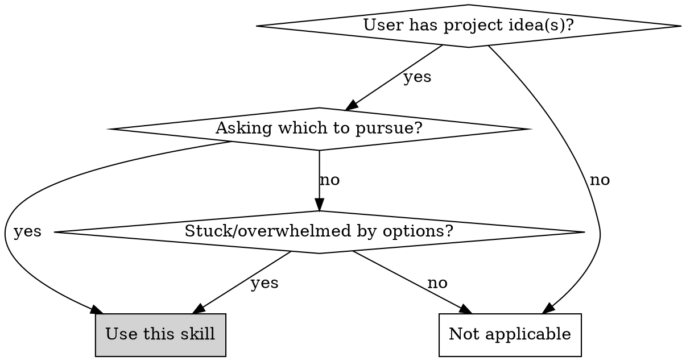
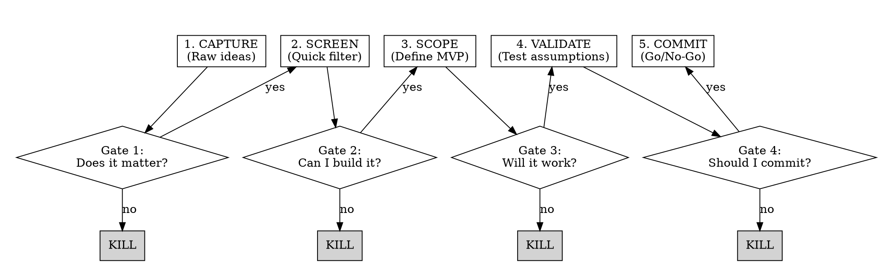

# Project Concept Funnel

## Overview

A structured process for filtering project ideas through progressive gates. Many ideas enter; few emerge as committed projects. Each gate applies specific criteria to kill weak ideas early and invest energy only in validated concepts.

**Core principle:** Ideas are cheap. Commitment is expensive. The funnel protects your time by forcing ideas to prove themselves before you invest.

## When to Use

**Use when:**
- User has one or more project ideas to evaluate
- User asks "should I build X?"
- User is paralyzed choosing between projects
- User keeps starting but not finishing projects
- User wants to validate an idea before committing

**Don't use for:**
- Already-committed projects (use planning skills instead)
- Pure research/exploration tasks
- Work assignments with fixed scope

## The Funnel

## Stage Details

### Stage 1: CAPTURE
**Goal:** Get all ideas out of your head into a list.

No filtering yet. Just capture:
- What is the idea?
- What problem does it solve?
- Who has this problem?

### Gate 1: Does It Matter?
Kill ideas where:
- [ ] You don't personally care about the problem
- [ ] No one you know has this problem
- [ ] Solution already exists and is good enough
- [ ] It's a "nice to have" not a real pain point

### Stage 2: SCREEN
**Goal:** Quick feasibility check.

For each surviving idea, assess:

| Criterion | Question | Score 1-5 |
|-----------|----------|-----------|
| **Motivation** | How excited am I about this? | |
| **Capability** | Do I have (or can learn) the skills? | |
| **Time** | Can I build MVP in 2-4 weeks? | |
| **Differentiation** | What makes this different from existing solutions? | |

### Gate 2: Can I Build It?
Kill ideas where:
- [ ] Motivation < 3 (you'll abandon it)
- [ ] Capability requires massive learning curve
- [ ] MVP would take months, not weeks
- [ ] No meaningful differentiation

### Stage 3: SCOPE
**Goal:** Define the smallest useful version.

Answer these precisely:
1. **Who** is the specific user? (Not "everyone")
2. **What** is the ONE core feature?
3. **When** will you know it works? (Success criteria)
4. **What's OUT** of scope for v1?

Write a one-sentence MVP definition:
> "A [type of solution] that lets [specific user] do [one thing] so they can [outcome]."

### Gate 3: Will It Work?
Kill ideas where:
- [ ] Can't define a specific user
- [ ] "Core feature" is actually 5 features
- [ ] Success criteria is vague ("people like it")
- [ ] MVP scope keeps growing

### Stage 4: VALIDATE
**Goal:** Test critical assumptions before building.

Identify your riskiest assumption and test it cheaply:

| Assumption Type | Validation Method |
|-----------------|-------------------|
| "People want this" | Talk to 5 potential users |
| "This is technically possible" | Build a 2-hour prototype |
| "I can learn X" | Complete a tutorial/spike |
| "The market exists" | Find 3 competitors or adjacent solutions |

### Gate 4: Should I Commit?
Kill ideas where:
- [ ] Users said "nice idea" but wouldn't use it
- [ ] Technical spike revealed blockers
- [ ] You lost interest during validation
- [ ] Better idea emerged from research

## Quick Reference: The 4 Gates

| Gate | Question | Kill Signal |
|------|----------|-------------|
| 1 | Does it matter? | No real pain point |
| 2 | Can I build it? | Too hard, too long, no motivation |
| 3 | Will it work? | Can't scope, keeps growing |
| 4 | Should I commit? | Validation failed |

## Facilitating the Funnel

When helping someone through the funnel:

1. **Start by counting ideas** - "How many project ideas do you have right now?"
2. **Apply gates in order** - Don't skip to validation before screening
3. **Be willing to kill** - The funnel's job is to eliminate, not nurture
4. **One survivor is success** - If one idea makes it through, the funnel worked
5. **Zero survivors is also success** - Killing all bad ideas saves months of wasted time

## Common Mistakes

| Mistake | Fix |
|---------|-----|
| Skipping gates | Gates exist to kill early. Use them. |
| "All my ideas pass" | You're not being honest. Apply harder. |
| Scope creep at Stage 3 | MVP = ONE feature. Enforce ruthlessly. |
| Skipping validation | 2 hours of validation saves 200 hours of building wrong thing |
| Emotional attachment | Ideas are cheap. Your time is not. Kill freely. |

## Red Flags: User Rationalizations

Watch for these - they indicate the user is avoiding the funnel:

- "But this one is different"
- "I just need to start building to figure it out"
- "I don't need to validate, I know people want this"
- "The MVP needs all these features to be useful"
- "I can't narrow it down, they're all good"

**Response:** Return to the current gate's kill criteria. Apply them honestly.

## Output: The Commitment Statement

If an idea survives all gates, the user should be able to state:

> "I'm building [MVP description] for [specific user]. I validated that [assumption] by [method]. My success criteria is [measurable outcome]. I'm committing [X hours/weeks] starting [date]."

No commitment statement = not ready to build.
