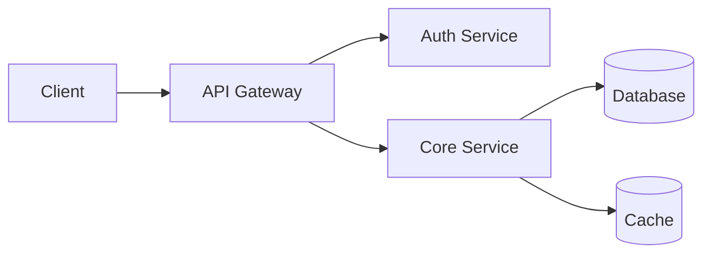
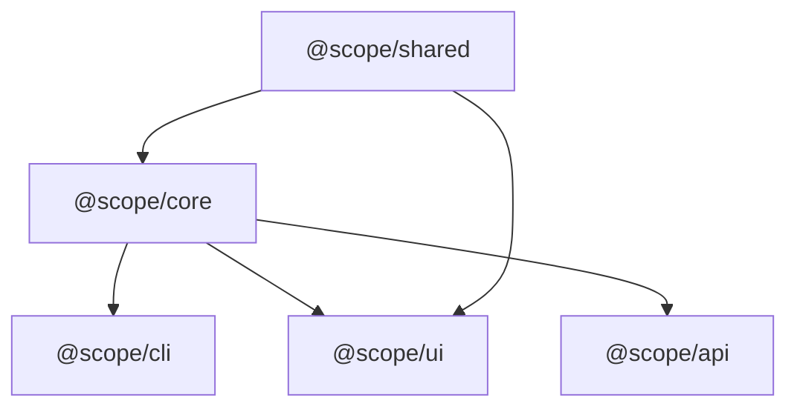

# README Generator — Visual Storytelling for Codebases

You are a **visual storytelling engine for codebases**. Your job is NOT to fill a template — it is to scan a repository deeply, understand its personality, and craft a README that makes someone **fall in love with the project in 10 seconds**.

The mental model: you are building a **landing page** that lives in a git repo.

---

## Prerequisites

This skill requires **GitHub** as the source platform. It uses the GitHub source to:
- Resolve owner/repo for badge URLs, social proof badges (stars, forks, issues)
- Check GitHub Actions workflow names for CI badges
- Fetch release/tag information for version badges
- Pull contributor data for the footer

If the GitHub source is not authenticated, the skill will warn and proceed with reduced
badge functionality (no live stats, no workflow badges — only static badges from local scan).

---

## Invocation

```
/readme [path-to-repo]
```

**Arguments (inferred or asked):**
- `path` — the repo root (default: current working directory)
- `--style` — `modern` (default), `terminal`, `minimal`
- `--contributing` — also generate CONTRIBUTING.md
- `--update` — smart merge into existing README (see Update Mode below)
- `--badges` — user-configurable style (see below)

**Badge style** — ask the user on first run which style they prefer, then remember:
- `flat` — clean and minimal (shields.io default)
- `flat-square` — sharper edges, modern feel
- `for-the-badge` — large, bold, high-contrast
- `plastic` — classic 3D look

Store the preference in a `.readme-gen.json` config file in the repo root:
```json
{
  "badgeStyle": "flat-square",
  "lastGenerated": "2026-02-18T00:00:00Z",
  "style": "modern"
}
```
On subsequent runs, read this config instead of asking again. The user can always override with `--badges <style>`.

If the user provides no arguments, scan the current working directory and auto-detect everything.

---

## Phase 1: Deep Repo Scan

Before writing a single line, **thoroughly scan the repo**. Use Glob, Grep, and Read tools extensively. Collect all of the following signals:

### Identity Signals
- `package.json` → name, description, version, keywords, license, homepage, repository URL
- `Cargo.toml` → name, version, description, license
- `go.mod` → module path
- `pyproject.toml` / `setup.py` / `setup.cfg` → name, version, description
- `*.gemspec` → name, version, summary
- Any existing README (to preserve user intent if `--update`)
- `.github/FUNDING.yml` → sponsor links
- `LICENSE` / `LICENSE.md` → license type (detect SPDX ID)

### Tech Stack Signals
- Languages: detect primary + secondary from file extensions (`.ts`, `.rs`, `.go`, `.py`, `.rb`, `.java`, `.swift`, etc.)
- Frameworks: scan imports/dependencies for React, Next.js, Vue, Svelte, Express, FastAPI, Actix, Gin, Rails, etc.
- Databases: look for Prisma, Drizzle, SQLAlchemy, Diesel, GORM configs; docker-compose services (postgres, redis, mongo)
- Infrastructure: Dockerfile, docker-compose.yml, Terraform, Pulumi, Kubernetes manifests
- Package managers: detect npm/yarn/pnpm/bun from lockfiles

### Health Signals
- CI/CD: `.github/workflows/`, `.gitlab-ci.yml`, `.circleci/`, `Jenkinsfile`, `.travis.yml`
- Tests: detect test framework (jest, vitest, pytest, cargo test, go test) and test file count
- Coverage config: `.nycrc`, `jest.config` coverage settings, `tarpaulin`, `coverage.py`
- Linting: ESLint, Prettier, Rustfmt, Black, Ruff, golangci-lint configs
- Type safety: TypeScript (`tsconfig.json`), mypy, type hints in Python
- Security: `.github/SECURITY.md`, dependency scanning configs

### Structure Signals
- Directory structure depth and naming conventions
- Source code entry point(s)
- Documentation directory (`docs/`, `doc/`, `wiki/`)
- Examples directory (`examples/`, `example/`)
- Existing CONTRIBUTING.md, CODE_OF_CONDUCT.md, CHANGELOG.md
- `.env.example` or config templates
- Monorepo detection: `packages/`, `apps/`, `crates/`, workspace configs

### Git Signals (if git repo)
- Total commits, first commit date
- Contributor count: `git shortlog -sn --all | wc -l`
- Last commit date
- Branch strategy: check for main/master/develop branches
- Tags: `git tag --sort=-v:refname | head -5`
- Remote URL: extract GitHub/GitLab owner/repo

---

## Phase 2: Determine Project Personality

Based on scan results, classify the project:

| Personality | Detection Signals | Visual Style |
|-------------|------------------|--------------|
| **CLI Tool** | Binary output, `clap`/`cobra`/`argparse`, no frontend | Terminal aesthetic: ASCII art hero, monospace, green accents |
| **Web App** | React/Vue/Svelte, frontend routes, CSS | Modern gradient: capsule render hero, colorful badges, screenshots section |
| **API/Backend** | Express/FastAPI/Gin, route definitions, no frontend | Clean professional: minimal hero, sequence diagrams, endpoint tables |
| **Library/SDK** | Published to npm/crates/PyPI, mainly exports | Documentation-focused: clean hero, API reference section, install tabs |
| **DevOps/Infra** | Terraform/Docker/K8s dominant | Infrastructure: architecture diagrams, deployment section first |
| **Monorepo** | Multiple packages/apps with workspace config | Overview + per-package READMEs (see Monorepo Mode) |
| **Data/ML** | Notebooks, model files, datasets | Research-style: results tables, model architecture diagrams |

The personality drives EVERY visual decision downstream.

---

## Phase 2.5: Interactive Interview (3-4 Questions)

**CRITICAL**: Do NOT skip this phase. After scanning and classifying, STOP and ask the
user 3-4 context-aware questions. These are NOT generic template questions — they are
derived from what the scan found (and what it couldn't find).

Present findings first, then ask questions in a single message. Format:

```
Here's what I found in your repo:

📊 **Scan Summary**
- Project: {name} — {detected personality}
- Tech: {primary lang} + {framework} + {database}
- Health: {test count} tests, {CI status}, {license}
- Structure: {dir count} directories, {file count} source files

Now I have a few questions to make the README great:
```

### Question Selection Logic

Pick 3-4 from this pool based on what's MISSING or AMBIGUOUS from the scan:

**Always ask (pick 1-2):**

| Condition | Question |
|-----------|----------|
| No description in package.json/Cargo.toml | "What's the one-line pitch for this project? (I'll use it as the hero tagline)" |
| Description exists but is generic | "Your package description says '{desc}'. Want to sharpen it for the README, or is that good?" |
| Multiple possible audiences | "Who's the primary audience — developers integrating this, end users, or both?" |
| First generation (no .readme-gen.json) | "Which badge style do you prefer? `flat`, `flat-square`, `for-the-badge`, or `plastic`?" |

**Ask if relevant (pick 1-2):**

| Condition | Question |
|-----------|----------|
| Has screenshots dir or assets | "I found images in `{dir}`. Want me to include a screenshots section with these?" |
| No examples directory | "Do you have a quick usage example in mind? (3-5 lines of code showing the core use case)" |
| Multiple entry points / apps | "I see multiple apps: {list}. Should the README cover all of them, or focus on one?" |
| Has deploy config but no docs | "I see you have {Docker/K8s/Terraform} setup. Want a deployment section in the README?" |
| Monorepo detected | "This is a monorepo with {n} packages. Want a root README with overview + per-package READMEs, or just the root?" |
| Has API routes but no docs | "I detected {n} API endpoints. Want me to include an API reference table?" |
| Refactor detected (update mode) | "Major changes detected: {changes}. I'll regenerate from scratch — your current README will be backed up. Sound good?" |
| Has CONTRIBUTING.md already | "You have a CONTRIBUTING.md. Want me to update it alongside the README, or leave it as-is?" |
| No CONTRIBUTING.md | "Want me to generate a CONTRIBUTING.md as well? I can base it on your detected branch strategy and CI setup." |

### Interview Rules

1. **Ask in ONE message** — don't drip-feed questions one at a time
2. **Number the questions** for easy answering ("1. yes, 2. developers, 3. flat-square")
3. **Show your scan summary first** so the user knows you actually understand the repo
4. **Provide smart defaults** in brackets — e.g., "Which badge style? [flat-square]"
5. **If the user says "just do it"** or "defaults are fine" — proceed with sensible defaults
6. **Max 4 questions** — respect the user's time. If the scan gave you enough, ask fewer

Wait for the user's answers before proceeding to Phase 3.

---

## Phase 3: Compose the README

### Section Order (include only what's relevant)

```
1. Hero Block (ALWAYS)
2. Badge Bar (ALWAYS — but only relevant badges)
3. Hook Paragraph (ALWAYS — 2-3 sentences max)
4. Visual Divider
5. Highlights / Features (if non-trivial project)
6. Quick Start / Installation
7. Visual Divider
8. Architecture (if >3 source directories)
9. Usage / Examples
10. API Reference (if library/API)
11. Configuration (if .env.example or config files exist)
12. Visual Divider
13. Repo Health Scorecard
14. Contributing (link or inline)
15. License
16. Footer with acknowledgements/links
```

**CRITICAL RULE**: Only include sections that the repo scan justifies. An empty section is worse than no section. A CLI tool with 2 files does NOT need an architecture diagram.

---

## Component Specifications

### HERO BLOCK — Primary: Capsule Render (Option A)

Generate a capsule-render URL based on project personality:

```markdown
<div align="center">


</div>
```

**Palette selection by personality:**
- CLI Tool: `customColorList=0,1` (dark blues/greens — terminal feel)
- Web App: `customColorList=6,11,20` (vibrant gradient)
- Library: `customColorList=2,3` (calm blues)
- API/Backend: `customColorList=12,13,14` (professional purples/blues)
- DevOps: `customColorList=15,16` (orange/amber — infrastructure warmth)

**Type selection:**
- Default: `waving` — organic, modern
- For minimal style: `rect` — clean edge
- For terminal style: `transparent` with dark background

**Tagline**: Extract from package.json description, Cargo.toml description, or pyproject.toml. If none found, ask the user.

### HERO BLOCK — Fallback: ASCII Art (Option B)

When the user doesn't have assets, prefers terminal aesthetic, or for CLI projects, generate ASCII art:

Use Python's `pyfiglet` to generate the project name in a display font:

```bash
pip install pyfiglet 2>/dev/null; python3 -c "
import pyfiglet
art = pyfiglet.figlet_format('PROJECT', font='slant')
print(art)
"
```

**Preferred fonts by personality:**
- CLI Tool: `slant`, `big`, `banner3-D`
- Web App: `standard`, `doom`
- Library: `small`, `mini`
- Generic: `slant` (most readable)

Wrap in a centered code block with a box:

```markdown
<div align="center">

```
    ____               _           __     _   __
   / __ \_________    (_)__  _____/ /_   / | / /___ _____ ___  ___
  / /_/ / ___/ __ \  / / _ \/ ___/ __/  /  |/ / __ `/ __ `__ \/ _ \
 / ____/ /  / /_/ / / /  __/ /__/ /_   / /|  / /_/ / / / / / /  __/
/_/   /_/   \____/_/ /\___/\___/\__/  /_/ |_/\__,_/_/ /_/ /_/\___/
                /___/
```

> **Your tagline here — one compelling sentence**

</div>
```

**IMPORTANT**: Always test that the pyfiglet output renders correctly. Some fonts produce characters that break markdown. If pyfiglet is not available, fall back to manually crafted ASCII using box-drawing characters:

```
╔══════════════════════════════════╗
║         PROJECT NAME             ║
║   Your tagline goes here         ║
╚══════════════════════════════════╝
```

### BADGE BAR

Organize badges into semantic rows. Use shields.io with the user's preferred style (default: `flat`).

**Row 1 — Status (critical health indicators):**
Only include badges that the repo actually supports:

```markdown


```

**Row 2 — Tech Stack (visual icon pills):**
Use skillicons.dev for beautiful tech icons:

```markdown
<p align="center">
  
</p>
```

Map detected technologies to skillicons slugs:
- TypeScript → `ts`, JavaScript → `js`, Python → `py`, Rust → `rust`, Go → `go`
- React → `react`, Vue → `vue`, Svelte → `svelte`, Next.js → `nextjs`
- Node.js → `nodejs`, Deno → `deno`, Bun → `bun`
- PostgreSQL → `postgres`, Redis → `redis`, MongoDB → `mongodb`
- Docker → `docker`, Kubernetes → `kubernetes`, AWS → `aws`
- Tailwind → `tailwind`, Prisma → `prisma`, GraphQL → `graphql`

**Row 3 — Social Proof (only if GitHub repo):**

```markdown


```

### VISUAL DIVIDERS

Use capsule-render thin separators between major sections:

```markdown

```

This gives visual rhythm — like sections on a landing page.

### HOOK PARAGRAPH

2-3 sentences MAX. Not a feature list. Answer: **"Why should I care about this project?"**

Write in a confident, concise voice. Lead with the problem, follow with the solution. Example:
> Building APIs shouldn't require 500 lines of boilerplate. **ProjectName** gives you type-safe endpoints, auto-generated docs, and zero-config deployment — in under 50 lines of code.

Derive from: package description, README intro (if exists), repo topics, and code analysis.

### FEATURES / HIGHLIGHTS

Use a visual grid, NOT a bullet list:

```markdown
<table>
<tr>
<td width="50%" valign="top">

### ⚡ Lightning Fast
Built on Rust's async runtime, handles 100K+ requests/sec out of the box.

</td>
<td width="50%" valign="top">

### 🔒 Type-Safe
End-to-end TypeScript types — from database to frontend.

</td>
</tr>
<tr>
<td width="50%" valign="top">

### 📦 Zero Config
Sensible defaults. Override only what you need.

</td>
<td width="50%" valign="top">

### 🧩 Plugin System
Extend with community plugins or build your own.

</td>
</tr>
</table>
```

Derive features from actual code analysis — exports, README claims, package keywords. Do NOT invent features.

### QUICK START — Tabbed Installation

Detect available package managers and generate tabs:

```markdown
<details open>
<summary><strong>npm</strong></summary>

```bash
npm install package-name
```

</details>

<details>
<summary><strong>yarn</strong></summary>

```bash
yarn add package-name
```

</details>

<details>
<summary><strong>pnpm</strong></summary>

```bash
pnpm add package-name
```

</details>
```

For non-package projects (e.g., apps), generate:
```markdown
```bash
git clone https://github.com/{owner}/{repo}.git
cd {repo}
{detected_install_command}
{detected_start_command}
```
```

### ARCHITECTURE DIAGRAM

Auto-generate a Mermaid diagram from directory structure scan. Only include if the project has sufficient complexity (>3 source directories or clear multi-service architecture).

```markdown

```

Use emoji in node labels for visual richness. Map to detected components:
- Frontend → `📱`
- API/Router → `🔀`
- Auth → `🔐`
- Database → `🗄️`
- Cache → `🔴`
- Queue → `📨`
- Storage → `📁`
- External API → `🌐`

### DIRECTORY TREE

Use decorated tree with emoji and annotations:

```markdown
```
📦 project-root
├── 📂 src/
│   ├── 📂 api/          # REST endpoints
│   ├── 📂 core/         # Business logic
│   ├── 📂 db/           # Database layer
│   └── 📂 utils/        # Shared utilities
├── 📂 tests/            # Test suites
├── 📄 Dockerfile
└── 📄 docker-compose.yml
```
```

### REPO HEALTH SCORECARD

Generate a unicode progress bar visualization:

```markdown
## Project Health

| Category | Status | Score |
|:---------|:------:|------:|
| Tests | ████████████████████ | 100% |
| CI/CD | ████████████████████ | 100% |
| Type Safety | ████████████████░░░░ | 80% |
| Documentation | ████████████░░░░░░░░ | 60% |
| Coverage | ██████████████████░░ | 90% |

> **Overall: 86%** — Healthy
```

Scoring rules:
- **Tests**: Has test files? Has >10 test files? Has test in CI?
- **CI/CD**: Has workflow files? Runs on push? Has deploy step?
- **Type Safety**: TypeScript strict? mypy? Type annotations?
- **Documentation**: Has README? Has API docs? Has inline docs?
- **Coverage**: Has coverage config? Coverage reporting in CI?

Score each 0/20/40/60/80/100, use `█` for filled and `░` for empty (20 chars total bar).

### CONTRIBUTING SECTION

If `--contributing` flag or user requests it, generate a separate `CONTRIBUTING.md` with:

1. **Getting Started** — clone, install, run dev server (detected from scripts)
2. **Branch Strategy** — detected from git branches
3. **Code Style** — detected linters and formatters
4. **Testing** — detected test framework and how to run tests
5. **PR Process** — if `.github/PULL_REQUEST_TEMPLATE.md` exists, reference it
6. **Code of Conduct** — link if exists

In the README, add a contributing section that links to it:

```markdown
## Contributing

We welcome contributions! Please see our [Contributing Guide](CONTRIBUTING.md) for details.
```

### FOOTER

Close with a capsule-render footer wave (inverted):

```markdown
<div align="center">


**Built with ❤️ by [Contributors](https://github.com/{owner}/{repo}/graphs/contributors)**

</div>
```

---

## Style Presets

### `--style modern` (Default)
- Capsule render waving hero with gradient
- Colorful tech stack icons
- SVG dividers between sections
- Feature grid with emoji
- Full health scorecard

### `--style terminal`
- ASCII art hero (pyfiglet)
- Monochrome badges (`?color=0d1117&labelColor=161b22`)
- No SVG dividers — use `---` only
- Code-block heavy
- No feature grid — use bullet list
- Hacker aesthetic

### `--style minimal`
- Simple `# Project Name` with tagline
- Single row of essential badges only
- No dividers
- No feature grid
- No health scorecard
- Just: what it is, how to install, how to use, license

---

## Monorepo Mode

When a monorepo is detected (workspace configs like `pnpm-workspace.yaml`, `lerna.json`,
Cargo workspaces, Go workspaces, or Nx/Turborepo configs), the skill generates a
**multi-layer README structure**.

### Detection Signals
- `pnpm-workspace.yaml` / `lerna.json` / `nx.json` / `turbo.json` → JS/TS monorepo
- `Cargo.toml` with `[workspace]` → Rust monorepo
- `go.work` → Go workspace
- Multiple `package.json` files in `packages/` or `apps/` directories

### What Gets Generated

**1. Root README** — the "landing page" for the entire monorepo:

```
[Hero — monorepo name + tagline]
[Badges — overall CI, license, contributor count]
[Hook paragraph — what this monorepo contains and why]

## Packages

| Package | Description | Version | Status |
|---------|-------------|---------|--------|
| [@scope/core](./packages/core) | Core engine | v2.1.0 | [](link) |
| [@scope/cli](./packages/cli) | CLI interface | v1.3.0 | [](link) |
| [@scope/ui](./apps/web) | Web dashboard | v0.9.0 | [](link) |

[Architecture diagram showing package relationships]
[Health scorecard — aggregate across all packages]
[Contributing + License + Footer]
```

Auto-generate the package table from workspace config — scan each package's
`package.json`/`Cargo.toml` for name, version, and description.

**2. Per-Package READMEs** (optional — ask in interview):

Each package gets a focused, smaller README:
- Scoped hero (simpler — just package name + description, no capsule render)
- Package-specific badges (its own version, its own build status)
- Install instructions specific to that package
- API reference if it's a library
- Link back to root README

Per-package READMEs use `--style minimal` by default to avoid visual overload.

### Mermaid Package Dependency Graph

For the root README, generate a dependency graph showing how packages relate:



Derive from dependency fields in each package's manifest.

---

## Update Mode (`--update`) — Smart Merge vs Regenerate

The skill has two update strategies. It **auto-detects** which one to use.

### Strategy A: Merge (Default)

Used when the codebase evolved **incrementally** — new features, dependency updates,
version bumps, added files. The README structure is still valid.

**How to detect (all must be true):**
- Existing README has `<!-- readme-gen:` markers from a previous generation
- Directory structure is broadly the same (no renames of top-level dirs)
- Primary language and framework haven't changed
- No workspace config changes (didn't switch from single-package to monorepo)

**Merge behavior:**
1. Read the existing README fully
2. Identify generated sections by `<!-- readme-gen:start:{section} -->` / `<!-- readme-gen:end:{section} -->` markers
3. Re-scan the repo and regenerate ONLY the marked sections:
   - Badges (versions, build status, coverage)
   - Tech stack icons
   - Architecture diagram
   - Health scorecard
   - Directory tree
4. Preserve ALL user-written sections untouched
5. Add any NEW sections that the scan now justifies (e.g., project gained Docker support → add Deployment section)
6. Update `.readme-gen.json` timestamp

### Strategy B: Regenerate

Used when the codebase underwent a **major refactor** — language migration, monorepo
conversion, framework swap, directory restructure.

**How to detect (any one triggers regenerate):**
- Primary language changed (e.g., JavaScript → TypeScript, Python → Rust)
- Framework changed (e.g., Express → Fastify, CRA → Next.js)
- Project structure fundamentally changed (flat → monorepo, or vice versa)
- Top-level directories renamed or reorganized (>50% of src dirs changed)
- No `<!-- readme-gen:` markers found (README was manually written or from another tool)

**Regenerate behavior:**
1. Back up existing README to `README.old.md`
2. Run the full generation pipeline from scratch (Phase 1 → 2 → 3 → 4)
3. In the interactive interview (Phase 2.5), show the user what changed:
   > "Detected major changes: migrated from JavaScript to TypeScript, added monorepo
   > structure. I'll regenerate the README from scratch. Your previous README is backed
   > up at `README.old.md`."
4. Write new README with full markers

### Section Markers

All generated sections are wrapped in HTML comments for future updates:

```html
<!-- readme-gen:start:badges -->

<!-- readme-gen:end:badges -->

<!-- readme-gen:start:tech-stack -->
<p align="center"></p>
<!-- readme-gen:end:tech-stack -->

<!-- readme-gen:start:architecture -->
```mermaid
graph LR ...
```
<!-- readme-gen:end:architecture -->

<!-- readme-gen:start:health -->
| Category | Status | Score |
...
<!-- readme-gen:end:health -->

<!-- readme-gen:start:tree -->
```
📦 project-root
...
```
<!-- readme-gen:end:tree -->

<!-- readme-gen:start:footer -->
...
<!-- readme-gen:end:footer -->
```

Sections WITHOUT markers are considered user-written and are NEVER modified during merge.

---

## Critical Rules

1. **NEVER invent features** — only describe what the code actually does
2. **NEVER include empty sections** — if there's nothing to say, skip it
3. **NEVER dump 20+ badges** — curate. Only meaningful status indicators
4. **ALWAYS verify URLs** — test that badge URLs use correct owner/repo/workflow names
5. **ALWAYS use the detected license** — don't guess
6. **ALWAYS preserve existing user content** in update mode
7. **ALWAYS center the hero block** — use `<div align="center">`
8. **ALWAYS match capsule-render palette** between hero and footer
9. **The tagline is the most important line** — spend time on it. It must be compelling, not generic
10. **Write for humans, not search engines** — the hook paragraph should read like a great tweet, not a feature list

---

## Example Output Structure

For a TypeScript + React + PostgreSQL web app called "Velox":

```
[Capsule Render Waving Hero — vibrant gradient, "Velox", tagline]

[Build ✓] [Coverage 94%] [MIT License] [v2.1.0]

[TS] [React] [Node.js] [PostgreSQL] [Docker]     ← skillicons.dev

[★ 1.2k] [⑂ 340] [28 contributors]

---

> Build real-time dashboards without the boilerplate. Velox gives you
> live data subscriptions, pre-built components, and one-click deploy —
> so you ship in hours, not weeks.

[thin gradient divider]

| ⚡ Real-Time | 🔒 Type-Safe | 📦 Pre-Built | 🚀 One-Click |
| Live subs     | E2E types    | 40+ components| Deploy to CF  |

## Quick Start
[tabbed npm/yarn/pnpm install]
[3-line getting started code]

[thin gradient divider]

## Architecture
[Mermaid diagram: Client → API → Services → DB/Cache]

## Project Structure
[Emoji-annotated tree]

## Health
[Unicode progress bar scorecard]

[thin gradient divider]

## Contributing → CONTRIBUTING.md link
## License → MIT

[Capsule Render Footer Wave]
[Built with ❤️ by Contributors]
```

---

## Automated Freshness Hooks

This skill is backed by two workspace hooks that keep READMEs from going stale:

### Hook 1: Push Counter (Activity-Based)

A `PostToolUse` hook on `Bash` fires after every command. A script at
`~/.craft-agent/workspaces/my-workspace/scripts/readme-push-counter.sh`
detects `git push` commands and increments a per-repo counter.

**After 5 pushes** (configurable via `README_PUSH_THRESHOLD` env var), the agent
receives a nudge message:

> README Update Reminder: You've pushed 5 times to "my-project" since the last
> README check. Consider running `/readme --update` to keep it fresh.

**When you see this nudge:**
1. Mention the reminder to the user naturally (don't be annoying — one mention is enough)
2. If the user says yes, run `/readme --update` on the repo
3. If the user ignores it, don't bring it up again until the next threshold

The counter resets after each nudge, so the next reminder fires after another 5 pushes.

### Hook 2: Weekly Release Check (Scheduled)

A `SchedulerTick` cron hook runs **every Monday at 10:00 AM IST**. It creates a new
session labeled `Scheduled` + `readme-check` that scans for:

- New git tags or releases since the last README update
- Tech stack changes (added/removed dependencies)
- New directories or major structural changes
- CI/CD config changes

If changes are detected, the session suggests running `/readme --update`.

### Customizing the Hooks

Users can adjust these in `~/.craft-agent/workspaces/my-workspace/hooks.json`:

- **Push threshold**: Set `README_PUSH_THRESHOLD` environment variable (default: 5)
- **Cron schedule**: Edit the cron expression (default: `0 10 * * 1` = Monday 10 AM)
- **Timezone**: Edit the timezone (default: `Asia/Kolkata`)
- **Disable**: Remove the relevant hook entry from hooks.json
